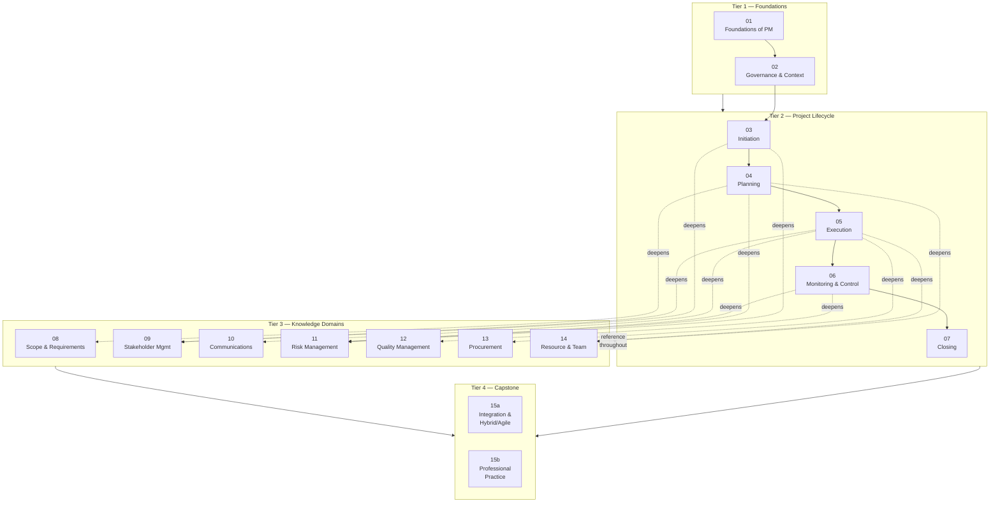

# Curriculum Map — Project Management Fundamentals


> This map shows how modules relate to each other, recommended learning paths for different audiences, and the flow of the course from foundations to capstone.

---

## Table of Contents

- [Full Course Architecture](#full-course-architecture)
- [Module Dependency Map](#module-dependency-map)
- [Learning Paths by Audience](#learning-paths-by-audience)
- [Module Summary Table](#module-summary-table)
- [Knowledge Domain Cross-Reference](#knowledge-domain-cross-reference)
- [Template-to-Module Index](#template-to-module-index)

---

## Full Course Architecture



*Solid arrows = sequential prerequisite. Dashed arrows = knowledge domain deepens the lifecycle module it connects to.*

---

## Module Dependency Map

Each module's prerequisites and what it unlocks:

| Module | Hard prerequisite | Recommended prior | Unlocks |
|---|---|---|---|
| **01** Foundations | None | None | Everything |
| **02** Governance | 01 | — | 03, and all governance concepts |
| **03** Initiation | 01, 02 | — | 04, 09 (in depth) |
| **04** Planning | 03 | 08, 11, 14 for depth | 05, 06 |
| **05** Execution | 04 | 09, 10, 13, 14 for depth | 06 |
| **06** Monitoring & Control | 04, 05 | 11, 12 for depth | 07 |
| **07** Closing | 05, 06 | — | 15a, 15b (synthesises all) |
| **08** Scope & Requirements | 04 | — | Deepens 04, 05 |
| **09** Stakeholder Management | 03 | — | Deepens 05, 10 |
| **10** Communications | 05 | 09 | Deepens 05, 06 |
| **11** Risk Management | 03 | — | Deepens 04, 05, 06 |
| **12** Quality Management | 05 | — | Deepens 06 |
| **13** Procurement | 05 | — | Standalone; referenced in 05 |
| **14** Resource & Team | 04 | — | Deepens 05, 06 |
| **15a** Integration & Hybrid/Agile | 01–07 | 08–14 | 15b |
| **15b** Professional Practice | 15a | 08–14 | Course completion |

---

## Learning Paths by Audience

### Path A — New Project Manager (Full Course, Sequential)

Estimated total time: 42–57 hours

```
01 → 02 → 03 → 04 → 05 → 06 → 07 → 08 → 09 → 10 → 11 → 12 → 13 → 14 → 15a → 15b
```

**Notes:**
- Work modules 01–07 in strict sequence; the lifecycle is progressive.
- Modules 08–14 can be studied alongside the relevant lifecycle module or after Module 07.
- Return to knowledge domain modules as a reference whenever the topic arises on a real project.

---

### Path B — Experienced Practitioner (Knowledge Gaps Focus)

Estimated total time: 20–30 hours

```
01 (skim) → 02 → 08 → 09 → 11 → 12 → 13 → 14 → 15a → 15b
```

**Notes:**
- Skip or skim Modules 03–07 unless you want to formalise lifecycle knowledge.
- Focus on the knowledge domains most relevant to your current gaps.
- Modules 15a and 15b synthesise and frame professional practice — do not skip these.

---

### Path C — Team Lead / BA Entering PM

Estimated total time: 30–40 hours

```
01 → 02 → 03 → 04 → 05 → 06 → 07 → 09 → 10 → 11 → 15a → 15b
```

**Notes:**
- Modules 09 (Stakeholders) and 10 (Communications) are especially important for this audience.
- Module 11 (Risk) provides immediate practical value.
- Can defer Modules 08, 12, 13, 14 to a second pass.

---

### Path D — Agile / Scrum Practitioner Adding PM Context

Estimated total time: 20–25 hours

```
01 → 02 → 06 → 07 → 09 → 11 → 15a → 15b
```

**Notes:**
- Module 01 establishes vocabulary and framing.
- Module 02 addresses governance — often weak in pure agile environments.
- Modules 06 and 11 address monitoring and risk — formal disciplines that complement agile practices.
- Module 15a directly addresses the agile/hybrid intersection.

---

### Path E — PRINCE2 Practitioner (PMI PMP Preparation)

Estimated total time: 35–45 hours

```
01 → 02 → 03 → 04 → 05 → 06 → 07 → 08 → 09 → 10 → 11 → 12 → 13 → 14 → 15a → 15b
```

**Notes:**
- Complete coverage is recommended for PMP preparation (current exam includes agile/hybrid content).
- Pay particular attention to EVM in Module 06 — always examined.
- Module 15a covers agile content weighted in the current PMP exam.
- See `INSTRUCTOR-GUIDE.md` for detailed certification mapping.

---

### Path F — One-Day Overview (Manager / Executive)

Estimated total time: 4–6 hours

```
01 → 02 → 03 (Sections 1–4 only) → 06 (EVM section only) → 11 (Risk) → 15b (Section: Failure Modes)
```

**Notes:**
- This path builds enough vocabulary and frameworks to sponsor projects effectively.
- Focus on understanding: why projects fail, what governance is, how to read a status report, and what risk management involves.
- Not a substitute for the full programme for practising PMs.

---

## Module Summary Table

| # | Module | Tier | Key Concepts | Core Artefacts | Est. Time |
|---|---|---|---|---|---|
| 01 | Foundations of Project Management | Foundations | Project definition, triple constraint, PM role, value chain, ethics | — | 2–3 hrs |
| 02 | Governance & Organisational Context | Foundations | Governance framework, PMO, benefits management, tailoring, ESG | Benefits Register | 2–3 hrs |
| 03 | Project Initiation | Lifecycle | Business case, feasibility, project charter, stakeholder identification, kick-off | Business Case, Project Charter, Stakeholder Register, Assumption Log | 3–4 hrs |
| 04 | Project Planning | Lifecycle | WBS, schedule, critical path, cost estimating, resource planning, PMP | WBS, RACI, Resource Calendar | 4–5 hrs |
| 05 | Project Execution | Lifecycle | Work authorisation, team management, issue management, change control, quality assurance | Change Request, Change Log, Issue Log | 3–4 hrs |
| 06 | Monitoring & Control | Lifecycle | EVM (SV, CV, SPI, CPI), scope/schedule/cost control, reporting, configuration | Status Report | 3–4 hrs |
| 07 | Project Closing | Lifecycle | Acceptance, handover, lessons learned, administrative closure, post-implementation review | Closure Report, Handover Doc, Lessons Learned Log | 2–3 hrs |
| 08 | Scope & Requirements Management | Knowledge | Requirements lifecycle, MoSCoW, RTM, acceptance criteria, scope creep | (RTM — referenced) | 2–3 hrs |
| 09 | Stakeholder Management | Knowledge | Identification, power/interest grid, engagement levels, difficult stakeholders | Stakeholder Register | 2–3 hrs |
| 10 | Communications Management | Knowledge | Comms planning, meeting management, escalation, virtual teams | Communications Plan, Meeting Agenda, Meeting Minutes | 2–3 hrs |
| 11 | Risk Management | Knowledge | Risk process, qualitative/quantitative analysis, response strategies, risk register | Risk Register | 3–4 hrs |
| 12 | Quality Management | Knowledge | QA vs QC, PDCA, root cause analysis, quality tools, defect management | Quality Register | 2–3 hrs |
| 13 | Procurement & Contract Management | Knowledge | Make-or-buy, contract types, RFP/RFQ, supplier management | Procurement Evaluation Scorecard | 3–4 hrs |
| 14 | Resource & Team Management | Knowledge | Skills matrix, Tuckman, motivation, conflict, virtual teams, RACI | Resource Calendar, RACI | 3–4 hrs |
| 15a | Integration & Hybrid/Agile | Capstone | Integration management, change control, agile manifesto, Scrum, Kanban, scaling | Integrated PMP | 3–4 hrs |
| 15b | Professional Practice | Capstone | PM competency frameworks, CPD, failure modes, industry contexts, reflective practice | CPD Log, Competency Self-Assessment | 2–3 hrs |

---

## Knowledge Domain Cross-Reference

Which lifecycle modules introduce each knowledge domain topic, and which knowledge domain module provides the deep treatment:

| Knowledge Area | First introduced | Deep treatment | Templates |
|---|---|---|---|
| Scope Management | 03, 04 | 08 | WBS, RACI |
| Stakeholder Management | 03 | 09 | Stakeholder Register |
| Communications | 05, 06 | 10 | Communications Plan, Meeting Agenda/Minutes, Status Report |
| Risk Management | 03, 04 | 11 | Risk Register |
| Quality Management | 05, 06 | 12 | Quality Register |
| Procurement | 05 | 13 | Procurement Evaluation Scorecard |
| Resource Management | 04, 05 | 14 | RACI, Resource Calendar |
| Benefits Management | 02, 03 | 15a (integration) | Benefits Register |
| Change Management | 05, 06 | 15a (integration) | Change Request, Change Log |
| Integration | Throughout | 15a | Project Management Plan |

---

## Template-to-Module Index

| Template | Module where first introduced | Deep treatment module |
|---|---|---|
| Business Case | 03 | 03 |
| Project Charter | 03 | 03 |
| Stakeholder Register | 03 | 09 |
| Assumption & Constraint Log | 03 | 03 |
| WBS | 04 | 08 |
| RACI Matrix | 04 | 14 |
| Resource Calendar | 04 | 14 |
| Change Request | 05 | 15a |
| Change Log | 05 | 15a |
| Issue Log | 05 | 05 |
| Meeting Agenda | 05 | 10 |
| Meeting Minutes | 05 | 10 |
| Status Report | 06 | 06, 10 |
| Risk Register | 03, 04 | 11 |
| Lessons Learned Log | 07 | 07 |
| Project Closure Report | 07 | 07 |
| Project Handover Document | 07 | 07 |
| Benefits Register | 02 | 02, 15a |
| Communications Plan | 10 | 10 |
| Quality Register | 12 | 12 |
| Procurement Evaluation Scorecard | 13 | 13 |

---

[↑ Back to top](#table-of-contents)

---

&copy; 2026 UncleJs &mdash; Licensed under [CC BY-NC-SA 4.0](https://creativecommons.org/licenses/by-nc-sa/4.0/)
