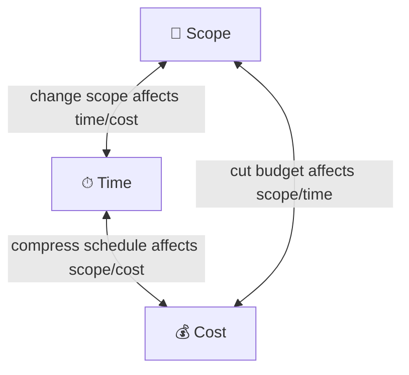
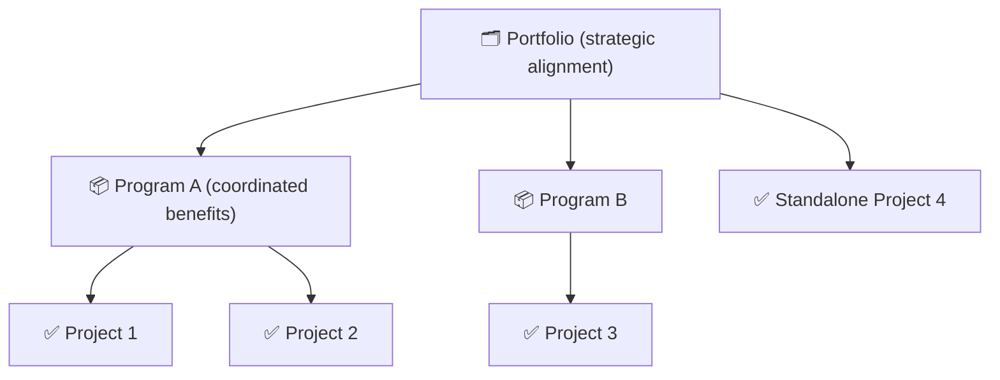
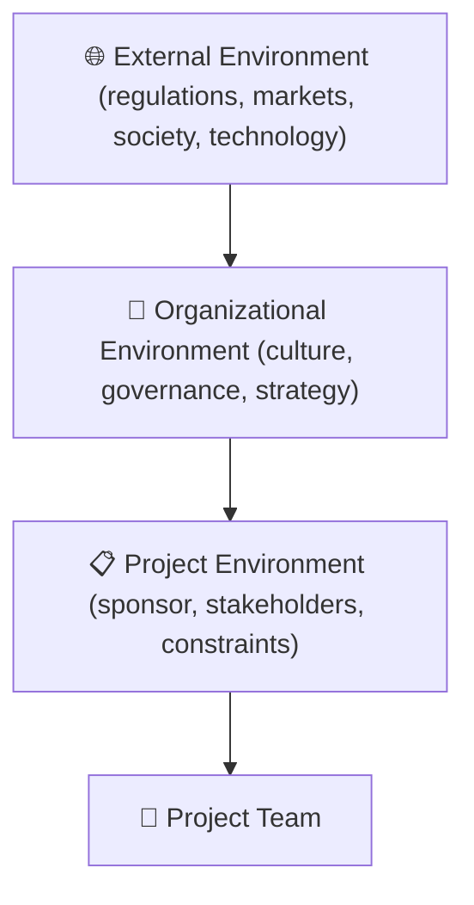
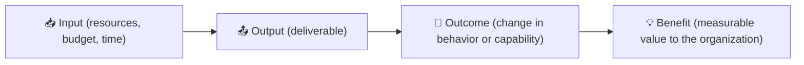

# Module 01 — Foundations of Project Management

> **What is a project, why do they exist, and what does a project manager actually do?** This module builds the conceptual foundation for everything that follows.

---

## Table of Contents

- [1. What Is a Project?](#1-what-is-a-project)
  - [Why "temporary" matters](#why-temporary-matters)
  - [Why "unique" matters](#why-unique-matters)
  - [The triple constraint](#the-triple-constraint)
- [2. Projects vs. Operations vs. Programs vs. Portfolios](#2-projects-vs-operations-vs-programs-vs-portfolios)
  - [Projects vs. Operations](#projects-vs-operations)
  - [Programs](#programs)
  - [Portfolios](#portfolios)
- [3. The Project Environment](#3-the-project-environment)
  - [Organizational structures](#organizational-structures)
  - [Organizational culture](#organizational-culture)
  - [The project environment model](#the-project-environment-model)
- [4. Overview of Project Management Frameworks](#4-overview-of-project-management-frameworks)
  - [Why no single methodology?](#why-no-single-methodology)
- [5. The Project Manager Role](#5-the-project-manager-role)
  - [What a project manager does](#what-a-project-manager-does)
  - [Core competency areas](#core-competency-areas)
  - [Authority vs. influence](#authority-vs-influence)
  - [The PM is not the expert](#the-pm-is-not-the-expert)
- [6. Business Justification and Value Delivery](#6-business-justification-and-value-delivery)
  - [Why projects exist](#why-projects-exist)
  - [The business case](#the-business-case)
  - [Value vs. outputs](#value-vs-outputs)
- [7. Ethics and Professionalism in Project Management](#7-ethics-and-professionalism-in-project-management)
  - [Why ethics matters in PM](#why-ethics-matters-in-pm)
  - [Core ethical principles](#core-ethical-principles)
  - [Common ethical challenges in PM](#common-ethical-challenges-in-pm)
  - [Professional codes](#professional-codes)
- [Artifacts](#artifacts)
- [Exercises](#exercises)
  - [Exercise 1.1 — Is it a project?](#exercise-11--is-it-a-project)
  - [Exercise 1.2 — Mapping the environment](#exercise-12--mapping-the-environment)
  - [Exercise 1.3 — Value chain mapping](#exercise-13--value-chain-mapping)
- [Quiz](#quiz)
- [Related Modules](#related-modules)

---

## 1. What Is a Project?

A **project** is a **temporary endeavor** undertaken to create a **unique product, service, or result**.

Three characteristics define every project:

| Characteristic | What It Means |
|---|---|
| **Temporary** | A definite start and a definite end — it does not go on forever |
| **Unique** | The outcome is different from anything else the organization has produced before, even if similar work has been done |
| **Progressive elaboration** | Details are developed incrementally as the project moves forward and understanding deepens |

### Why "temporary" matters

Temporary does not mean short. A five-year infrastructure project is still temporary — it has a defined end. What makes it a project is that it is not ongoing, repetitive work. When the road is built, the project ends, even though the road itself may last a century.

### Why "unique" matters

Uniqueness introduces **uncertainty** — and uncertainty is the primary reason projects need management. If you had done exactly this before, you would simply repeat the process. Because you have not, you must plan, adapt, and control.

### The triple constraint

Every project exists within three fundamental constraints:

*The triple constraint: every change ripples across all three dimensions.*

- Change the scope → affects time and/or cost
- Cut the budget → affects scope and/or time
- Compress the schedule → affects scope and/or cost

Modern practice adds **quality**, **risk**, **resources**, and **stakeholder satisfaction** to this list. The project manager's job is to manage the balance across all of them.

[↑ Back to top](#table-of-contents)

---

## 2. Projects vs. Operations vs. Programs vs. Portfolios

### Projects vs. Operations

| Dimension | Project | Operation |
|---|---|---|
| Duration | Temporary | Ongoing |
| Output | Unique | Repetitive |
| Purpose | Create change | Sustain current state |
| Examples | Build a new warehouse | Run the warehouse |

Operations are the day-to-day activities that keep an organization running. Projects are the vehicles for change. Most organizations run both simultaneously — and managing the **interface** between them is a critical PM skill.

### Programs

A **program** is a group of related projects managed in a coordinated way to obtain benefits that could not be achieved by managing each individually. A program has a unifying strategic purpose. Example: a digital transformation program containing separate projects for CRM replacement, staff training, and data migration.

### Portfolios

A **portfolio** is a collection of programs, projects, and operational work grouped together to achieve a strategic objective. Portfolio management is about selecting the right projects to fund and ensuring the mix aligns with organizational strategy.

*Portfolios contain programs and standalone projects; programs coordinate related projects to realize shared benefits.*

[↑ Back to top](#table-of-contents)

---

## 3. The Project Environment

### Organizational structures

The structure of the host organization has a direct impact on the project manager's authority and access to resources.

| Structure | PM Authority | Resource Control |
|---|---|---|
| **Functional** | Low — PM is a coordinator | Functional managers own resources |
| **Weak Matrix** | Low to moderate | Shared between PM and functional manager |
| **Balanced Matrix** | Moderate | Negotiated |
| **Strong Matrix** | Moderate to high | PM has significant influence |
| **Projectized** | High — PM is the boss | PM controls resources |

Most real organizations are hybrid — the PM must understand and navigate the specific power dynamics in their context.

### Organizational culture

Culture determines how communication happens, how conflict is handled, how decisions are made, and how much autonomy the project manager is granted. Culture is often invisible until it creates friction. A PM who ignores culture will struggle; one who reads it well will accelerate.

### The project environment model

*Projects are nested inside organizations, which are nested inside an external environment. The PM must navigate all three layers.*

Projects are nested inside organizations, which are nested inside an external environment of regulations, market forces, technology change, and societal expectations. The PM must be aware of all three layers.

[↑ Back to top](#table-of-contents)

---

## 4. Overview of Project Management Frameworks

Several frameworks and standards exist for project management. This course draws on all of them without prescribing any single approach.

| Framework / Standard | Originated | Core Orientation |
|---|---|---|
| **PMBOK** (PMI) | USA | Process groups and knowledge areas; now principle-based in edition 7 |
| **PRINCE2** | UK Government | Stage-gate, governance-heavy, business-case-driven |
| **ISO 21500 / 21502** | International | Technology-neutral reference standard |
| **Agile Manifesto / Scrum** | Software industry | Iterative, incremental, adaptive delivery |
| **ICB (IPMA)** | Europe | Competency-based approach to PM professionalism |

### Why no single methodology?

No single framework fits every project. A small internal IT project does not need the governance overhead of PRINCE2. A safety-critical nuclear plant cannot be managed with pure agile. Skilled project managers understand the principles behind frameworks and **tailor** their approach to context.

Throughout this course, we introduce principles and practices. Where a concept is particularly associated with one framework, that is noted — but the principle itself is what matters.

[↑ Back to top](#table-of-contents)

---

## 5. The Project Manager Role

### What a project manager does

The project manager is the person assigned responsibility for leading the project team to achieve project objectives. The role involves:

- **Initiating** — working with sponsors to define scope and build the charter
- **Planning** — developing the roadmap: scope, schedule, budget, risks, and resources
- **Executing** — directing and motivating the team to produce deliverables
- **Monitoring and controlling** — comparing actuals to plan and taking corrective action
- **Closing** — formally completing the project and capturing lessons

### Core competency areas

| Competency Area | Examples |
|---|---|
| **Technical PM skills** | Scheduling, budgeting, risk management, earned value |
| **Leadership** | Motivating teams, resolving conflict, influencing without authority |
| **Strategic thinking** | Understanding the business context; connecting project work to outcomes |
| **Communication** | Written and verbal; upward, downward, and sideways |
| **Stakeholder management** | Identifying interests, managing expectations, handling resistance |

### Authority vs. influence

In many organizations, the project manager does not have formal line management authority over team members. They must achieve results through **influence** — building relationships, demonstrating competence, and creating clarity. This is one of the most challenging aspects of the role.

### The PM is not the expert

The project manager does not need to be the technical expert on every aspect of the project. The PM's job is to **create the conditions** for the team to succeed — by providing clarity, removing obstacles, managing stakeholders, and ensuring the right information reaches the right people at the right time.

[↑ Back to top](#table-of-contents)

---

## 6. Business Justification and Value Delivery

### Why projects exist

Projects are not ends in themselves. They exist to deliver **value** to the organization and its stakeholders. A project that delivers its scope on time and on budget but produces no value is a failure.

The chain from investment to value looks like this:

*Example: $200k budget → self-service portal → customers resolve issues without calling → 30% call-center reduction.*

**Example:**
- Input: $200,000 budget, 3-month timeline
- Output: New customer self-service portal
- Outcome: Customers can resolve issues without calling the helpdesk
- Benefit: 30% reduction in call center volume; improved customer satisfaction

### The business case

The **business case** is the key document that articulates why the project should be undertaken. It answers:

- What problem are we solving or opportunity are we exploiting?
- What are the expected benefits, and how will they be measured?
- What are the costs and timescales?
- What are the risks?
- What are the alternatives?
- Is the project the best use of available resources?

The business case should be reviewed at key decision points — not just written at the start and filed away. If the case for proceeding weakens (costs escalate, benefits shrink), the organization must be willing to stop the project.

### Value vs. outputs

A common failure mode is confusing **delivering an output** with **delivering value**. The PM's responsibility extends beyond outputs. They must understand the intended outcomes and ensure the project is designed to achieve them — flagging early if the approach is unlikely to deliver the expected benefits.

[↑ Back to top](#table-of-contents)

---

## 7. Ethics and Professionalism in Project Management

### Why ethics matters in PM

Project managers handle significant resources, make decisions that affect many people, and operate with delegated authority. Ethical behavior is not optional — it is foundational to the trust that makes the PM role effective.

### Core ethical principles

| Principle | In Practice |
|---|---|
| **Honesty** | Report status accurately, including bad news; do not hide problems |
| **Responsibility** | Own your decisions and their consequences |
| **Fairness** | Apply consistent standards; avoid favoritism in team and vendor management |
| **Respect** | Treat all stakeholders with dignity regardless of their level or influence |
| **Transparency** | Share information that others need to make good decisions |

### Common ethical challenges in PM

- **Reporting pressure**: sponsors who want good news, even when things are going wrong
- **Scope manipulation**: agreeing to scope changes without formally recording them
- **Procurement conflicts of interest**: selecting vendors based on relationships rather than merit
- **Time and resource falsification**: inflating estimates to create padding without disclosing it
- **Stakeholder deception**: managing upward with selective or misleading information

### Professional codes

Most professional PM bodies (PMI, APM, IPMA) maintain a professional code of conduct or ethics standard. While these vary in specifics, they converge on honesty, respect, fairness, and responsibility. Familiarity with your organization's or profession's code is expected of every practicing PM.

[↑ Back to top](#table-of-contents)

---

## Artifacts

This module is conceptual. No project artifacts are produced at this stage. However, the following documents become relevant in the next module and should be understood in context:

| Artifact | First Introduced In |
|---|---|
| Business Case | [Module 03 — Initiation](03-initiation.md) |
| Project Charter | [Module 03 — Initiation](03-initiation.md) |
| Benefits Register | [Module 02 — Governance](02-governance.md) |

[↑ Back to top](#table-of-contents)

---

## Exercises

### Exercise 1.1 — Is it a project?

For each of the following, determine whether it is a **project**, an **operation**, a **program**, or a **portfolio**. Justify your answer.

1. A bank's monthly processing of payroll for 10,000 employees
2. Constructing a new regional hospital
3. A company's annual program of technology upgrades spanning seven separate IT projects
4. A government department's collection of all active initiatives aligned to a national infrastructure strategy
5. A weekly team meeting to review customer complaints

**Expected output:** A short table with your classification and one sentence of reasoning per item.

---

### Exercise 1.2 — Mapping the environment

Think of a project you have been involved in (or research a well-known public project failure such as the UK's NHS National Program for IT, the Sydney Opera House, or the Denver Airport baggage system).

Answer the following:

1. What was the organizational structure? How did it affect the PM's authority?
2. What external environment factors influenced the project?
3. Was there a clear business case? Was it reviewed during the project?
4. Were there any visible ethical challenges? How were they handled?

**Expected output:** A one-page written analysis.

---

### Exercise 1.3 — Value chain mapping

Choose a project from any industry. Map it through the value chain:

**Input → Output → Outcome → Benefit**

Then ask: *Could the benefit have been achieved without this project? If not, what specifically makes the project the right vehicle?*

**Expected output:** A completed value chain diagram with brief notes on each stage.

[↑ Back to top](#table-of-contents)

---

## Quiz

Test your understanding of Module 01. Attempt the questions before revealing the answers.

**Question 1:** Which of the following is NOT a characteristic of a project?
- A) Temporary
- B) Unique
- C) Repetitive
- D) Progressively elaborated

Reveal Answer

**C) Repetitive.** Projects are temporary and unique. Repetitive work is the hallmark of operations, not projects.

---

**Question 2:** A project manager leads a team of specialists from across the organization but has no line management authority over any of them. What type of organizational structure is this most likely?

- A) Projectized
- B) Functional
- C) Matrix
- D) Portfolio

Reveal Answer

**C) Matrix.** In a matrix structure, team members have both a functional manager and report to the project manager. The degree of PM authority varies (weak, balanced, or strong matrix) but the PM lacks full line authority.

---

**Question 3:** The business case document serves what primary purpose?

- A) Defines the detailed project schedule
- B) Justifies why the project should be undertaken
- C) Lists all project risks
- D) Assigns roles and responsibilities

Reveal Answer

**B) Justifies why the project should be undertaken.** The business case presents the rationale, costs, benefits, risks, and alternatives to support a go/no-go decision.

---

**Question 4:** Put the following in the correct value delivery sequence:
Outcome / Benefit / Input / Output

Reveal Answer

**Input → Output → Outcome → Benefit.**

Resources go in (input), a deliverable comes out (output), that deliverable enables a change (outcome), which produces measurable value (benefit).

---

**Question 5:** A project manager is asked by their sponsor to report the project as "green" in the monthly status report even though cost performance is deteriorating and the project is 15% over budget. Which ethical principle is primarily at stake?

- A) Fairness
- B) Responsibility
- C) Honesty
- D) Respect

Reveal Answer

**C) Honesty.** The PM is being pressured to misrepresent status. Reporting accurately, including bad news, is a fundamental honesty obligation.

---

**Question 6:** True or False: A program and a project are the same thing, just at different scales.

Reveal Answer

**False.** A program is a group of related projects managed in a coordinated way to obtain benefits not achievable by managing them individually. The key distinction is that a program has a unifying strategic purpose and manages interdependencies between projects, not merely that it is larger.

---

**Question 7:** Which framework takes a primarily principle-based approach (rather than process-based) in its most recent edition?

- A) PRINCE2
- B) ISO 21500
- C) PMBOK 7th edition
- D) Scrum

Reveal Answer

**C) PMBOK 7th edition.** PMI shifted from prescriptive process groups and knowledge areas (PMBOK 6) to 12 principles and 8 performance domains in PMBOK 7.

[↑ Back to top](#table-of-contents)

---

**Next Module:** [Module 02 — Project Governance and Organizational Context](02-governance.md)

---

## Related Modules

| Module | Relationship |
|---|---|
| [02 — Governance and Organizational Context](02-governance.md) | Governance structures and frameworks build directly on the foundational concepts introduced here |
| [03 — Project Initiation](03-initiation.md) | The project lifecycle and key initiation documents introduced here are expanded into practice |
| [04 — Planning](04-planning.md) | Planning tools (WBS, schedule, cost baseline) put the process groups and knowledge areas into action |
| [15a — Integration, Hybrid Approaches, and Agile](15a-integration-hybrid-agile.md) | Integration management synthesizes all knowledge areas first introduced in this module |

---

&copy; 2026 UncleJs &mdash; Licensed under [CC BY-NC-SA 4.0](https://creativecommons.org/licenses/by-nc-sa/4.0/)
