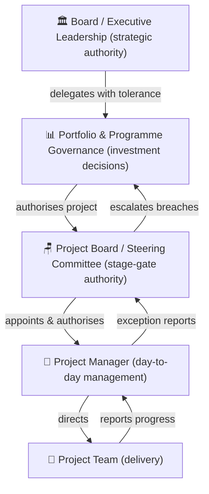
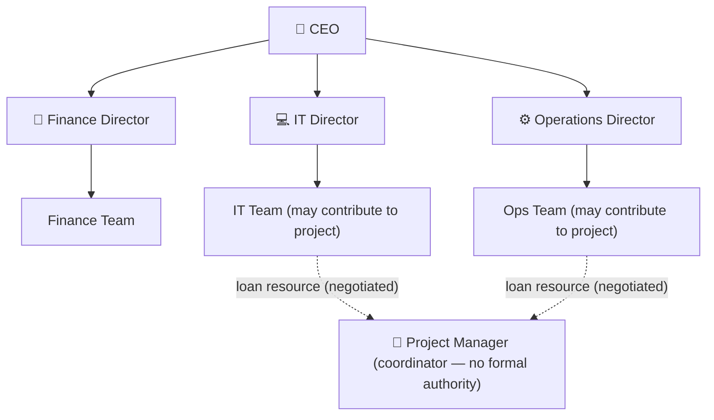
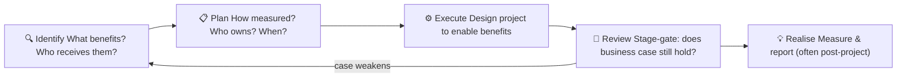

# Module 02 — Project Governance and Organisational Context

> **Good governance is the invisible scaffold that keeps projects standing.** This module explains how authority, accountability, and decision-making are structured around projects — and why getting governance right is as important as any technical skill.

---

## Table of Contents

- [1. What Is Project Governance?](#1-what-is-project-governance)
  - [The governance hierarchy](#the-governance-hierarchy)
  - [Management by exception](#management-by-exception)
- [2. Governance Roles and Structures](#2-governance-roles-and-structures)
  - [The Project Board (Steering Committee)](#the-project-board-steering-committee)
  - [The Project Manager](#the-project-manager)
  - [The Change Control Board (CCB)](#the-change-control-board-ccb)
  - [Terms of Reference](#terms-of-reference)
- [3. Organisational Structures and Their Impact](#3-organisational-structures-and-their-impact)
  - [Functional organisations](#functional-organisations)
  - [Matrix organisations](#matrix-organisations)
  - [Projectised organisations](#projectised-organisations)
- [4. Benefits Management](#4-benefits-management)
  - [Benefits are the reason projects exist](#benefits-are-the-reason-projects-exist)
  - [The benefits lifecycle](#the-benefits-lifecycle)
  - [Benefits vs. outputs vs. outcomes](#benefits-vs-outputs-vs-outcomes)
  - [Key artifacts](#key-artifacts)
- [5. The Project Management Office (PMO)](#5-the-project-management-office-pmo)
  - [What is a PMO?](#what-is-a-pmo)
  - [PMO functions](#pmo-functions)
  - [Is a PMO always needed?](#is-a-pmo-always-needed)
  - [PMO Charter](#pmo-charter)
- [6. Tailoring: Adapting Governance to Context](#6-tailoring-adapting-governance-to-context)
  - [One size does not fit all](#one-size-does-not-fit-all)
  - [Factors to consider when tailoring](#factors-to-consider-when-tailoring)
  - [Tailoring decisions should be documented](#tailoring-decisions-should-be-documented)
- [7. Sustainability and ESG in Projects](#7-sustainability-and-esg-in-projects)
  - [Sustainability as a project dimension](#sustainability-as-a-project-dimension)
  - [Embedding sustainability in governance](#embedding-sustainability-in-governance)
- [Artifacts](#artifacts)
- [Exercises](#exercises)
  - [Exercise 2.1 — Governance gap analysis](#exercise-21-governance-gap-analysis)
  - [Exercise 2.2 — Benefits mapping](#exercise-22-benefits-mapping)
  - [Exercise 2.3 — Tailoring decision](#exercise-23-tailoring-decision)
- [Quiz](#quiz)
- [Related Modules](#related-modules)

---

## 1. What Is Project Governance?

**Project governance** is the framework of authority, accountability, decision-making, and oversight that surrounds a project. It answers:

- Who has the authority to approve the project to proceed?
- Who can authorise changes to scope, budget, or timeline?
- Who must be consulted before key decisions are made?
- Who is accountable if the project fails to deliver value?
- How are decisions escalated when problems exceed the project manager's tolerance?

Governance is not bureaucracy for its own sake. It exists to protect the organisation's investment, to give stakeholders confidence, and to ensure that the project stays aligned with strategic objectives.

### The governance hierarchy

*Each level holds defined authority and escalates only when tolerances are forecast to be breached — management by exception.*

Each level has defined authority and defined thresholds. When a lower level cannot resolve an issue within its authority, it escalates upward.

### Management by exception

A cornerstone of effective governance is **management by exception** — the principle that authority is delegated with tolerances, and only when those tolerances are forecast to be breached does the matter escalate to the next level. This keeps senior decision-makers free of unnecessary operational detail while ensuring they are engaged when it truly matters.

Example: A project manager is authorised to manage a £500,000 budget within a ±10% tolerance. If the project is forecast to exceed £550,000, the PM escalates to the project board. Below that threshold, the PM resolves issues independently.

[↑ Back to top](#table-of-contents)

---

## 2. Governance Roles and Structures

### The Project Board (Steering Committee)

The project board is the group with ultimate responsibility for the project's success at the organisational level. It typically meets at key decision points (stage gates) rather than continuously. Core roles on a project board:

| Role | Responsibility |
|---|---|
| **Executive / Sponsor** | Owns the business case; ultimate accountability; provides resources and political support |
| **Senior User** | Represents those who will use the project's outputs; ensures the product meets their needs |
| **Senior Supplier** | Represents those delivering the project work; ensures technical feasibility and quality |

In smaller organisations, one person may hold multiple roles — but the functions must all be performed.

### The Project Manager

Appointed by the project board, the project manager is responsible for day-to-day management of the project. The PM:

- Plans and monitors all aspects of the project
- Manages the team and stakeholders
- Reports to the project board at agreed intervals
- Escalates issues that exceed tolerances
- Does **not** unilaterally change the project's scope, budget, or timeline beyond authorised limits

### The Change Control Board (CCB)

A CCB (also called a Change Advisory Board) is convened to review, evaluate, and decide on proposed changes to project baselines. On smaller projects, this function may sit with the project board or sponsor. On large programmes, it may be a dedicated standing group.

### Terms of Reference

Every project board and CCB should operate under **Terms of Reference** (ToR) — a document that defines:

- Purpose and scope of authority
- Membership and roles
- Meeting frequency and quorum rules
- Escalation thresholds
- Reporting requirements

[↑ Back to top](#table-of-contents)

---

## 3. Organisational Structures and Their Impact

The host organisation's structure shapes almost every aspect of how the project manager works. This was introduced in Module 01; here we examine the practical governance implications in more detail.

### Functional organisations

*In a functional organisation the PM coordinates across silos but controls no resources — executive sponsorship is critical.*

**PM's position:** Usually a part-time coordinator with no formal authority. Relies entirely on relationships with functional managers who control resources. Governance decisions flow up through functional hierarchies, not a project board.

**Implication:** Projects in functional organisations are high risk without explicit executive sponsorship. Without a sponsor who can direct functional managers to prioritise project work, schedule slippage is common.

### Matrix organisations

The PM exists alongside functional managers. Resources are shared. The balance of authority defines the type:

| Type | PM Authority | Common in |
|---|---|---|
| Weak matrix | Low — functional manager dominates | Finance, legal, government |
| Balanced matrix | Roughly equal authority | Professional services, consulting |
| Strong matrix | PM dominates | Technology, engineering |

**Implication:** Conflict between the PM's priorities and the functional manager's priorities is structural. A clear governance escalation path is essential to resolve resource and priority disputes.

### Projectised organisations

Resources report directly to the PM. The project board oversees strategy and funding, but operational authority rests with the PM.

**Implication:** Maximum PM authority but can create silos between projects. Knowledge and resources may not be shared efficiently.

[↑ Back to top](#table-of-contents)

---

## 4. Benefits Management

### Benefits are the reason projects exist

A project that delivers its scope but produces no benefit is not a success. Benefits management ensures that the organisation is intentional about the value it expects from projects — and that someone is held accountable for realising that value.

### The benefits lifecycle

*Benefits realisation often outlasts the project; a named operational owner must continue tracking after handover.*

1. **Identify** — What benefits are expected? Who will experience them?
2. **Plan** — How will benefits be measured? Who is accountable? When will they be realised?
3. **Execute** — Ensure the project is designed to enable the benefits
4. **Review** — At stage gates, check whether the benefits case still holds
5. **Realise** — Benefits are typically realised after the project ends; someone in operations owns this

### Benefits vs. outputs vs. outcomes

| Term | Definition | Example |
|---|---|---|
| Output | What the project produces | A new warehouse management system |
| Outcome | The change enabled by the output | Warehouse staff can process orders 40% faster |
| Benefit | The value of the outcome | £1.2M per year in operational cost savings |

### Key artifacts

| Artifact | Purpose |
|---|---|
| **Benefits Register** | Catalogues all expected benefits with measurement criteria, realisation dates, and owners |
| **Benefits Realisation Plan** | Describes when and how each benefit will be measured and by whom |

Benefits realisation often outlasts the project itself. The project manager should ensure a named person in operations is responsible for tracking and reporting benefits after handover.

[↑ Back to top](#table-of-contents)

---

## 5. The Project Management Office (PMO)

### What is a PMO?

A Project Management Office is an organisational function that supports projects by providing standards, tools, guidance, and oversight. PMOs vary enormously in their remit:

| PMO Type | Role | Authority |
|---|---|---|
| **Supportive** | Provides templates, training, lessons learned; low control | Advisory only |
| **Controlling** | Sets standards; requires compliance; conducts audits | Compliance enforcer |
| **Directive** | Directly manages projects; resources and PMs report to the PMO | Full management authority |

### PMO functions

Depending on type and maturity, a PMO may:

- Maintain standard project templates and methodology
- Provide training and coaching to project managers
- Perform project health checks and audits
- Aggregate portfolio reporting for senior leadership
- Manage the project scheduling and resource planning toolset
- Maintain the lessons learned repository
- Support post-project reviews

### Is a PMO always needed?

No. A small organisation running three projects per year does not need a PMO. A large enterprise running 200 simultaneous projects does. The question is whether the cost of the PMO is justified by the benefits it provides in consistency, efficiency, and governance quality.

### PMO Charter

When a PMO is established, it should have a **PMO Charter** that defines its mandate, scope, authority, structure, and reporting lines — analogous to the project charter for a project.

[↑ Back to top](#table-of-contents)

---

## 6. Tailoring: Adapting Governance to Context

### One size does not fit all

A safety-critical infrastructure project demands rigorous governance, extensive documentation, and multiple layers of sign-off. A small internal process improvement project requires much lighter-touch oversight. Applying heavyweight governance to a lightweight project wastes resources and creates frustration. Applying lightweight governance to a high-risk project is dangerous.

**Tailoring** is the deliberate adaptation of governance, processes, and artefacts to the project's context.

### Factors to consider when tailoring

| Factor | Implication |
|---|---|
| **Size and complexity** | More complex = more governance structure needed |
| **Risk** | Higher risk = more rigorous controls and reporting |
| **Regulatory environment** | Compliance requirements may mandate specific artefacts and sign-offs |
| **Organisational maturity** | Less mature = more explicit structure needed |
| **Delivery approach** | Agile/adaptive requires different checkpoints than predictive |
| **Strategic importance** | Higher visibility = more senior governance engagement |

### Tailoring decisions should be documented

A **tailoring decision log** records what governance elements were applied, what was adapted or omitted, and the rationale. This creates auditability and prevents ad-hoc erosion of governance under delivery pressure.

[↑ Back to top](#table-of-contents)

---

## 7. Sustainability and ESG in Projects

### Sustainability as a project dimension

Modern project governance increasingly incorporates **Environmental, Social, and Governance (ESG)** considerations. Projects that ignore sustainability create risks — regulatory, reputational, and financial.

The relevant dimensions:

| Dimension | Questions to Ask |
|---|---|
| **Environmental** | What is the project's carbon footprint? Does it comply with environmental regulations? Does it contribute to or mitigate climate risk? |
| **Social** | Who is affected by the project's outcomes? Are communities consulted? Are labour practices ethical throughout the supply chain? |
| **Governance** | Does the project operate with appropriate transparency, accountability, and integrity? |

### Embedding sustainability in governance

Sustainability should not be an afterthought. It belongs in:

- The **business case** (sustainability costs and benefits as evaluation criteria)
- The **risk register** (environmental and social risks)
- **Procurement decisions** (supplier sustainability credentials)
- **Acceptance criteria** (ESG compliance as a delivery requirement)
- **Lessons learned** (sharing what worked in reducing environmental and social impact)

Organisations that build sustainability into project governance create compounding value — each project incrementally improves the organisation's ESG performance.

[↑ Back to top](#table-of-contents)

---

## Artifacts

The following artefacts are introduced or referenced in this module. Templates are available in the `/templates/` folder.

| Artifact | Description | Template |
|---|---|---|
| **Project Governance Framework** | Defines the overall governance structure, roles, and escalation paths for the project | (describe in project charter) |
| **Terms of Reference (ToR)** | Defines the mandate, membership, and operating rules of the project board or CCB | — |
| **Benefits Register** | Catalogues expected benefits with measurement criteria and owners | [benefits-register.md](../templates/benefits-register.md) |
| **Benefits Realisation Plan** | Plans how and when benefits will be measured post-project | — |
| **PMO Charter** | Defines the PMO's mandate, authority, and structure | — |
| **Tailoring Decision Log** | Records governance adaptations made for this project | — |

[↑ Back to top](#table-of-contents)

---

## Exercises

### Exercise 2.1 — Governance gap analysis

Select a project you are familiar with, or choose a publicly documented project (e.g., UK Universal Credit, Boeing 737 MAX software, Sydney Metro expansion).

1. Who held the role of sponsor/executive? Was accountability clear?
2. Was there a project board or steering committee? Did it meet regularly?
3. Was management by exception practised, or did the board micromanage?
4. What governance gaps, if any, contributed to challenges or failures?

**Expected output:** A one-page governance gap analysis.

---

### Exercise 2.2 — Benefits mapping

You are the project manager for a project to introduce a new employee onboarding platform at a company of 500 people. The current onboarding process is entirely manual and takes 3 weeks per new hire.

1. Identify at least 4 expected benefits.
2. For each benefit, define a measurable indicator and a realistic realisation timeframe.
3. Assign a benefit owner (use a role title, not a name).

**Expected output:** A completed Benefits Register with at least 4 rows.

---

### Exercise 2.3 — Tailoring decision

You are setting up governance for the following two projects. For each, recommend an appropriate governance structure (project board composition, reporting frequency, and documentation requirements). Justify your tailoring decisions.

**Project A:** A 6-week internal project to update the company intranet. Budget: £15,000. Low risk. No regulatory requirements.

**Project B:** A 3-year project to build a new 200-bed hospital wing. Budget: £80M. High risk. Multiple regulatory requirements. Multiple contractors.

**Expected output:** Two short governance design recommendations with justifications.

[↑ Back to top](#table-of-contents)

---

## Quiz

**Question 1:** What is the primary purpose of management by exception in project governance?

- A) To allow the project manager to ignore risks below a certain threshold
- B) To keep senior decision-makers free of operational detail while ensuring escalation when needed
- C) To prevent the project board from becoming involved in day-to-day decisions at all
- D) To reduce the number of project reports required

Reveal Answer

**B) To keep senior decision-makers free of operational detail while ensuring escalation when needed.** Management by exception defines tolerance levels so that the PM handles normal variation independently, but brings significant deviations to the project board.

---

**Question 2:** Which project board role is primarily accountable for ensuring the project's outputs are fit for purpose from the users' perspective?

- A) Executive / Sponsor
- B) Senior Supplier
- C) Senior User
- D) Project Manager

Reveal Answer

**C) Senior User.** The Senior User represents those who will work with or benefit from the project's outputs, ensuring that the product meets their operational needs.

---

**Question 3:** A PMO that sets mandatory standards and conducts audits for compliance is best described as which type?

- A) Supportive
- B) Controlling
- C) Directive
- D) Advisory

Reveal Answer

**B) Controlling.** A controlling PMO defines and enforces standards across projects, including requiring compliance and conducting audits.

---

**Question 4:** True or False: Benefits realisation is the project manager's responsibility and ends when the project is closed.

Reveal Answer

**False.** Benefits are typically realised after the project has closed and the outputs are in operational use. Responsibility for benefit realisation is transferred to an operational owner at handover. The PM's role is to ensure the project is set up to enable the benefits, not to realise them personally.

---

**Question 5:** Which factor would most strongly suggest that a project needs heavier-than-standard governance?

- A) The project manager is experienced
- B) The project is strategically critical and involves high regulatory risk
- C) The project team is co-located
- D) The project budget is under £50,000

Reveal Answer

**B) The project is strategically critical and involves high regulatory risk.** Strategic importance and regulatory risk increase the need for rigorous governance, formal documentation, and multiple layers of oversight.

---

**Question 6:** What document should define the operating rules, membership, and authority of a project board?

- A) Project Management Plan
- B) Risk Register
- C) Terms of Reference
- D) Project Charter

Reveal Answer

**C) Terms of Reference.** The Terms of Reference defines the mandate, membership, meeting rules, quorum requirements, and authority of the project board or any committee.

[↑ Back to top](#table-of-contents)

---

**Previous Module:** [Module 01 — Foundations of Project Management](01-foundations.md)
**Next Module:** [Module 03 — Project Initiation](03-initiation.md)

---

## Related Modules

| Module | Relationship |
|---|---|
| [01 — Foundations](01-foundations.md) | Governance structures extend the lifecycle and organisational context introduced there |
| [03 — Initiation](03-initiation.md) | The business case produced in governance is the primary input to project initiation |
| [07 — Closing](07-closing.md) | Benefits realisation and post-project review close the governance loop opened here |
| [15b — Professional Practice](15b-professional-practice.md) | PM competency frameworks and CPD extend the professional governance themes in this module |

---

&copy; 2026 UncleJs &mdash; Licensed under [CC BY-NC-SA 4.0](https://creativecommons.org/licenses/by-nc-sa/4.0/)
