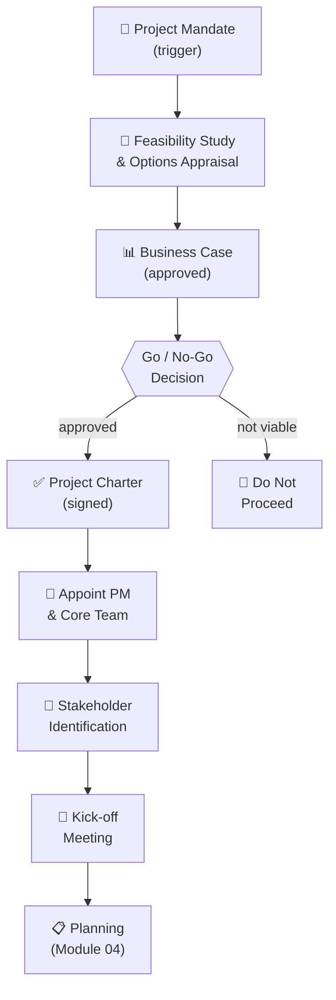
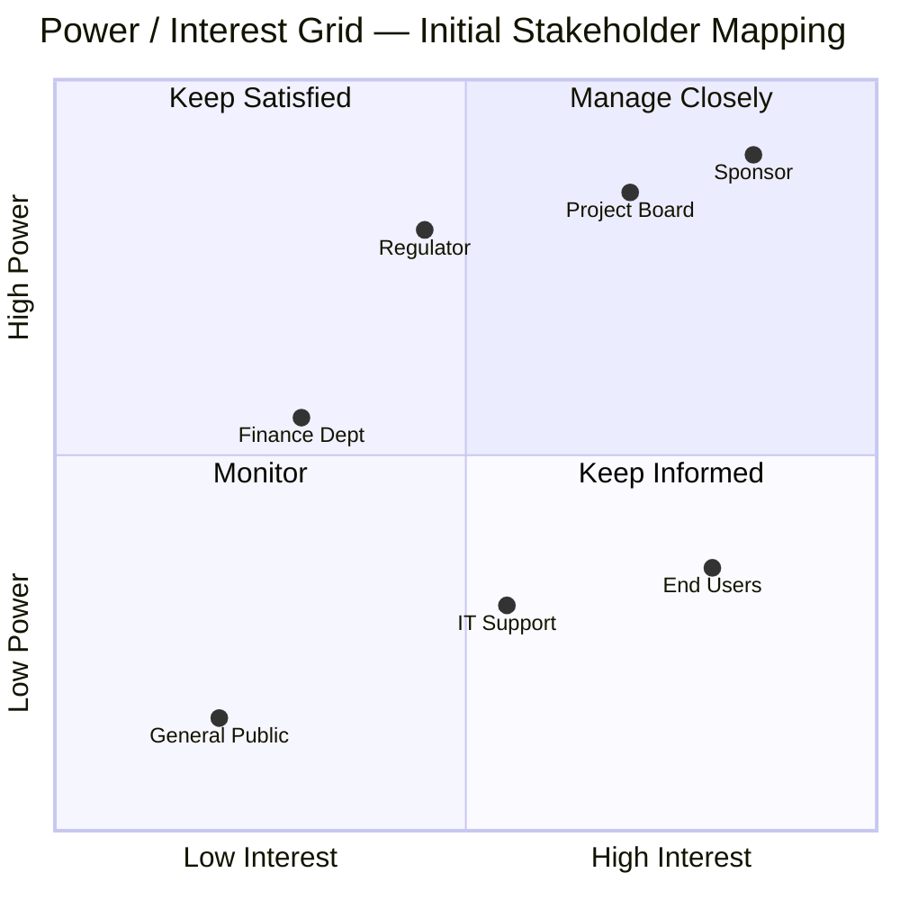

# Module 03 — Project Initiation


> **A project without a clear foundation will drift from the moment it starts.** This module covers everything that happens before work begins — from identifying the need, to appointing the project manager, to holding the kick-off meeting.

---

## Table of Contents

- [1. Pre-Project: Identifying the Need](#1-pre-project-identifying-the-need)
- [2. Feasibility Assessment](#2-feasibility-assessment)
- [3. Project Selection Methods](#3-project-selection-methods)
- [4. The Business Case](#4-the-business-case)
- [5. The Project Charter](#5-the-project-charter)
- [6. Appointing the Project Manager and Initial Team](#6-appointing-the-project-manager-and-initial-team)
- [7. Initial Stakeholder Identification](#7-initial-stakeholder-identification)
- [8. Capturing Assumptions and Constraints](#8-capturing-assumptions-and-constraints)
- [9. The Kick-off Meeting](#9-the-kick-off-meeting)
- [Artifacts](#artifacts)
- [Exercises](#exercises)
- [Quiz](#quiz)

---

## 1. Pre-Project: Identifying the Need

Before a project is authorised, there must be a **reason** for it. Projects are triggered by a recognised need, problem, or opportunity. Common triggers include:

| Trigger Type | Examples |
|---|---|
| **Problem to solve** | Customer complaints about product quality; system downtime; process inefficiency |
| **Opportunity to exploit** | New market segment; new technology that cuts costs; competitive advantage |
| **Regulatory requirement** | New data privacy law; safety compliance deadline |
| **Strategic decision** | Board decides to enter a new geography; organisation acquires a competitor |
| **Stakeholder request** | Client requests a new service; government mandates a change |

### The project mandate

The trigger is often captured in a **project mandate** — an informal or formal document (sometimes just an email or executive decision) that identifies the problem/opportunity, proposes a response, and initiates the pre-project work. It is the starting gun, not the finishing line.

The mandate does not authorise the project to proceed. It authorises the work of defining whether the project should proceed.

[↑ Back to top](#table-of-contents)

---

## 2. Feasibility Assessment

Before committing significant resources, the organisation must determine whether the project is **viable**. A feasibility study examines four dimensions:

| Dimension | Key Questions |
|---|---|
| **Technical feasibility** | Can we actually build or implement this? Do we have the technology and technical skills? |
| **Financial feasibility** | Do the expected benefits outweigh the costs? Can we fund this? |
| **Operational feasibility** | Will the output work in the operational environment? Can users adapt? |
| **Strategic feasibility** | Does this align with our strategy and priorities? Is now the right time? |

### Options appraisal

A feasibility study should not just assess whether one approach is viable — it should consider **alternatives**:

- **Do nothing** — What happens if we don't act? This is always an option.
- **Minimum viable option** — What is the least we could do to address the need?
- **Preferred option** — The recommended solution.
- **Full solution option** — The maximum-scope approach.

Presenting options forces a genuine decision rather than rubber-stamping a predetermined outcome.

[↑ Back to top](#table-of-contents)

---

## 3. Project Selection Methods

When organisations have more project opportunities than resources, they must choose. Selection methods provide rigour to that decision:

### Financial methods

| Method | How It Works | Pros / Cons |
|---|---|---|
| **Net Present Value (NPV)** | Discounts future cash flows to today's value; positive NPV = value-creating | Rigorous; requires reliable forecasts |
| **Return on Investment (ROI)** | (Benefit − Cost) ÷ Cost × 100 | Simple; easy to compare; ignores time value of money |
| **Payback Period** | How long until cumulative benefits recover the investment | Intuitive; ignores post-payback returns |
| **Internal Rate of Return (IRR)** | The discount rate at which NPV = 0 | Comparable across projects; complex to calculate |

### Scoring models

For projects where financial metrics alone don't capture the full picture (e.g., regulatory compliance, strategic fit), a **weighted scoring model** assigns scores across multiple criteria (strategic alignment, risk, cost, benefit, feasibility) and weights them by importance.

```
Criterion        Weight    Project A    Project B
Strategic fit    30%       4 × 0.30     2 × 0.30
Financial return 25%       3 × 0.25     5 × 0.25
Risk level       20%       5 × 0.20     2 × 0.20
Technical ease   15%       3 × 0.15     4 × 0.15
Urgency          10%       2 × 0.10     4 × 0.10
                           ─────────    ─────────
Weighted total             3.55         3.25
```

No model removes the need for human judgement — but they make the judgement explicit and auditable.

[↑ Back to top](#table-of-contents)

---

## 4. The Business Case

The business case is the **most important document in a project**. It is the authorising justification for everything that follows. If the business case cannot be made, the project should not proceed.

### What a business case contains

| Section | Content |
|---|---|
| **Executive summary** | One-page overview of the decision being requested |
| **Background and context** | What problem or opportunity prompted this? |
| **Options considered** | Including "do nothing" |
| **Recommended option** | With rationale |
| **Expected benefits** | Quantified where possible; measurement criteria |
| **Costs** | Capital costs, running costs, transition costs |
| **Risks** | Top risks and their impact on the case |
| **Timeline** | High-level milestones |
| **Assumptions** | What must be true for the benefits to materialise |
| **Recommendation** | Explicitly requests approval to proceed |

### The business case is a living document

A common mistake is to treat the business case as a one-time approval document. In reality, it should be **reviewed at every stage gate**:

- Has the cost estimate changed significantly?
- Are the expected benefits still achievable?
- Has the risk profile changed?
- Are there better alternatives available now?

If the business case no longer justifies the project, the right decision is to stop — regardless of how much has already been spent (sunk cost fallacy).

[↑ Back to top](#table-of-contents)

---

## 5. The Project Charter

Once the decision to proceed is made, the project is formally authorised through a **project charter** (also called a project brief or initiation document, depending on the organisation).

### What the project charter does

- Formally **authorises the project** to exist
- **Appoints the project manager** and grants them authority to apply resources
- Establishes the **project's objectives and high-level scope**
- Documents **initial constraints and assumptions**
- Names the **sponsor** and key stakeholders

### What the project charter contains

| Element | Description |
|---|---|
| Project name and reference | Unique identifier |
| Purpose and objectives | Why the project exists; what it must achieve |
| High-level scope | What is in scope; what is explicitly excluded |
| Key deliverables | What the project will produce |
| High-level timeline | Key milestones and projected end date |
| Budget authority | Approved funding envelope |
| Project manager | Name, authority level |
| Sponsor | Name, role, responsibilities |
| Key stakeholders | Initial list |
| Assumptions and constraints | High-level summary |
| Sign-off | Sponsor (and board, if applicable) signature |

### Charter vs. business case

The business case justifies *whether* to do the project. The charter authorises *how* to proceed. They are related but distinct:


*Initiation establishes the mandate before any commitment to delivery. The business case is the go/no-go gateway.*

[↑ Back to top](#table-of-contents)

---

## 6. Appointing the Project Manager and Initial Team

### Appointing the PM

The project manager should be appointed **as early as possible** — ideally before planning begins, so they can own the plan rather than inherit one. The sponsor selects the PM based on:

- Technical domain knowledge (relevant but not essential)
- PM skills and experience (essential)
- Availability and organisational fit
- Leadership and communication ability

### Initial team formation

At initiation, the full project team is rarely assembled. However, **core team members** — those who will lead major workstreams — should be identified and engaged during initiation to:

- Contribute to planning from the start
- Identify risks and constraints in their areas
- Build a sense of ownership in the plan

[↑ Back to top](#table-of-contents)

---

## 7. Initial Stakeholder Identification

Stakeholders are anyone who may affect, be affected by, or perceive themselves to be affected by the project. **Identifying stakeholders early** is critical — late stakeholder discovery is a frequent source of scope changes, delays, and resistance.

### How to identify stakeholders

- Review the business case — who benefits? Who pays?
- Identify who must approve deliverables
- Identify operational functions impacted by the change
- Consider external parties: regulators, customers, suppliers, community groups
- Ask existing stakeholders: "Who else should we be talking to?"

### The initial stakeholder register

At initiation, capture a basic register covering:

- Name / role
- Organisation / department
- Interest in the project
- Level of influence
- Initial attitude (supportive / neutral / resistant)
- Preferred communication channel

This register will be expanded and analysed in depth in [Module 09 — Stakeholder Management](09-stakeholder-management.md).


*Plot each stakeholder to decide the right engagement strategy. Positions shift as the project progresses — revisit regularly.*

[↑ Back to top](#table-of-contents)

---

## 8. Capturing Assumptions and Constraints

### Assumptions

An assumption is something accepted as true without proof. All projects operate under assumptions — the problem arises when they are **implicit** (undocumented and unchallenged). Documenting assumptions:

- Makes them visible and challengeable
- Connects them to risks (if an assumption is wrong, what happens?)
- Creates accountability for monitoring them

**Examples of project assumptions:**
- The new system will integrate with the existing ERP without custom development
- The regulatory approval will be granted by Q2
- All three required subject matter experts will be available for the full planning phase

### Constraints

A constraint is a limiting condition — a boundary the project cannot cross. Common constraint types:

| Type | Example |
|---|---|
| **Time** | "Must go live before the financial year end" |
| **Budget** | "Maximum approved budget is £250,000" |
| **Resource** | "Only one senior developer is available" |
| **Technology** | "Must be built on the existing cloud platform" |
| **Regulatory** | "Must comply with GDPR data handling requirements" |

Constraints are **facts**, not risks. They define the playing field. The project plan must accommodate them — unless the sponsor explicitly relaxes a constraint.

### The Assumption and Constraint Log

All assumptions and constraints should be documented in a log maintained throughout the project. Each entry should include the owner, the date captured, the associated risk (for assumptions), and the current status.

[↑ Back to top](#table-of-contents)

---

## 9. The Kick-off Meeting

The kick-off meeting is the project's **formal launch event**. It signals the transition from initiation to active project work and brings all key participants together to establish a shared understanding.

### Two types of kick-off

| Type | Audience | Purpose |
|---|---|---|
| **Internal kick-off** | Project team + key internal stakeholders | Align on objectives, roles, plan, and ways of working |
| **External kick-off** | Customer / sponsor / external stakeholders | Set expectations, confirm scope, build relationships |

These may be the same meeting or separate events, depending on the project's context.

### What a kick-off meeting covers

1. **Welcome and introductions** — who is in the room and why
2. **Project background and objectives** — why we are here
3. **Scope overview** — what we will and will not deliver
4. **Governance and roles** — who decides what; how we escalate
5. **High-level plan and milestones** — the timeline in summary
6. **Risks and constraints** — key known risks; what we're watching
7. **Communication approach** — how we report; how often we meet
8. **Next steps** — what happens immediately after this meeting

A kick-off meeting without a written agenda and documented minutes produces no lasting alignment. Both documents should be prepared in advance and distributed after.

[↑ Back to top](#table-of-contents)

---

## Artifacts

| Artifact | Description | Template |
|---|---|---|
| **Project Mandate** | Trigger document initiating pre-project work | — |
| **Feasibility Study / Options Appraisal** | Assesses viability and alternatives | — |
| **Business Case** | Justifies the project; decision input for sponsors | [business-case.md](../templates/business-case.md) |
| **Project Charter** | Formally authorises the project and the PM | [project-charter.md](../templates/project-charter.md) |
| **Initial Stakeholder Register** | Catalogue of stakeholders with initial analysis | [stakeholder-register.md](../templates/stakeholder-register.md) |
| **Assumption and Constraint Log** | Documents all known assumptions and constraints | [assumption-constraint-log.md](../templates/assumption-constraint-log.md) |
| **Kick-off Meeting Agenda** | Structured agenda for the project launch meeting | [meeting-agenda.md](../templates/meeting-agenda.md) |
| **Kick-off Meeting Minutes** | Record of decisions, actions, and attendees | [meeting-minutes.md](../templates/meeting-minutes.md) |

[↑ Back to top](#table-of-contents)

---

## Exercises

### Exercise 3.1 — Write a business case summary

**Scenario:** A regional council wants to replace its paper-based planning application process with a digital self-service portal. Currently, applicants submit paper forms; processing takes 28 days on average; the error rate is 18%; and customer satisfaction is 34%.

Write a one-page business case summary covering: background, at least two options (including do nothing), recommended option, expected benefits (quantify where you can), key risks, and a recommendation.

**Expected output:** A business case summary of approximately 400–600 words, structured using the sections from this module.

---

### Exercise 3.2 — Draft a project charter

Using the scenario from Exercise 3.1 (assume the business case has been approved), draft a project charter for the digital planning portal project.

Include: project name, purpose, objectives (SMART), scope (in scope and out of scope), key deliverables, high-level milestones, budget authority, PM name (fictitious), sponsor, top 3 assumptions, and top 3 constraints.

**Expected output:** A completed project charter using the [template](../templates/project-charter.md).

---

### Exercise 3.3 — Stakeholder identification sprint

Still using the digital planning portal scenario, brainstorm a comprehensive list of stakeholders. For each, note:
- Their role or organisation
- Their primary interest in the project
- Whether their initial attitude is likely to be supportive, neutral, or resistant — and why

Aim for at least 10 stakeholders across internal, external, and regulatory categories.

**Expected output:** An initial stakeholder register with at least 10 entries.

[↑ Back to top](#table-of-contents)

---

## Quiz

**Question 1:** Which document formally authorises the project and appoints the project manager?

- A) Business Case
- B) Feasibility Study
- C) Project Charter
- D) Project Mandate

<details>
<summary>Reveal Answer</summary>

**C) Project Charter.** The charter formally authorises the project's existence and gives the PM the authority to apply resources. The business case justifies *whether* to proceed; the charter authorises *how*.

</details>

---

**Question 2:** A feasibility study should always include which option, regardless of what the preferred approach is?

- A) Maximum scope option
- B) Outsourcing option
- C) Do nothing option
- D) Phased delivery option

<details>
<summary>Reveal Answer</summary>

**C) Do nothing option.** The "do nothing" baseline shows what happens if no action is taken, making it the essential comparator for all other options.

</details>

---

**Question 3:** The project mandate, business case, and project charter are three different documents. Place them in the correct chronological order.

<details>
<summary>Reveal Answer</summary>

**1. Project Mandate → 2. Business Case → 3. Project Charter.**

The mandate triggers the work. The business case makes the case for proceeding. The charter formally authorises proceeding and appoints the PM.

</details>

---

**Question 4:** A project team assumes that regulatory approval will be granted before the launch date. This is later found to be incorrect, causing a 3-month delay. This is an example of:

- A) A constraint becoming a risk
- B) An undocumented assumption materialising as a risk
- C) Scope creep
- D) A governance failure

<details>
<summary>Reveal Answer</summary>

**B) An undocumented assumption materialising as a risk.** Had the assumption been logged, it would have triggered a risk entry: "If regulatory approval is delayed, the project launch will be delayed." A response plan could have been developed in advance.

</details>

---

**Question 5:** What is the primary difference between an assumption and a constraint?

- A) Assumptions are documented; constraints are not
- B) Assumptions are accepted as true without proof; constraints are fixed limiting conditions
- C) Constraints affect cost; assumptions affect time
- D) There is no practical difference

<details>
<summary>Reveal Answer</summary>

**B) Assumptions are accepted as true without proof; constraints are fixed limiting conditions.** Assumptions introduce risk (they might be wrong). Constraints define boundaries that the plan must work within.

</details>

---

**Question 6:** When should the business case be reviewed again after initial approval?

- A) Never — it was approved; that decision is final
- B) Only if the project goes significantly over budget
- C) At every major stage gate or phase review
- D) Only at project closure

<details>
<summary>Reveal Answer</summary>

**C) At every major stage gate or phase review.** The business case is a living document. If costs rise significantly, benefits shrink, or the external environment changes, the case for continuing must be re-evaluated.

</details>

[↑ Back to top](#table-of-contents)

---

**Previous Module:** [Module 02 — Project Governance and Organisational Context](02-governance.md)
**Next Module:** [Module 04 — Project Planning](04-planning.md)

---

## Related Modules

| Module | Relationship |
|---|---|
| [02 — Governance and Business Case](02-governance.md) | The business case and governance structures that authorise initiation are covered there |
| [04 — Planning](04-planning.md) | The project charter and scope statement from initiation feed directly into the planning phase |
| [09 — Stakeholder Management](09-stakeholder-management.md) | The stakeholder register first built at initiation is managed throughout in Module 09 |
| [15a — Integration, Hybrid, and Agile](15a-integration-hybrid-agile.md) | Integration management shows how all initiation outputs must remain coherent throughout |

---

&copy; 2026 UncleJs &mdash; Licensed under [CC BY-NC-SA 4.0](https://creativecommons.org/licenses/by-nc-sa/4.0/)
