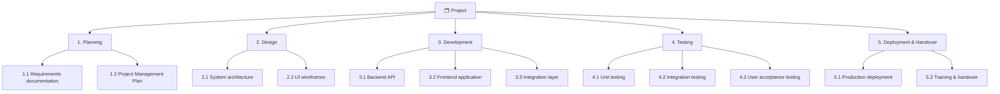
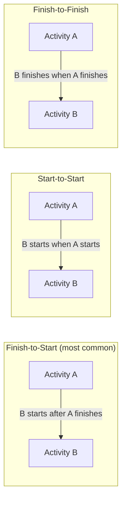
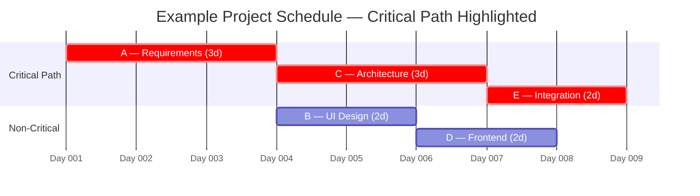
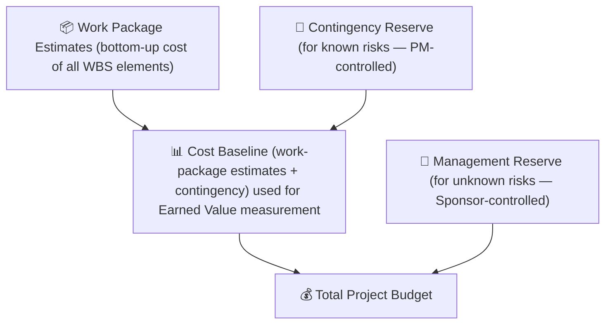

# Module 04 — Project Planning

> **Failing to plan is planning to fail — but over-planning is its own failure.** This module covers how to build a plan that is detailed enough to guide execution and flexible enough to survive contact with reality.

---

## Table of Contents

- [1. Planning Principles](#1-planning-principles)
  - [Plans are hypotheses, not contracts](#plans-are-hypotheses-not-contracts)
  - [Progressive elaboration](#progressive-elaboration)
  - [The planning sequence](#the-planning-sequence)
- [2. Scope Planning](#2-scope-planning)
  - [Requirements elicitation](#requirements-elicitation)
  - [Product scope vs. project scope](#product-scope-vs-project-scope)
  - [The Scope Statement](#the-scope-statement)
  - [Work Breakdown Structure (WBS)](#work-breakdown-structure-wbs)
  - [WBS Dictionary](#wbs-dictionary)
- [3. Schedule Planning](#3-schedule-planning)
  - [From work packages to activities](#from-work-packages-to-activities)
  - [Dependency types](#dependency-types)
  - [Estimating techniques](#estimating-techniques)
  - [Critical Path Method (CPM)](#critical-path-method-cpm)
  - [Schedule compression](#schedule-compression)
  - [The Gantt chart](#the-gantt-chart)
- [4. Cost Planning and Budgeting](#4-cost-planning-and-budgeting)
  - [Resource cost estimating](#resource-cost-estimating)
  - [Budget components](#budget-components)
  - [Cash flow planning](#cash-flow-planning)
  - [Introduction to Earned Value Management (EVM)](#introduction-to-earned-value-management-evm)
- [5. Resource Planning](#5-resource-planning)
  - [Identifying resources](#identifying-resources)
  - [RACI Matrix](#raci-matrix)
  - [Resource leveling vs. smoothing](#resource-leveling-vs-smoothing)
  - [Organizational Breakdown Structure (OBS)](#organizational-breakdown-structure-obs)
- [6. The Project Management Plan](#6-the-project-management-plan)
  - [What the PMP contains](#what-the-pmp-contains)
  - [The PMP vs. the project plan](#the-pmp-vs-the-project-plan)
- [7. Baseline Authorization](#7-baseline-authorization)
  - [What is a baseline?](#what-is-a-baseline)
  - [Why baselines matter](#why-baselines-matter)
  - [Approving the baseline](#approving-the-baseline)
  - [Baseline integrity](#baseline-integrity)
- [Artifacts](#artifacts)
- [Exercises](#exercises)
  - [Exercise 4.1 — Build a WBS](#exercise-41--build-a-wbs)
  - [Exercise 4.2 — Schedule a small project](#exercise-42--schedule-a-small-project)
  - [Exercise 4.3 — Build a budget](#exercise-43--build-a-budget)
- [Quiz](#quiz)
- [Related Modules](#related-modules)

---

## 1. Planning Principles

### Plans are hypotheses, not contracts

A plan is the best current understanding of how the project will be executed. It will change. The goal of planning is not to produce a perfect document but to think through the work deeply enough that:

- Risks and dependencies are visible before they cause problems
- The team understands what they are doing and in what order
- Stakeholders have a shared, agreed baseline to measure against
- Changes can be assessed against something concrete

### Progressive elaboration

It is rarely possible — or useful — to plan every detail from day one. **Rolling wave planning** allows near-term work to be planned in detail while future work is planned at a higher level, with detail added as understanding grows.

### The planning sequence

*Each step feeds the next — building a Gantt chart before defining scope produces a schedule disconnected from reality.*

Each step feeds the next. Jumping straight to "build a Gantt chart" without first defining scope and the WBS produces a schedule disconnected from reality.

[↑ Back to top](#table-of-contents)

---

## 2. Scope Planning

### Requirements elicitation

Before scope can be defined, **requirements must be gathered**. Common techniques:

| Technique | Best Used When |
|---|---|
| **Interviews** | Deep individual input needed; sensitive topics |
| **Workshops** | Group alignment; resolving conflicting requirements |
| **Observation** | Understanding how users actually work (not how they say they work) |
| **Document analysis** | Requirements embedded in existing system documentation |
| **Prototyping** | Requirements are unclear; visual or working model helps clarify |
| **Surveys / questionnaires** | Large, dispersed user population |

### Product scope vs. project scope

- **Product scope**: the features and functions of the deliverable (what the thing does)
- **Project scope**: all the work required to deliver the product (what the team does)

Both must be defined. A well-defined product scope with a vague project scope leaves execution exposed.

### The Scope Statement

The scope statement formally documents:

- What is **in scope** — deliverables and work included
- What is **out of scope** — explicitly excluded (reduces scope creep)
- **Acceptance criteria** — how we know when each deliverable is complete
- **Assumptions and constraints** — carried forward from initiation

### Work Breakdown Structure (WBS)

The WBS is the hierarchical decomposition of the total project scope into work packages. It is the most important single planning tool in project management.

**Rules for a good WBS:**
1. Each element represents a deliverable, not an activity
2. Each work package should be estimable, assignable, and controllable
3. The 100% rule: the WBS must capture 100% of the project scope — nothing more, nothing less
4. Typically 3–5 levels deep; deeper for complex projects

*The WBS decomposes scope into deliverables (not activities). The 100% rule: the WBS must capture every element of scope — nothing more, nothing less.*

### WBS Dictionary

Each WBS element should have a **WBS Dictionary entry** describing:

- Scope of work
- Acceptance criteria
- Owner
- Assumptions
- Schedule and budget information (once defined)

[↑ Back to top](#table-of-contents)

---

## 3. Schedule Planning

### From work packages to activities

Work packages from the WBS are decomposed into **activities** — the specific, time-bound actions that produce the work package outputs. Activities are what go on the schedule.

### Dependency types

Activities are linked by **dependencies** (also called logical relationships):

| Type | Meaning | Example |
|---|---|---|
| **Finish-to-Start (FS)** | B cannot start until A finishes | Testing cannot start until coding finishes |
| **Start-to-Start (SS)** | B cannot start until A starts | Documentation can start when development starts |
| **Finish-to-Finish (FF)** | B cannot finish until A finishes | Testing finishes when bug-fixing finishes |
| **Start-to-Finish (SF)** | B cannot finish until A starts | Rare; used in handover scenarios |

**Leads** allow overlap (e.g., start B 2 days before A finishes). **Lags** enforce delays (e.g., wait 3 days after A finishes before starting B).

*Most real-world schedules use Finish-to-Start. Leads and lags refine timing without changing the dependency type.*

### Estimating techniques

| Technique | How It Works | Best For |
|---|---|---|
| **Expert judgment** | Ask experienced practitioners | All situations; most practical |
| **Analogous** | Use actuals from similar past activities | Early-stage estimates |
| **Parametric** | Multiply a unit rate by quantity | Predictable, measurable work |
| **Three-point (PERT)** | E = (O + 4M + P) ÷ 6 | Uncertain activities |
| **Bottom-up** | Estimate each sub-task; aggregate | Detailed planning phase |

### Critical Path Method (CPM)

The **critical path** is the longest path through the project network — it determines the minimum project duration. Any delay to a critical path activity delays the entire project.

**Float (slack)** is the amount of time an activity can slip without affecting the project end date. Critical path activities have zero float.

*Critical path activities (red) have zero float — any delay pushes the end date. Non-critical activities have float and can slip within limits.*

### Schedule compression

When the initial schedule is too long:

- **Fast-tracking**: perform activities in parallel that were planned sequentially. Increases risk.
- **Crashing**: add resources to critical path activities to reduce their duration. Increases cost.

Neither is free — always assess the trade-offs before compressing.

### The Gantt chart

The Gantt chart remains the most widely used schedule visualization:

- Horizontal bars represent activities and durations
- Dependencies shown as connecting arrows
- Milestones shown as diamonds
- Critical path highlighted

The schedule is more than a Gantt chart, but for most stakeholders, the Gantt is what "the plan" looks like.

[↑ Back to top](#table-of-contents)

---

## 4. Cost Planning and Budgeting

### Resource cost estimating

Costs flow from resources. For each activity or work package, estimate:

- **Labor**: hours × hourly rate for each team member
- **Materials**: unit costs × quantities
- **Equipment**: rental or depreciation costs
- **External services**: contractor or vendor quotes
- **Travel and facilities**: where applicable

### Budget components

*The cost baseline is the time-phased S-curve used in EVM. The management reserve sits above it and is not the PM's to spend.*

The **cost baseline** is the time-phased spending plan against which Earned Value is measured. The **management reserve** sits above it and is controlled by the sponsor, not the PM.

### Cash flow planning

The budget tells you *how much* will be spent. The cash flow plan tells you *when*. This matters for:

- Organization's cash management
- Identifying funding milestones
- Contract payment scheduling

### Introduction to Earned Value Management (EVM)

EVM is covered in depth in [Module 06](06-monitoring-control.md). At the planning stage, establish the foundation:

| EVM Term | Definition |
|---|---|
| **Budget at Completion (BAC)** | Total authorized budget for the project |
| **Planned Value (PV)** | Budgeted cost of scheduled work at a point in time |
| **Earned Value (EV)** | Budgeted cost of work actually performed |
| **Actual Cost (AC)** | Actual cost incurred for work performed |

The cost baseline (time-phased PV) is the "S-curve" that forms the EVM measurement baseline.

[↑ Back to top](#table-of-contents)

---

## 5. Resource Planning

### Identifying resources

For each work package, identify:

- **Who** will do it (roles, not necessarily names at this stage)
- **What skills** are required
- **How much** effort (person-days/hours)
- **When** availability is needed
- **What physical resources** are required (equipment, facilities, materials)

### RACI Matrix

The RACI matrix — a specific form of Responsibility Assignment Matrix (RAM) — assigns accountability across the team for each deliverable or major activity. RACI stands for **Responsible, Accountable, Consulted, Informed**:

| | PM | Developer | Business Analyst | Sponsor |
|---|---|---|---|---|
| Requirements document | A | I | R | C |
| Architecture design | C | R | C | I |
| User acceptance test | A | C | R | C |
| Go-live approval | C | I | I | R/A |

- **R** = Responsible (does the work)
- **A** = Accountable (owns the outcome; only one per row)
- **C** = Consulted (input required before completion)
- **I** = Informed (notified of outcome)

One common mistake: assigning multiple "A" entries per row. Accountability must be singular.

### Resource leveling vs. smoothing

- **Resource leveling**: adjusts schedule to fit resource constraints — may extend the project
- **Resource smoothing**: redistributes work within existing float to reduce peaks — does not extend the project

Both are performed after the initial schedule is built to produce a realistic, resource-constrained plan.

### Organizational Breakdown Structure (OBS)

The OBS maps project work to the organizational units responsible. Overlaying the WBS with the OBS produces the RAM (Responsibility Assignment Matrix) — the basis for RACI.

[↑ Back to top](#table-of-contents)

---

## 6. The Project Management Plan

The **Project Management Plan (PMP)** is the master document for the project. It does not contain the project content — it describes *how the project will be managed*.

### What the PMP contains

| Subsidiary Plan | Covers |
|---|---|
| **Scope Management Plan** | How scope will be defined, documented, and controlled |
| **Schedule Management Plan** | How the schedule will be developed, maintained, and controlled |
| **Cost Management Plan** | How costs will be estimated, budgeted, and controlled |
| **Resource Management Plan** | How physical and human resources will be acquired and managed |
| **Communications Management Plan** | Who gets what information, when, how, and from whom |
| **Risk Management Plan** | How risks will be identified, assessed, and responded to |
| **Quality Management Plan** | Quality objectives, standards, assurance and control activities |
| **Procurement Management Plan** | How vendors will be selected and contracts managed |
| **Stakeholder Engagement Plan** | How stakeholders will be engaged throughout the project |
| **Change Management Plan** | How changes to baselines will be requested, assessed, and approved |
| **Configuration Management Plan** | How document and product versions will be controlled |

Each subsidiary plan can be a section of the PMP or a separate document — the choice depends on complexity and organizational standards.

### The PMP vs. the project plan

A common confusion: people say "the project plan" when they mean "the schedule." The schedule is one input to the PMP. The PMP is the complete set of instructions for how to run the project.

[↑ Back to top](#table-of-contents)

---

## 7. Baseline Authorization

### What is a baseline?

A **baseline** is the approved version of a plan. The three primary baselines are:

| Baseline | What It Captures |
|---|---|
| **Scope baseline** | Approved scope statement + WBS + WBS Dictionary |
| **Schedule baseline** | Approved project schedule |
| **Cost baseline** | Approved time-phased budget (PV curve) |

Together these form the **Performance Measurement Baseline (PMB)** — used in Earned Value Management.

### Why baselines matter

Without a baseline, there is no meaningful measurement. "We're running late" means nothing unless you can show late against what. Baselines make variance visible and change control meaningful.

### Approving the baseline

The project sponsor (and/or project board) formally approves the baselines before execution begins. This is the gate between planning and execution. Only the sponsor/board has authority to approve changes to a baseline once set.

### Baseline integrity

Once set, baselines must be **protected**. The most common project management failure is allowing baselines to drift informally — scope is added without approval, schedules are revised without formal change control. When this happens, all performance measurement becomes meaningless.

[↑ Back to top](#table-of-contents)

---

## Artifacts

| Artifact | Description | Template |
|---|---|---|
| **Requirements Documentation** | Gathered, documented, and agreed requirements | — |
| **Scope Statement** | Defines in-scope, out-of-scope, and acceptance criteria | — |
| **WBS + WBS Dictionary** | Hierarchical scope decomposition with work package descriptions | [wbs.md](../templates/wbs.md) |
| **Project Schedule (Gantt)** | Activity sequencing and timing | — |
| **Schedule Baseline** | Approved schedule for measurement | — |
| **Cost Estimates** | Bottom-up estimates by work package | — |
| **Cost Baseline / Budget** | Time-phased approved budget | — |
| **RACI Matrix** | Responsibility assignment | [raci-matrix.md](../templates/raci-matrix.md) |
| **Resource Management Plan** | Resource identification and allocation | — |
| **Project Management Plan** | Master governance document for execution | — |
| **Team Charter** | Team operating agreements, norms, and commitments | — |

[↑ Back to top](#table-of-contents)

---

## Exercises

### Exercise 4.1 — Build a WBS

Using the digital planning portal project from Module 03, create a WBS to at least three levels. Ensure the 100% rule is satisfied. Include at least 20 work packages.

For three of your work packages, write a WBS Dictionary entry.

**Expected output:** A WBS diagram (text-based hierarchy is fine) and three WBS Dictionary entries.

---

### Exercise 4.2 — Schedule a small project

You are planning a 10-week internal project to migrate a small company's file storage from a local server to a cloud platform (50 users, 2TB data).

1. Define at least 12 activities
2. Sequence them with appropriate dependencies
3. Estimate durations (use three-point estimating for at least 3 activities)
4. Identify the critical path
5. Draw a simplified Gantt chart (table format is acceptable)

**Expected output:** An activity list with durations, dependencies, float, critical path identification, and a Gantt table.

---

### Exercise 4.3 — Build a budget

Using the activities from Exercise 4.2, estimate the project budget:

1. Assign a resource to each activity (use roles: Project Manager, Systems Engineer, Data Migration Specialist, User Support)
2. Apply hourly rates (make reasonable assumptions and state them)
3. Add a 15% contingency reserve for identified risks
4. Produce a budget summary showing cost per work package and total budget

**Expected output:** A budget table with cost baseline and contingency.

[↑ Back to top](#table-of-contents)

---

## Quiz

**Question 1:** The 100% rule in WBS development means:

- A) All activities must be completed 100% before any payment is made
- B) The WBS must capture 100% of the project scope — no more, no less
- C) Each work package should take no more than 100 hours
- D) All team members must contribute equally

Reveal Answer

**B) The WBS must capture 100% of the project scope — no more, no less.** The WBS is the authoritative decomposition of all project scope. Work not in the WBS is not authorized; scope in the project but not the WBS is lost.

---

**Question 2:** Which estimating technique uses the formula E = (O + 4M + P) ÷ 6?

- A) Analogous estimating
- B) Bottom-up estimating
- C) Three-point (PERT) estimating
- D) Parametric estimating

Reveal Answer

**C) Three-point (PERT) estimating.** The formula uses optimistic (O), most likely (M), and pessimistic (P) estimates, weighting the most likely value four times.

---

**Question 3:** An activity on the critical path has how much total float?

- A) Maximum float in the project
- B) 1 day
- C) Zero
- D) It depends on the project

Reveal Answer

**C) Zero.** By definition, activities on the critical path have zero total float. Any delay to them delays the project end date.

---

**Question 4:** What is the difference between fast-tracking and crashing?

- A) Fast-tracking reduces cost; crashing reduces time
- B) Fast-tracking overlaps activities; crashing adds resources to critical path activities
- C) They are the same technique with different names
- D) Fast-tracking adds float; crashing removes it

Reveal Answer

**B) Fast-tracking overlaps activities; crashing adds resources to critical path activities.** Both compress the schedule. Fast-tracking increases risk; crashing increases cost.

---

**Question 5:** In a RACI matrix, how many people should be "Accountable" (A) for a single deliverable?

- A) As many as needed
- B) At least two to ensure coverage
- C) Exactly one
- D) The whole project team

Reveal Answer

**C) Exactly one.** Accountability must be singular. If two people are accountable, neither is truly accountable — each can defer to the other. Responsibility (R) can be shared; Accountability cannot.

---

**Question 6:** The performance measurement baseline (PMB) is composed of which three baselines?

- A) Quality, risk, and resource baselines
- B) Scope, schedule, and cost baselines
- C) Communications, procurement, and stakeholder baselines
- D) Risk, communications, and scope baselines

Reveal Answer

**B) Scope, schedule, and cost baselines.** The PMB is the integrated baseline against which Earned Value Management measures project performance.

[↑ Back to top](#table-of-contents)

---

**Previous Module:** [Module 03 — Project Initiation](03-initiation.md)
**Next Module:** [Module 05 — Project Execution](05-execution.md)

---

## Related Modules

| Module | Relationship |
|---|---|
| [Module 03 — Project Initiation](03-initiation.md) | Initiation defines the mandate and constraints that planning must honor; the PID and business case feed directly into the project plan |
| [Module 05 — Project Execution](05-execution.md) | Plans created here are put into action during execution; baseline integrity is essential for meaningful performance measurement |
| [Module 08 — Scope and Requirements Management](08-scope-requirements.md) | Scope baseline and WBS are core planning outputs; requirements traceability is established during planning |
| [Module 15a — Integration, Hybrid Approaches, and Agile](15a-integration-hybrid-agile.md) | Covers adaptive planning in hybrid environments and how iterative scheduling differs from traditional baseline-driven planning |

---

&copy; 2026 UncleJs &mdash; Licensed under [CC BY-NC-SA 4.0](https://creativecommons.org/licenses/by-nc-sa/4.0/)
