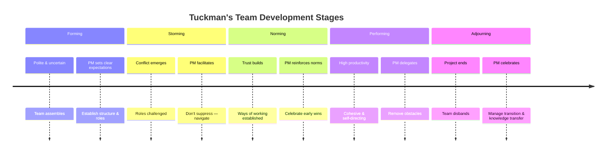
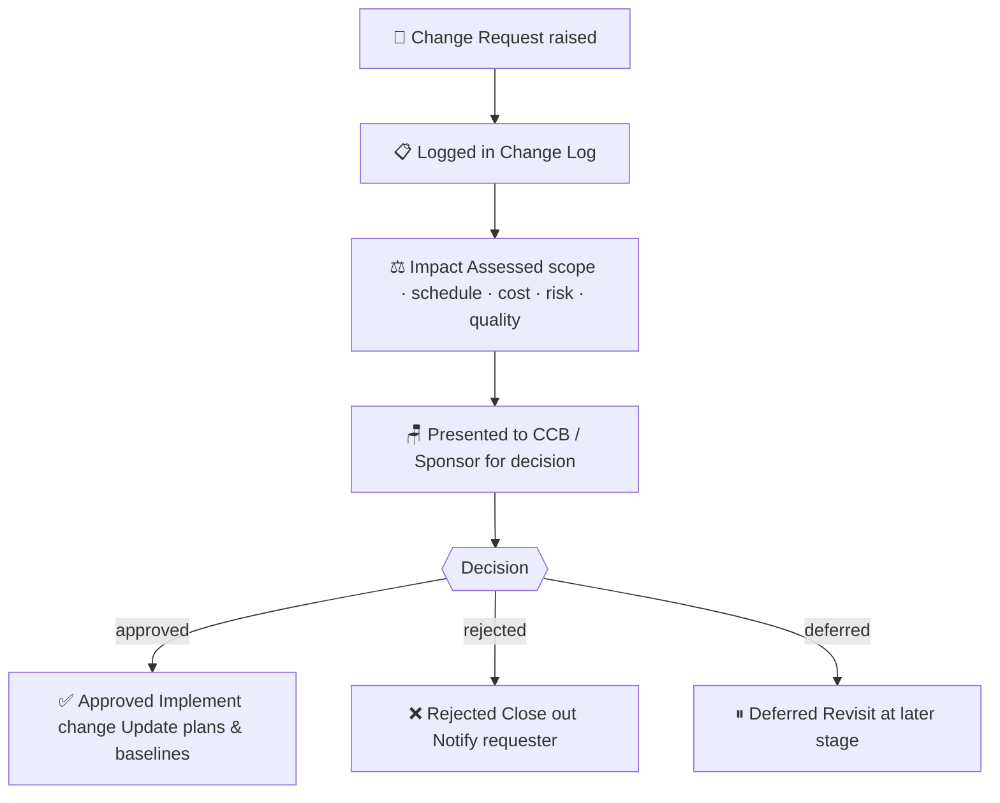
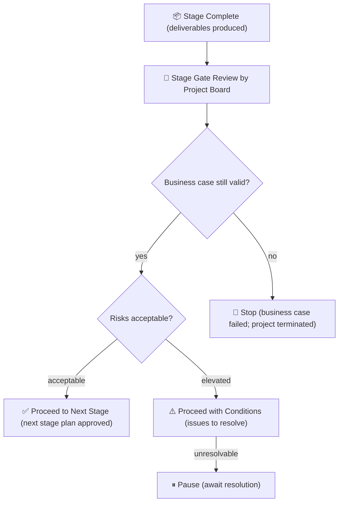

# Module 05 — Project Execution

> **Execution is where plans meet reality.** This module covers how to direct project work, manage the team, handle change and issues, and keep stakeholders engaged while the project is underway.

---

## Learning outcomes

By the end of this module you will be able to:

- Direct project work against the agreed baselines
- Handle change and issues while delivery is underway
- Keep the team, the supplier, and the stakeholders working to the same plan

---

## Table of Contents

- [Learning outcomes](#learning-outcomes)
- [1. Directing and Managing Project Work](#1-directing-and-managing-project-work)
  - [Translating plans into action](#translating-plans-into-action)
  - [The PM as servant and director](#the-pm-as-servant-and-director)
- [2. Work Authorization](#2-work-authorization)
  - [Formal work authorization](#formal-work-authorization)
  - [Work Package Assignments](#work-package-assignments)
- [3. Managing the Project Team](#3-managing-the-project-team)
  - [The PM's leadership role](#the-pms-leadership-role)
  - [Team development: Tuckman's stages](#team-development-tuckmans-stages)
  - [Conflict resolution](#conflict-resolution)
  - [Team Charter](#team-charter)
  - [Motivation](#motivation)
- [4. Stakeholder Engagement During Execution](#4-stakeholder-engagement-during-execution)
  - [Engagement is not a one-time activity](#engagement-is-not-a-one-time-activity)
  - [Practical engagement during execution](#practical-engagement-during-execution)
  - [Managing resistance](#managing-resistance)
- [5. Managing Issues](#5-managing-issues)
  - [Issues vs. risks](#issues-vs-risks)
  - [The issue management process](#the-issue-management-process)
  - [Issue escalation](#issue-escalation)
- [6. Managing Change During Execution](#6-managing-change-during-execution)
  - [Change is normal — uncontrolled change is the problem](#change-is-normal--uncontrolled-change-is-the-problem)
  - [The change control process](#the-change-control-process)
  - [Change Request Form](#change-request-form)
  - [Protecting the baseline](#protecting-the-baseline)
- [7. Quality Assurance During Execution](#7-quality-assurance-during-execution)
  - [QA vs. QC](#qa-vs-qc)
  - [Quality audits](#quality-audits)
- [8. Conducting Procurements](#8-conducting-procurements)
  - [When procurement happens in execution](#when-procurement-happens-in-execution)
  - [The procurement process during execution](#the-procurement-process-during-execution)
  - [Vendor evaluation](#vendor-evaluation)
- [9. Stage and Phase Transitions](#9-stage-and-phase-transitions)
  - [End-of-stage reviews](#end-of-stage-reviews)
  - [The value of stage gates](#the-value-of-stage-gates)
  - [End Stage Report](#end-stage-report)
- [10. Meeting Discipline](#10-meeting-discipline)
  - [Why meetings matter](#why-meetings-matter)
  - [Types of project meetings](#types-of-project-meetings)
  - [Meeting discipline basics](#meeting-discipline-basics)
- [Artifacts](#artifacts)
- [Exercises](#exercises)
  - [Exercise 5.1 — Issue resolution simulation](#exercise-51--issue-resolution-simulation)
  - [Exercise 5.2 — Evaluate a change request](#exercise-52--evaluate-a-change-request)
  - [Exercise 5.3 — Conflict scenario](#exercise-53--conflict-scenario)
- [Quiz](#quiz)
- [Related Modules](#related-modules)

---

## 1. Directing and Managing Project Work

### Translating plans into action

The approved project management plan is the authority document for execution. The PM's job is to direct the team to execute the plan — while continuously monitoring for deviations.

Key execution responsibilities:

- **Authorize work** to begin on each activity and work package
- **Direct team members** on what to do, when, and to what standard
- **Monitor progress** against the plan and identify variances early
- **Manage changes** when reality diverges from the plan
- **Protect the team** from unplanned distractions and scope intrusions
- **Remove obstacles** that are outside the team's control

### The PM as servant and director

Good execution requires the PM to oscillate between two modes:

- **Director**: sets direction, resolves ambiguity, makes decisions, holds people accountable
- **Servant**: removes obstacles, provides resources, creates conditions for team success

Neither mode alone is sufficient. A PM who only directs creates a disempowered team. A PM who only serves creates a directionless one.

[↑ Back to top](#table-of-contents)

---

## 2. Work Authorization

### Formal work authorization

Work should not begin on a task or work package until it is formally authorized. This prevents:

- Premature work on future-phase deliverables
- Unauthorized scope additions
- Budget consumed before planned

A **work authorization system** can be as simple as a task card assigned in a project tool, or as formal as a signed work package description. The level of formality should match the project's risk and complexity.

### Work Package Assignments

A work package assignment (or work package description) tells the team member or team:

- What is to be produced (the deliverable)
- The acceptance criteria
- The budget and timeline
- Any dependencies
- Reporting requirements

[↑ Back to top](#table-of-contents)

---

## 3. Managing the Project Team

### The PM's leadership role

Most project teams are **temporary assemblies** — people from different departments, backgrounds, and reporting lines brought together for the project's duration. Building a cohesive, high-performing team from this starting point is one of the PM's hardest challenges.

### Team development: Tuckman's stages

A widely useful model for team development:

| Stage | What Happens | PM's Role |
|---|---|---|
| **Forming** | Team assembles; people are polite and uncertain | Set clear expectations; establish structure |
| **Storming** | Conflict emerges; roles and approaches are challenged | Facilitate resolution; don't suppress conflict |
| **Norming** | Team establishes ways of working; trust builds | Reinforce positive norms; celebrate progress |
| **Performing** | Team is cohesive and productive | Delegate; remove obstacles; focus on outcomes |
| **Adjourning** | Project ends; team disbands | Celebrate achievement; manage transition |

The PM cannot skip stages — but they can navigate them more or less skillfully.

*Teams cannot skip stages, but skilled leadership shortens the difficult ones.*

### Conflict resolution

Conflict is inevitable and, managed well, is productive. Five modes of conflict resolution (Thomas-Kilmann):

| Mode | Approach | Best When |
|---|---|---|
| **Collaborating** | Work together to find a solution that satisfies all parties | Time allows; long-term relationship matters; issue is important |
| **Compromising** | Each party gives something up | Quick resolution needed; equally valid positions |
| **Accommodating** | One party yields to the other | Preserving the relationship outweighs winning the issue |
| **Competing** | One party imposes their will | Crisis requires immediate decision; safety at stake |
| **Avoiding** | Issue is set aside | Issue is trivial; timing is wrong |

The most effective PMs use **collaborating** as the default, knowing when to switch modes based on context.

### Team Charter

A **Team Charter** documents agreed ways of working: communication norms, decision-making rules, how conflicts are handled, availability expectations, and team values. Created at the start of execution, it gives the team a shared reference point.

### Motivation

Motivated teams outperform unmotivated ones by orders of magnitude. Key motivational insights for PMs:

- **Maslow's hierarchy**: ensure basic needs (safety, clarity, fair treatment) are met before expecting higher performance
- **Herzberg's two-factor theory**: hygiene factors (pay, conditions) prevent dissatisfaction; motivators (recognition, achievement, growth) drive satisfaction
- **McGregor's Theory X/Y**: assume people want to do good work (Theory Y) — treating people as capable and trustworthy tends to create capable, trustworthy teams

[↑ Back to top](#table-of-contents)

---

## 4. Stakeholder Engagement During Execution

### Engagement is not a one-time activity

Stakeholder analysis is done at initiation, but **engagement is continuous throughout execution**. Stakeholders' attitudes, interests, and levels of influence change. Neglected stakeholders can become blockers; previously resistant stakeholders can become advocates.

### Practical engagement during execution

- Hold regular **briefings or one-to-ones** with key stakeholders between formal reports
- **Involve stakeholders in reviews** before deliverables are finalized — not after
- Watch for **early signals of disengagement or resistance** (missed meetings, unanswered emails, lack of feedback)
- Address **concerns promptly and openly** — stakeholders who feel heard are less likely to escalate

### Managing resistance

Resistance is usually not irrational. It typically reflects a legitimate concern: loss of control, fear of change, competing priorities, or previous bad experiences with similar projects. Effective PMs diagnose the source of resistance before responding to it.

Steps:
1. Listen — understand the specific concern
2. Acknowledge — validate the concern as legitimate
3. Address — provide information, adjust approach, or escalate if the concern reveals a real problem
4. Follow up — confirm the concern has been resolved

[↑ Back to top](#table-of-contents)

---

## 5. Managing Issues

### Issues vs. risks

- A **risk** is a future uncertainty — it may or may not occur
- An **issue** has already occurred and requires action now

The distinction matters because the responses are different:
- Risks are managed proactively through response planning
- Issues require immediate reactive management

Many issues arise from risks that materialized — good risk planning reduces the frequency and severity of issues.

### The issue management process

1. **Identify** — anyone on the project can raise an issue
2. **Log** — record in the issue log immediately
3. **Assess** — what is the impact? How urgent is resolution?
4. **Assign** — give the issue to a named owner
5. **Resolve** — develop and implement a resolution
6. **Escalate if needed** — if the issue exceeds the PM's tolerance, escalate to the project board
7. **Close** — confirm resolution; update the log

### Issue escalation

Not all issues can be resolved at the team level. Clear **escalation thresholds** must be defined:

- Team resolves issues within their work package scope
- PM resolves issues within project tolerances
- Project board resolves issues that breach tolerances or require additional authority

An unresolved issue that festers is far more damaging than an issue escalated promptly.

[↑ Back to top](#table-of-contents)

---

## 6. Managing Change During Execution

### Change is normal — uncontrolled change is the problem

Scope, schedule, and cost will change during any project of meaningful complexity. The question is not whether change will happen, but whether it will be **managed intentionally**.

### The change control process

*Every change — however small — must pass through this process. Baseline erosion begins with the first exception.*

### Change Request Form

Every proposed change should be documented on a **Change Request Form** that captures:

- Description of the change
- Reason / justification
- Impact on scope, schedule, cost, quality, and risk
- Options considered
- Recommendation
- Decision (approved / rejected / deferred)
- Authorized by / date

### Protecting the baseline

The biggest execution risk is **baseline erosion** — small, individually harmless changes accumulating into a significantly different project without any formal acknowledgment. Rigorous change control prevents this.

Signs of baseline erosion:
- Schedule is "revised" without formal approval
- Extra features are added because "they're small"
- Budget is informally exceeded and reconciled later

[↑ Back to top](#table-of-contents)

---

## 7. Quality Assurance During Execution

### QA vs. QC

- **Quality Assurance (QA)** is proactive — it ensures that the processes being used are appropriate and being followed correctly. It is process-oriented.
- **Quality Control (QC)** is reactive — it inspects outputs to identify defects. It is product-oriented.

QA during execution includes:

- **Process audits**: are the team following the agreed development/delivery process?
- **Standards compliance checks**: are deliverables being produced to the agreed standards?
- **Lessons learned reviews**: are early lessons being applied to improve subsequent work?

### Quality audits

A **quality audit** is a structured, independent review of project processes and practices. It asks: "Are we doing what we said we would do, in the way we said we would do it?"

Audits are not blame exercises. Their purpose is to identify process improvements and share good practices.

[↑ Back to top](#table-of-contents)

---

## 8. Conducting Procurements

### When procurement happens in execution

For projects involving external suppliers, the execution phase includes selecting vendors and awarding contracts (if this was not completed in planning).

### The procurement process during execution

1. **Issue procurement documents** (RFP, RFQ, RFI) to potential suppliers
2. **Receive and evaluate bids / proposals** using agreed evaluation criteria
3. **Select the preferred supplier** through a formal selection process
4. **Negotiate and award the contract**
5. **Manage the vendor relationship** throughout execution

### Vendor evaluation

Use a **weighted evaluation scorecard** to score proposals consistently:

| Criterion | Weight | Supplier A | Supplier B |
|---|---|---|---|
| Technical capability | 30% | 8 | 7 |
| Price | 25% | 7 | 9 |
| Track record | 20% | 9 | 7 |
| Implementation approach | 15% | 8 | 8 |
| Support model | 10% | 7 | 8 |
| **Weighted total** | | **7.85** | **7.75** |

The scorecard makes the decision transparent and defensible.

[↑ Back to top](#table-of-contents)

---

## 9. Stage and Phase Transitions

### End-of-stage reviews

Projects are often divided into stages or phases with formal review points (stage gates) between them. At each gate, the project board reviews:

- Have the current stage's deliverables been completed and accepted?
- Is the business case still valid?
- Are the risks acceptable for the next stage?
- Is the next stage plan approved?

The outcome is a formal decision: **proceed**, **proceed with changes**, **pause**, or **stop**.

*Stage gates prevent momentum from carrying a failing project forward by default.*

### The value of stage gates

Stage gates are not bureaucracy. They are structured decision points that:

- Force the organization to consciously re-commit to the project at each stage
- Prevent momentum from carrying a failing project forward by default
- Create natural checkpoints for learning and adapting

### End Stage Report

An **End Stage Report** summarizes the stage's performance: what was delivered, actual vs. planned cost and time, current risk status, and lessons learned. It provides the information the project board needs to make the next-stage decision.

[↑ Back to top](#table-of-contents)

---

## 10. Meeting Discipline

### Why meetings matter

Projects run on communication, and much of that communication happens in meetings. Poorly run meetings are one of the most common sources of project inefficiency and frustration.

### Types of project meetings

| Meeting Type | Frequency | Purpose |
|---|---|---|
| **Team status meeting** | Weekly (or as needed) | Share progress; surface blockers; coordinate |
| **One-to-one check-in** | Weekly | Individual team member engagement |
| **Stakeholder briefing** | Per schedule | Keep key stakeholders informed |
| **Project board / steering committee** | Per governance cycle | Oversight and decision-making |
| **Risk review** | Bi-weekly or monthly | Review and update risk register |
| **Lessons learned session** | End of each phase | Capture and apply learning |

### Meeting discipline basics

1. **No meeting without an agenda** — distributed in advance
2. **Start and end on time** — always
3. **Only necessary people in the room** — large meetings produce small decisions
4. **Capture decisions and actions** — with owners and due dates
5. **Distribute minutes within 24 hours** — while memories are fresh
6. **Follow up on actions** — open actions from the previous meeting are the first agenda item

[↑ Back to top](#table-of-contents)

---

## Artifacts

| Artifact | Description | Template |
|---|---|---|
| **Work Authorization Document** | Formally authorizes work to begin on a package | — |
| **Issue Log** | Tracks active and resolved issues | [issue-log.md](../templates/issue-log.md) |
| **Change Request Form** | Documents a proposed change for evaluation | [change-request.md](../templates/change-request.md) |
| **Change Log** | Running history of all change requests | [change-log.md](../templates/change-log.md) |
| **Decision Log** | Records key project decisions and rationale | — |
| **Team Charter** | Team norms and operating agreements | — |
| **Meeting Agenda** | Structured agenda template | [meeting-agenda.md](../templates/meeting-agenda.md) |
| **Meeting Minutes** | Record of decisions and actions | [meeting-minutes.md](../templates/meeting-minutes.md) |
| **Lessons Learned Log** | Ongoing capture of lessons during execution | [lessons-learned-log.md](../templates/lessons-learned-log.md) |
| **Procurement Evaluation Scorecard** | Weighted scoring for vendor selection | [procurement-evaluation-scorecard.md](../templates/procurement-evaluation-scorecard.md) |

[↑ Back to top](#table-of-contents)

---

## Exercises

### Exercise 5.1 — Issue resolution simulation

You are managing a software development project. Your lead developer informs you on Monday morning that a critical integration dependency (an API provided by an external system) will not be ready for 6 more weeks. Your current schedule has work depending on that API starting in 10 days.

1. Log the issue formally (use the issue log template structure)
2. Assess the impact on scope, schedule, and cost
3. Identify at least three possible responses
4. Decide on a recommended course of action and justify it
5. Determine whether this needs to be escalated and to whom

**Expected output:** A completed issue log entry + a brief impact and response analysis.

---

### Exercise 5.2 — Evaluate a change request

A stakeholder from the marketing department raises the following change request mid-project: "While you're building the new portal, can we also add a live chat feature? Our competitor has it and our customers keep asking."

The project is currently on schedule and within budget, with 6 weeks remaining.

1. Complete a change request form for this request
2. Analyse the impact on scope, schedule, cost, risk, and quality
3. Provide a recommendation (approve, reject, or defer with conditions) and justify it

**Expected output:** A completed change request form with impact analysis and recommendation.

---

### Exercise 5.3 — Conflict scenario

Two team members — the lead developer and the business analyst — are in persistent conflict. The developer says the requirements are constantly changing and is resisting further work until requirements are "frozen." The BA says the developer is inflexible and refuses to accommodate valid stakeholder needs.

1. Diagnose the root cause of the conflict
2. Identify which conflict resolution mode is most appropriate
3. Describe the steps you would take as PM to resolve the situation
4. What structural changes (to process or artifacts) might prevent this conflict recurring?

**Expected output:** A one-page conflict analysis and resolution plan.

[↑ Back to top](#table-of-contents)

---

## Quiz

**Question 1:** What is the primary purpose of a work authorization system?

- A) To track time spent by team members
- B) To formally release work to begin on authorized activities only
- C) To document team member performance
- D) To manage procurement contracts

Reveal Answer

**B) To formally release work to begin on authorized activities only.** Work authorization prevents premature or unauthorized work, protecting the baseline and ensuring resources are applied to approved scope.

---

**Question 2:** According to Tuckman's model, what is the stage where team conflict typically peaks?

- A) Forming
- B) Norming
- C) Storming
- D) Adjourning

Reveal Answer

**C) Storming.** In the storming stage, team members challenge roles, approaches, and each other. It is a natural and necessary stage — navigating it well leads to norming and performing.

---

**Question 3:** What is the key difference between an issue and a risk?

- A) Risks are documented; issues are not
- B) An issue has already occurred; a risk is a future uncertainty
- C) Issues affect cost; risks affect schedule
- D) Risks are owned by the PM; issues are owned by the team

Reveal Answer

**B) An issue has already occurred; a risk is a future uncertainty.** Issues require immediate reactive management. Risks are managed proactively before they occur.

---

**Question 4:** A change request is submitted to add a new feature to the project. The impact assessment shows it will add 3 weeks and $20,000 to the project. Who should approve this change?

- A) The project manager, since they are responsible for the project
- B) The lead developer, since they will do the work
- C) The project board or sponsor, since it affects the approved baseline
- D) The business analyst, since they captured the requirements

Reveal Answer

**C) The project board or sponsor, since it affects the approved baseline.** Changes that alter approved baselines (scope, schedule, cost) require approval from those who set the baseline — typically the sponsor or project board.

---

**Question 5:** Quality Assurance (QA) during execution is primarily focused on:

- A) Inspecting deliverables for defects
- B) Ensuring processes are appropriate and being followed correctly
- C) Managing the change control process
- D) Tracking actual vs. planned costs

Reveal Answer

**B) Ensuring processes are appropriate and being followed correctly.** QA is proactive and process-oriented. Defect inspection is Quality Control (QC), which is reactive and product-oriented.

---

**Question 6:** What should happen at a stage gate review?

- A) The project manager presents the next stage plan for approval
- B) The project board assesses whether the business case is still valid and whether to proceed
- C) Team members receive performance reviews
- D) All outstanding change requests are processed

Reveal Answer

**B) The project board assesses whether the business case is still valid and whether to proceed.** Stage gates are decision points. The board reviews stage performance, validates the business case, and makes an explicit decision: proceed, pause, or stop.

[↑ Back to top](#table-of-contents)

---

**Previous Module:** [Module 04 — Project Planning](04-planning.md)
**Next Module:** [Module 06 — Monitoring and Controlling](06-monitoring-control.md)

---

## Related Modules

| Module | Relationship |
|---|---|
| [Module 04 — Project Planning](04-planning.md) | The approved project plan is the execution baseline; changes during execution feed back into re-planning |
| [Module 06 — Monitoring and Controlling](06-monitoring-control.md) | Execution generates the performance data that monitoring processes track; the two phases run concurrently |
| [Module 09 — Stakeholder Management](09-stakeholder-management.md) | Active stakeholder engagement is an ongoing execution activity; resistance and issues surface during delivery |
| [Module 15a — Integration, Hybrid Approaches, and Agile](15a-integration-hybrid-agile.md) | Agile and hybrid execution patterns — sprint ceremonies, kanban flow, and coordinating predictive and iterative workstreams |

---

&copy; 2026 UncleJs &mdash; Licensed under [CC BY-NC-SA 4.0](https://creativecommons.org/licenses/by-nc-sa/4.0/)
