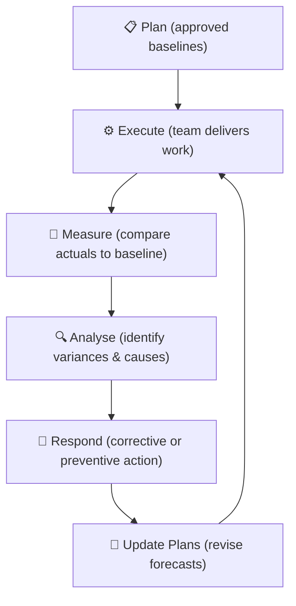
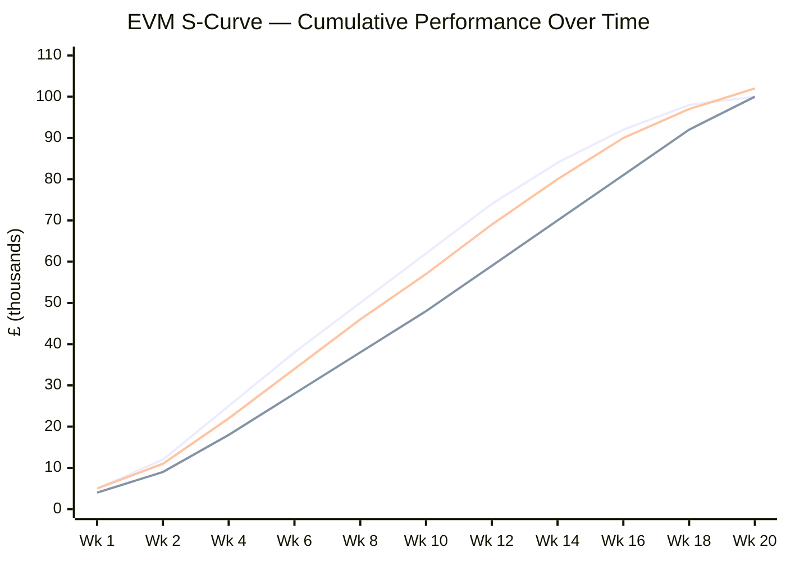

# Module 06 — Monitoring and Controlling


> **You can't manage what you don't measure.** This module covers how to track project performance objectively, detect problems early, report progress credibly, and maintain control without micromanaging.

---

## Table of Contents

- [1. The Purpose of Monitoring and Controlling](#1-the-purpose-of-monitoring-and-controlling)
- [2. Earned Value Management (EVM)](#2-earned-value-management-evm)
- [3. Scope and Change Control](#3-scope-and-change-control)
- [4. Schedule Control](#4-schedule-control)
- [5. Cost Control](#5-cost-control)
- [6. Progress Reporting](#6-progress-reporting)
- [7. Risk and Issue Monitoring](#7-risk-and-issue-monitoring)
- [8. Quality Control](#8-quality-control)
- [9. Configuration Management](#9-configuration-management)
- [Artifacts](#artifacts)
- [Exercises](#exercises)
- [Quiz](#quiz)

---

## 1. The Purpose of Monitoring and Controlling

Monitoring and controlling is not a phase — it runs **concurrently with execution** from the moment work starts until the project closes. Its purpose is to:

- Detect variances from the approved baselines (scope, schedule, cost, quality)
- Identify corrective or preventive actions when needed
- Manage changes formally and protect baseline integrity
- Provide accurate, timely information to decision-makers
- Confirm that deliverables meet quality requirements

### The control cycle


*This cycle repeats continuously — monitoring is not a phase, it runs concurrently with all execution work.*

This cycle repeats continuously throughout the project.

[↑ Back to top](#table-of-contents)

---

## 2. Earned Value Management (EVM)

EVM is the most robust, integrated method for measuring project performance. It combines scope, schedule, and cost into a single performance measurement framework.

### The three EVM data points

At any point in time, three values can be calculated for any work package or the whole project:

| Metric | Abbreviation | Definition |
|---|---|---|
| **Planned Value** | PV | The budgeted cost of work scheduled to be done by now |
| **Earned Value** | EV | The budgeted cost of work actually completed by now |
| **Actual Cost** | AC | The actual cost incurred for work completed by now |

### Variance metrics

| Metric | Formula | Interpretation |
|---|---|---|
| **Schedule Variance (SV)** | EV − PV | Positive = ahead of schedule; Negative = behind |
| **Cost Variance (CV)** | EV − AC | Positive = under budget; Negative = over budget |

### Performance indices

| Metric | Formula | Interpretation |
|---|---|---|
| **Schedule Performance Index (SPI)** | EV ÷ PV | >1.0 = ahead; <1.0 = behind; 1.0 = on schedule |
| **Cost Performance Index (CPI)** | EV ÷ AC | >1.0 = under budget; <1.0 = over budget; 1.0 = on budget |

### Forecasting to completion

| Metric | Formula | Meaning |
|---|---|---|
| **Estimate at Completion (EAC)** | BAC ÷ CPI | Forecast total cost based on current cost performance |
| **Estimate to Complete (ETC)** | EAC − AC | How much more will it cost to finish? |
| **Variance at Completion (VAC)** | BAC − EAC | Forecast final overspend (negative) or underspend (positive) |
| **To Complete Performance Index (TCPI)** | (BAC − EV) ÷ (BAC − AC) | Cost efficiency needed on remaining work to meet original budget |

### EVM worked example

A project has:
- BAC = £100,000
- At week 10 (midpoint of a 20-week project), planned spend = £50,000 (PV)
- Work actually completed = 40% of total scope (EV = 0.40 × £100,000 = £40,000)
- Actual spend to date = £45,000 (AC)

| Calculation | Value | Meaning |
|---|---|---|
| SV = EV − PV | £40,000 − £50,000 = **−£10,000** | Behind schedule |
| CV = EV − AC | £40,000 − £45,000 = **−£5,000** | Over budget |
| SPI = EV ÷ PV | £40,000 ÷ £50,000 = **0.80** | Doing 80% of the scheduled work |
| CPI = EV ÷ AC | £40,000 ÷ £45,000 = **0.89** | Getting £0.89 of value per £1 spent |
| EAC = BAC ÷ CPI | £100,000 ÷ 0.89 = **£112,360** | Project will likely cost £12,360 more than budgeted |
| VAC = BAC − EAC | £100,000 − £112,360 = **−£12,360** | Forecast overspend |

This project needs attention — it is both behind schedule and over budget at the midpoint.

### The S-curve

When cumulative PV, EV, and AC are plotted over time, the PV curve forms an "S" shape (slow at start, steep in middle, flattening at end). Comparing EV and AC to this S-curve is a powerful visual diagnostic.


*EV below PV = behind schedule (SV < 0). AC above EV = over budget (CV < 0). The gap between the curves shows the scale of the problem.*

[↑ Back to top](#table-of-contents)

---

## 3. Scope and Change Control

### Scope verification vs. scope validation

- **Scope verification**: confirming that the deliverable matches the approved scope (internal check by the PM/team)
- **Scope validation**: formal acceptance by the customer or sponsor (external sign-off)

Both are necessary. Deliverables can pass internal verification but fail customer validation if requirements were misunderstood.

### Preventing scope creep

Scope creep is the gradual, uncontrolled expansion of project scope. Common causes:

- Poorly defined initial scope (vague acceptance criteria)
- Informal agreements to "add something small"
- Stakeholders bypassing the PM to request work directly from team members
- Insufficient change control discipline

Prevention:
- Define scope clearly with explicit out-of-scope statements
- Enforce the change request process consistently — even for "small" changes
- Brief the team: all new requests go through the PM; none are implemented without approval

### Integrated change control

Every change request must be:
1. Formally documented
2. Impact-assessed across all baselines (scope, schedule, cost, risk, quality)
3. Decided by the appropriate authority
4. Implemented with updated plans and documentation

[↑ Back to top](#table-of-contents)

---

## 4. Schedule Control

### Identifying schedule variances

Use the schedule and EVM to detect delays:

- **SPI < 1.0**: less work has been completed than planned
- **Activities past due start/finish without completion**: visible on the Gantt
- **Milestone slippage**: key dates at risk

### Analysing variance causes

Not all schedule variances require the same response:

| Cause | Response |
|---|---|
| Activity took longer than estimated | Reforecast; assess impact on critical path |
| Resource was unavailable | Address resource issue; reforecast |
| Dependency was delayed by another party | Escalate; find workaround |
| Scope was added informally | Raise a change request; reset scope |

### Corrective and preventive actions

- **Corrective action**: addresses an existing variance (e.g., add resources to a delayed critical path activity)
- **Preventive action**: prevents a forecast variance from occurring (e.g., start procuring materials early because supply chain risk is increasing)

### Re-baselining

Re-baselining (formally updating the baseline to reflect approved changes) should only occur when:

- Significant, approved changes make the original baseline no longer meaningful
- A formal decision has been made at the appropriate authority level

Re-baselining to hide poor performance is an integrity failure. EVM history should be preserved.

[↑ Back to top](#table-of-contents)

---

## 5. Cost Control

### Tracking actual costs

Actual costs (AC) should be captured at the work package level and recorded in the PMIS. Common sources of cost data:

- Timesheets (labour)
- Purchase orders and invoices (materials, equipment, external services)
- Expense reports (travel, facilities)

### Forecasting to completion

CPI is the most reliable leading indicator of final project cost. A project with a CPI of 0.85 at the midpoint is statistically likely to end with a CPI close to 0.85 — the EAC = BAC ÷ CPI formula typically outperforms optimistic "we'll catch up" assumptions.

### Managing contingency

Contingency reserve is held for identified risks. It should be:

- Drawn down only when specific risk events materialise
- Tracked separately from the cost baseline
- Reported to the sponsor when consumed

If contingency is running low, this is an early warning that the project's risk exposure has increased beyond original estimates.

[↑ Back to top](#table-of-contents)

---

## 6. Progress Reporting

### The reporting hierarchy

Different audiences need different levels of detail:

| Report Type | Audience | Frequency | Content |
|---|---|---|---|
| **Checkpoint Report** | Project manager (from team) | Weekly | Task-level progress, issues, forecast |
| **Status / Highlight Report** | Sponsor / project board | Bi-weekly or monthly | Summary status, key milestones, risks, issues, decisions needed |
| **Exception Report** | Project board | As needed (when tolerance breached) | Description of exception, impact, options, recommendation |
| **End Stage Report** | Project board | End of each stage | Stage performance, updated business case, next stage plan |
| **Dashboard** | All stakeholders | Continuous or weekly | Visual KPIs: RAG status, EVM, milestones |

### RAG status

Red-Amber-Green (RAG) ratings provide a quick, accessible performance signal:

| Colour | Meaning |
|---|---|
| **Green** | On track; within tolerances |
| **Amber** | At risk; action being taken; may breach tolerance if not addressed |
| **Red** | Tolerance breached or about to be; escalation required; board action needed |

RAG ratings must be honest. A project that is amber but reported as green creates false confidence and delays necessary intervention.

```mermaid
quadrantChart
    title SPI / CPI Performance Quadrants
    x-axis Low SPI (Behind Schedule) --> High SPI (Ahead of Schedule)
    y-axis Low CPI (Over Budget) --> High CPI (Under Budget)
    quadrant-1 On Time & Under Budget
    quadrant-2 Ahead & Over Budget
    quadrant-3 Behind & Over Budget
    quadrant-4 Behind & Under Budget
    Ideal Target: [0.75, 0.75]
    Our Project: [0.35, 0.30]
    Watch Zone: [0.55, 0.65]
    Recovery Mode: [0.42, 0.38]
```
*Any project in the lower-left quadrant (behind schedule AND over budget) requires immediate corrective action and an exception report.*

### Exception Report

When a project or stage is forecast to exceed its tolerances, the PM must produce an **exception report** for the project board. It should contain:

- What happened / what is forecast to happen
- Why it occurred
- The impact on the project and business case
- Options for recovery (with pros, cons, and costs)
- A recommendation
- A request for a decision

[↑ Back to top](#table-of-contents)

---

## 7. Risk and Issue Monitoring

### Risk review cadence

Risks do not stay static. The risk register must be reviewed regularly to:

- Update probability and impact scores as conditions change
- Confirm that response actions are being executed
- Identify new risks that have emerged
- Close risks that are no longer relevant
- Promote risks to issues if they have materialised

A **risk review meeting** (typically bi-weekly or monthly) keeps the register current and forces the team to actively think about uncertainty rather than treating the risk register as a one-time exercise.

### Residual and secondary risks

- **Residual risk**: the remaining risk after a response has been implemented
- **Secondary risk**: a new risk created by the response to another risk

Both must be logged and managed.

### Issue escalation monitoring

The PM should track open issues by age. An issue that has been open for more than a defined period without progress is a red flag — it either needs a harder push to resolve or escalation.

[↑ Back to top](#table-of-contents)

---

## 8. Quality Control

### Quality control activities during monitoring

While QA (in execution) checks processes, QC (in monitoring) checks **outputs**:

- **Inspections**: physical or functional examination of a deliverable against acceptance criteria
- **Testing**: running the product through defined test cases
- **Sampling**: statistical sampling of output quality where 100% inspection is impractical
- **Checklists**: systematic verification that all required quality steps have been completed

### Defect management

When a defect is found:

1. Log in the defect log
2. Assign to the responsible party for resolution
3. Track through to verified resolution
4. Analyse defect patterns (root cause analysis) to prevent recurrence

A high defect rate is an early warning of underlying quality problems — in requirements, design, or process.

### Acceptance

**Formal acceptance** of a deliverable by the customer or sponsor should be recorded in writing. Verbal acceptance creates disputes. Deliverables should not move to the next phase until they are formally signed off.

[↑ Back to top](#table-of-contents)

---

## 9. Configuration Management

### What is configuration management?

Configuration management ensures that:

- Every version of every document and deliverable is uniquely identified
- Changes to controlled items are tracked and approved
- The current approved version is always identifiable
- Previous versions can be retrieved

Without configuration management, teams work with different versions of the same document, and "the latest plan" becomes a matter of opinion.

### Configuration items

Not everything needs to be under configuration control — only items where version confusion would cause problems. Typical configuration items:

- Requirements documents
- Design specifications
- Project management plan and baselines
- Deliverables pending or post-acceptance
- Test plans and test results
- Contracts

### Configuration status accounting

A **configuration status account** (or document register) shows:

- All configuration items
- Their current version
- Their current status (draft / under review / approved / superseded)
- Change history

[↑ Back to top](#table-of-contents)

---

## Artifacts

| Artifact | Description | Template |
|---|---|---|
| **EVM Report** | Schedule and cost performance metrics | — |
| **Status / Progress Report** | Summary of project health for stakeholders | [status-report.md](../templates/status-report.md) |
| **Exception Report** | Flags tolerance breach; requests board decision | — |
| **End Stage Report** | Summarises stage performance | — |
| **Variance Analysis Report** | Explains causes of significant variances | — |
| **Risk Register (updated)** | Current risk status and response actions | [risk-register.md](../templates/risk-register.md) |
| **Issue Log (updated)** | Current issue status | [issue-log.md](../templates/issue-log.md) |
| **Change Log (updated)** | Running record of all change requests | [change-log.md](../templates/change-log.md) |
| **Quality Control Checklists** | Inspection checklists for deliverable acceptance | — |
| **Defect Log** | Tracks identified defects through to resolution | — |
| **Project Dashboard** | Visual RAG + KPI summary | — |

[↑ Back to top](#table-of-contents)

---

## Exercises

### Exercise 6.1 — EVM calculations

A project has the following data at the end of month 4 of a 10-month project:

- **BAC**: £200,000
- **Planned completion at month 4**: 40%
- **Actual completion at month 4**: 33%
- **Actual spend to date**: £74,000

Calculate:
1. PV, EV, and AC
2. SV, CV, SPI, CPI
3. EAC and VAC
4. TCPI (target: original BAC)
5. Write a 3-sentence executive summary of the project's current performance

**Expected output:** A completed EVM table with calculations and a written summary.

---

### Exercise 6.2 — Produce a status report

Using the project data from Exercise 6.1, produce a one-page status report suitable for the project sponsor. Include:

- RAG status (with justification)
- Key accomplishments in the period
- Key concerns and risks
- Current forecast (EAC, completion date estimate)
- Actions requested from the sponsor (if any)

**Expected output:** A completed status report using the [template](../templates/status-report.md).

---

### Exercise 6.3 — Scope creep audit

Review the following list of activities that occurred on a project. Identify which represent scope creep, which are legitimate change-controlled changes, and which are acceptable scope clarification.

1. A developer adds input validation to a form "to make it more robust" — not in the requirements
2. The sponsor requests a new reporting dashboard via a formal change request that is approved and baselined
3. A user asks the BA to "add a search function" in a requirements workshop and it is included in the requirements document without PM knowledge
4. The PM agrees verbally in a meeting to include mobile-optimised views because "it seems obvious it should work on phones"
5. A bug is fixed that was not in scope but was causing the feature to not meet its acceptance criteria

Classify each and describe the correct process that should have been followed.

**Expected output:** A table with classification and corrective guidance.

[↑ Back to top](#table-of-contents)

---

## Quiz

**Question 1:** If a project has an SPI of 0.75, what does this indicate?

- A) The project is 25% over budget
- B) The project is completing 75p of work for every £1 spent
- C) The project is completing only 75% of the work it was scheduled to complete
- D) The project will finish 25% early

<details>
<summary>Reveal Answer</summary>

**C) The project is completing only 75% of the work it was scheduled to complete.** SPI = EV ÷ PV. An SPI of 0.75 means only 75 units of planned work have been earned — the project is behind schedule.

</details>

---

**Question 2:** EAC = BAC ÷ CPI is the most commonly used EAC formula. What assumption does this formula make?

- A) Future performance will be better than past performance
- B) The remaining work will be completed at the budgeted rate
- C) Future performance will continue at the same efficiency as past performance
- D) The project will recover its schedule variance

<details>
<summary>Reveal Answer</summary>

**C) Future performance will continue at the same efficiency as past performance.** This formula assumes the CPI trend continues to completion — historically this is the most accurate assumption for most projects, as cost performance tends to be persistent.

</details>

---

**Question 3:** What is the difference between scope verification and scope validation?

- A) Scope verification is done by the customer; scope validation is done by the team
- B) Scope verification checks the deliverable against the approved scope; scope validation is formal customer acceptance
- C) Scope verification is informal; scope validation is documented
- D) They are the same process with different names

<details>
<summary>Reveal Answer</summary>

**B) Scope verification checks the deliverable against the approved scope; scope validation is formal customer acceptance.** Verification is internal (does it match what was planned?). Validation is external (does the customer accept it?).

</details>

---

**Question 4:** When should an Exception Report be produced?

- A) At the end of every project stage
- B) When the project is forecast to breach its agreed tolerances
- C) When a new risk is identified
- D) When a change request is submitted

<details>
<summary>Reveal Answer</summary>

**B) When the project is forecast to breach its agreed tolerances.** Exception reports trigger escalation to the project board. They are not routine reports — they signal that the situation has moved beyond what the PM can manage within their delegated authority.

</details>

---

**Question 5:** A TCPI of 1.25 means:

- A) The project is forecast to deliver 25% more value than planned
- B) The team needs to be 25% more cost-efficient on remaining work to meet the original budget
- C) The project will cost 25% more than budgeted
- D) 25% of the remaining work has been completed

<details>
<summary>Reveal Answer</summary>

**B) The team needs to be 25% more cost-efficient on remaining work to meet the original budget.** TCPI > 1.0 means achieving the original budget target requires better efficiency than has been achieved so far — the higher the number, the less realistic the target.

</details>

---

**Question 6:** Which statement about RAG status reporting is true?

- A) Amber status means the project has already breached a tolerance
- B) Green status means the project will definitely deliver on time and on budget
- C) RAG status should honestly reflect forecast performance, even when reporting bad news
- D) Only Red and Green should be used; Amber is too ambiguous

<details>
<summary>Reveal Answer</summary>

**C) RAG status should honestly reflect forecast performance, even when reporting bad news.** RAG reporting is only useful if it is honest. A consistently "green" project that later fails spectacularly is a governance failure. Amber is deliberately imprecise — it signals attention needed without triggering full escalation.

</details>

[↑ Back to top](#table-of-contents)

---

**Previous Module:** [Module 05 — Project Execution](05-execution.md)
**Next Module:** [Module 07 — Project Closing](07-closing.md)

---

## Related Modules

| Module | Relationship |
|---|---|
| [Module 05 — Project Execution](05-execution.md) | Monitoring runs concurrently with execution; performance data from delivery drives control decisions |
| [Module 07 — Project Closing](07-closing.md) | Control processes are formally wound down at closure; final performance against baseline is assessed here |
| [Module 11 — Risk Management](11-risk-management.md) | Risk reviews and issue escalation are core monitoring activities; risk status informs RAG and exception reporting |
| [Module 15a — Integration, Hybrid Approaches, and Agile](15a-integration-hybrid-agile.md) | Covers how monitoring works in hybrid environments — sprint reviews, velocity tracking, and integrated reporting |

---

&copy; 2026 UncleJs &mdash; Licensed under [CC BY-NC-SA 4.0](https://creativecommons.org/licenses/by-nc-sa/4.0/)
