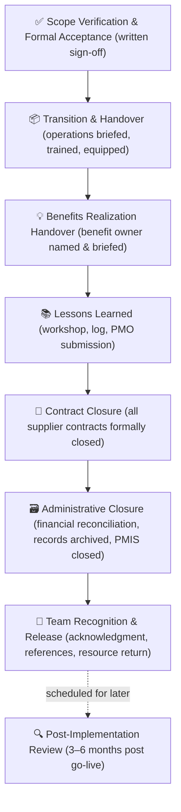
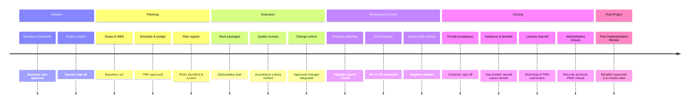

# Module 07 — Project Closing

> **How you close a project determines whether it actually succeeded.** This module covers formal acceptance, handover to operations, lessons learned, administrative closure, and how to end a project with integrity — whether it finishes as planned or is stopped early.

---

## Table of Contents

- [1. Conditions for Closure](#1-conditions-for-closure)
  - [Planned completion](#planned-completion)
  - [Premature or forced closure](#premature-or-forced-closure)
  - [Closure vs. abandonment](#closure-vs-abandonment)
- [2. Scope Verification and Formal Acceptance](#2-scope-verification-and-formal-acceptance)
  - [Verification before acceptance](#verification-before-acceptance)
  - [Getting formal sign-off](#getting-formal-sign-off)
  - [Handling disputes at acceptance](#handling-disputes-at-acceptance)
- [3. Transition and Handover](#3-transition-and-handover)
  - [Why handover matters](#why-handover-matters)
  - [The Project Handover Document](#the-project-handover-document)
  - [Transition period](#transition-period)
- [4. Benefits Realization Handover](#4-benefits-realization-handover)
  - [The project delivers outputs; operations realizes benefits](#the-project-delivers-outputs-operations-realizes-benefits)
  - [What to hand over](#what-to-hand-over)
  - [If benefits are already being realized](#if-benefits-are-already-being-realized)
- [5. Lessons Learned](#5-lessons-learned)
  - [The most neglected PM activity](#the-most-neglected-pm-activity)
  - [What "lessons learned" means](#what-lessons-learned-means)
  - [Capturing lessons throughout the project](#capturing-lessons-throughout-the-project)
  - [The lessons learned workshop](#the-lessons-learned-workshop)
  - [Making lessons useful](#making-lessons-useful)
- [6. Administrative Closure](#6-administrative-closure)
  - [What administrative closure involves](#what-administrative-closure-involves)
  - [Records retention](#records-retention)
  - [Archiving, not deleting](#archiving-not-deleting)
- [7. Contract Closure](#7-contract-closure)
  - [For projects involving external suppliers](#for-projects-involving-external-suppliers)
  - [Incomplete closure creates risk](#incomplete-closure-creates-risk)
- [8. Team Dissolution and Recognition](#8-team-dissolution-and-recognition)
  - [How you end the team matters](#how-you-end-the-team-matters)
  - [Recognition](#recognition)
  - [Releasing resources](#releasing-resources)
- [9. Post-Implementation Review](#9-post-implementation-review)
  - [What is a PIR?](#what-is-a-pir)
  - [Why PIRs are valuable](#why-pirs-are-valuable)
- [Artifacts](#artifacts)
- [Exercises](#exercises)
  - [Exercise 7.1 — Lessons learned workshop simulation](#exercise-71--lessons-learned-workshop-simulation)
  - [Exercise 7.2 — Write a closure report](#exercise-72--write-a-closure-report)
  - [Exercise 7.3 — Premature closure scenario](#exercise-73--premature-closure-scenario)
- [Quiz](#quiz)
- [Related Modules](#related-modules)

---

## 1. Conditions for Closure

### Planned completion

The most common type of project closure: the project has delivered its scope, deliverables have been accepted, and the project can be formally closed. Closure does not happen automatically — it must be actively managed.

### Premature or forced closure

Projects are sometimes closed before planned completion:

| Reason | Example |
|---|---|
| **Business case no longer valid** | Market changed; the outcome is no longer needed |
| **Funding withdrawn** | Budget cuts; financial crisis |
| **Strategic change** | Acquisition or merger changes priorities |
| **Unresolvable technical issues** | The solution cannot be built as envisioned |
| **Risk too high** | New information makes the project unacceptably risky |

Premature closure is not failure — continuing a project that no longer serves the organization is the real failure. Closing a project well when it must stop is a professional and valuable act.

*Closure is a deliberate, managed process — not the moment work stops. Every step preserves value or protects the organization.*

### Closure vs. abandonment

**Closure** is a deliberate, managed process that preserves value, documents learning, and releases resources cleanly.

**Abandonment** is what happens when a project stops without proper closure — deliverables are left incomplete, contracts are unresolved, team members don't know where they stand, and no learning is captured. Avoid it.

[↑ Back to top](#table-of-contents)

---

## 2. Scope Verification and Formal Acceptance

### Verification before acceptance

Before requesting customer acceptance, the PM must verify that all deliverables:

- Exist and are complete
- Meet the specified acceptance criteria
- Have passed quality control checks
- Are documented and in configuration control

### Getting formal sign-off

Customer or sponsor acceptance must be **written and explicit**. A verbal "looks good" does not constitute acceptance. The PM should:

1. Present each deliverable against its acceptance criteria
2. Demonstrate it meets the criteria (demonstration, test report, inspection)
3. Request written sign-off on the **Customer Acceptance Form**

### Handling disputes at acceptance

If the customer disputes whether a deliverable meets acceptance criteria:

- Review the criteria agreed at the outset — if criteria were clear and the deliverable meets them, the criteria govern
- If criteria were ambiguous, negotiate in good faith
- Escalate to the project board if agreement cannot be reached

Well-written acceptance criteria at the start of the project are the best defense against disputes at the end.

[↑ Back to top](#table-of-contents)

---

## 3. Transition and Handover

### Why handover matters

A project that delivers a product but fails to hand it over effectively has not completed its job. The operational team must be:

- **Trained** to use and maintain the new product or system
- **Equipped** with documentation, operating procedures, and support contacts
- **Prepared** for the transition period (when the new system is live but the team is still learning)

### The Project Handover Document

The **Handover Document** (also called Operations Handover Pack or Service Transition Document) should include:

| Section | Content |
|---|---|
| **Product overview** | What has been delivered; key capabilities |
| **Operating instructions** | How to use and maintain the product |
| **Technical documentation** | Architecture, configuration, infrastructure |
| **Known issues and workarounds** | Any known defects or limitations and how to handle them |
| **Support contacts** | Who to call for different types of problems |
| **SLAs and performance standards** | What performance levels are expected |
| **Benefits ownership** | Who is responsible for realizing and measuring benefits |
| **Escalation procedures** | How to escalate if serious issues arise |

### Transition period

Many projects include a **stabilization period** after go-live — typically 2–4 weeks — during which project team members are available to support the operational team. Define:

- How long the transition period lasts
- Which project team members will be available and in what capacity
- The triggers for ending transition support

[↑ Back to top](#table-of-contents)

---

## 4. Benefits Realization Handover

### The project delivers outputs; operations realizes benefits

Benefits are typically realized months or years after the project ends. It is essential that someone in the organization is explicitly accountable for measuring and reporting on benefit realization after the project team has disbanded.

### What to hand over

At closure, the PM should:

1. Update the **Benefits Register** with final baseline data (the pre-project "as-is" position)
2. Confirm measurement methods are in place
3. Identify and brief the **benefit owner** (an operational manager)
4. Agree a review schedule for post-project benefit measurement
5. Hand over responsibility formally, with a written record

### If benefits are already being realized

On long projects, some benefits may begin to materialize during the project. These should be measured and recorded — they strengthen the business case and demonstrate early value delivery.

[↑ Back to top](#table-of-contents)

---

## 5. Lessons Learned

### The most neglected PM activity

Lessons learned is consistently cited by PMs as important yet consistently under-resourced in practice. Common barriers:

- "We're too busy closing the project to document lessons"
- "Everyone moves on to the next project immediately"
- "The lessons register from the last project was never read anyway"

These are understandable — and must be overcome. Organizations that systematically capture and apply lessons improve project performance over time. Those that don't repeat the same mistakes.

### What "lessons learned" means

A lesson is not just a complaint. A lesson has three components:

1. **What happened** (factual description)
2. **Why it happened** (root cause)
3. **What should be done differently** (recommendation)

Without the recommendation, it's a problem statement. Without the root cause, recommendations are superficial. All three are needed.

### Capturing lessons throughout the project

The **Lessons Learned Log** should be maintained **continuously** during the project — not saved until the end. Every post-mortem, retrospective, or review meeting is an opportunity to capture lessons while memories are fresh.

### The lessons learned workshop

At project closure, facilitate a **lessons learned workshop** with the project team and key stakeholders:

**Format:**
- What went well? (preserve and repeat)
- What went poorly? (understand and change)
- What was surprising? (plan for next time)
- What would we do differently?

Use structured facilitation — individual silent reflection before group discussion — to prevent dominant voices from setting the agenda.

### Making lessons useful

A lessons learned report that sits in a file server is worthless. To create value:

- Submit to the PMO's lessons learned repository
- Reference during the initiation of similar future projects
- Brief future project managers on relevant lessons
- Update organizational templates and standards based on recurring lessons

[↑ Back to top](#table-of-contents)

---

## 6. Administrative Closure

### What administrative closure involves

| Activity | Description |
|---|---|
| **Final financial reconciliation** | Close purchase orders, process final invoices, reconcile actuals to budget |
| **Release of resources** | Formally release team members back to their home departments or next assignments |
| **Archive project records** | Organize and store all project documentation in a retrievable format |
| **Close the project in the PMIS** | Mark the project as closed in the project management information system |
| **Produce final performance report** | Document final actual vs. planned performance on scope, schedule, and cost |

### Records retention

Project records should be retained in line with organizational and regulatory requirements. At a minimum, retain:

- Project charter and business case
- Approved baselines and change log
- Accepted deliverables and acceptance records
- Contracts and contract closure documents
- Final reports and lessons learned

### Archiving, not deleting

Project records may be needed for: audits, regulatory inspections, legal disputes, warranty claims, post-project reviews, or reference for future similar projects. Do not delete.

[↑ Back to top](#table-of-contents)

---

## 7. Contract Closure

### For projects involving external suppliers

When the project used external contractors or suppliers, each contract must be formally closed:

1. **Verify deliverables**: confirm all contractual deliverables have been received and accepted
2. **Resolve claims**: address any outstanding disputes, warranty claims, or performance issues
3. **Final payment**: process final invoices and confirm payment
4. **Release of warranties / retentions**: follow contract terms for releasing held amounts
5. **Issue Contract Closure Certificate**: written confirmation that the contract is complete
6. **Capture vendor performance lessons**: record for future procurement decisions

### Incomplete closure creates risk

An open contract is an open liability. Leaving contracts informally "done" without formal closure can result in:

- Unexpected future invoices
- Disputed warranty obligations
- Legal claims
- Regulatory non-compliance

[↑ Back to top](#table-of-contents)

---

## 8. Team Dissolution and Recognition

### How you end the team matters

Team members invest significant effort and often personal commitment in a project. How the project ends affects their willingness to engage on future projects, their sense of professional satisfaction, and their view of the organization.

### Recognition

At project closure:

- **Acknowledge contributions** specifically — generic "thanks everyone" is hollow
- **Celebrate achievements** — even if the project was hard, identify what the team should be proud of
- **Provide written performance feedback** for team members' files
- **Write references or endorsements** for team members who excelled

### Releasing resources

Coordinate release of team members with their home department managers or HR:

- Give adequate notice to allow transition planning
- Ensure team members are not left in limbo between the project and their next assignment
- Document what each team member worked on (useful for their own records and future reference)

[↑ Back to top](#table-of-contents)

---

## 9. Post-Implementation Review

### What is a PIR?

A **Post-Implementation Review (PIR)** is conducted after the project's outputs have been in operational use for a period — typically 3–6 months — to assess whether:

- The product is working as intended
- The expected benefits are being realized
- Any unintended consequences have emerged
- Further action is needed

The PIR is distinct from the project's own closing activities — it is conducted by operations (sometimes supported by the original PM), after the project is formally closed.

### Why PIRs are valuable

The PIR closes the loop between project delivery and business value. Without it, the organization never knows whether projects are actually delivering what was promised in the business case.

PIR findings should feed back into:

- Future business case development
- Benefits estimation accuracy
- Estimating models for similar projects
- Lessons learned repositories

*The project lifecycle ends at formal closure — but value is only confirmed at the PIR when benefits are measured.*

[↑ Back to top](#table-of-contents)

---

## Artifacts

| Artifact | Description | Template |
|---|---|---|
| **Customer Acceptance Form** | Written sign-off by customer/sponsor on delivered scope | — |
| **Project Handover Document** | Transitions deliverables to operations | [project-handover.md](../templates/project-handover.md) |
| **Benefits Register (final)** | Updated with as-is baseline and measurement plan | [benefits-register.md](../templates/benefits-register.md) |
| **Lessons Learned Report** | Consolidated lessons from the project | — |
| **Project Closure Report** | Final performance summary | [project-closure-report.md](../templates/project-closure-report.md) |
| **Final Performance Report** | EVM summary, KPIs vs. actuals | — |
| **Contract Closure Certificate** | Formal confirmation of contract completion | — |
| **Resource Release Notices** | Formal release of team members | — |
| **Archiving Checklist** | Ensures all records are stored appropriately | — |
| **PIR Plan** | Schedule and scope for the post-implementation review | — |

[↑ Back to top](#table-of-contents)

---

## Exercises

### Exercise 7.1 — Lessons learned workshop simulation

The digital planning portal project (from earlier modules) has just gone live. It was delivered 4 weeks late and 8% over budget. However, user adoption is strong, the error rate has dropped from 18% to 2%, and the customer satisfaction score is up from 34% to 71%.

Prepare and facilitate a lessons learned workshop:

1. Draft a workshop agenda (45-minute session)
2. Prepare 3 discussion questions that will surface genuine insights (not just "what went wrong")
3. Write up at least 4 lessons in the correct format: what happened / why / recommendation
4. Identify which lessons should be escalated to the PMO as organizational changes

**Expected output:** Workshop agenda, 4 lesson entries, and a short escalation note to the PMO.

---

### Exercise 7.2 — Write a closure report

Using the digital planning portal project, produce a project closure report covering:

- Project overview and objectives
- Summary of scope delivered (vs. original scope — note any approved changes)
- Final cost vs. budget (EVM summary)
- Final schedule vs. planned (key milestones — planned vs. actual)
- Benefits baseline (pre-project state) ready for PIR measurement
- Top 3 lessons learned
- Actions outstanding at closure (if any)
- Formal recommendation to close

**Expected output:** A completed project closure report using the [template](../templates/project-closure-report.md).

---

### Exercise 7.3 — Premature closure scenario

The project board of a 12-month, $500,000 HR system implementation has just informed you that the company has been acquired and the new parent company already has an HR system. Your project is 6 months in, with $280,000 spent, and approximately 50% of deliverables complete.

1. What steps should you take to close the project responsibly?
2. What value (if any) can be preserved from the work done so far?
3. How do you handle team recognition and resource release in this situation?
4. What contractual obligations must be resolved before closure is complete?

**Expected output:** A one-page premature closure plan with four sections as above.

[↑ Back to top](#table-of-contents)

---

## Quiz

**Question 1:** What is the key difference between a planned closure and abandonment?

- A) Planned closure takes longer
- B) Abandonment saves money; planned closure does not
- C) Planned closure is a managed process that preserves value and learning; abandonment leaves things unresolved
- D) Only planned closures involve lessons learned

Reveal Answer

**C) Planned closure is a managed process that preserves value and learning; abandonment leaves things unresolved.** Even a project stopped early should be closed formally — releasing resources, settling contracts, capturing lessons, and archiving records.

---

**Question 2:** Who is typically responsible for realizing project benefits after the project has closed?

- A) The project manager
- B) The project team
- C) A named operational benefit owner
- D) The PMO

Reveal Answer

**C) A named operational benefit owner.** Benefits are realized during operations, not during the project. A specific individual in operations must own measurement and reporting of benefits post-handover.

---

**Question 3:** A lessons learned entry must include which three components to be complete?

- A) Date, author, and description
- B) What happened, why it happened, and what should be done differently
- C) What went well, what went poorly, and what was surprising
- D) Impact, likelihood, and response

Reveal Answer

**B) What happened, why it happened, and what should be done differently.** Without the root cause, recommendations are superficial. Without the recommendation, it's just a complaint. All three parts are needed for a lesson to be actionable.

---

**Question 4:** Formal customer acceptance of a deliverable must be:

- A) Verbal, communicated in a status meeting
- B) Written and explicit, against agreed acceptance criteria
- C) Implied by the customer's continued use of the product
- D) Optional if the project is on budget

Reveal Answer

**B) Written and explicit, against agreed acceptance criteria.** Verbal acceptance is not binding. The acceptance form creates a clear record that the customer received and approved the deliverable as meeting the agreed criteria.

---

**Question 5:** When should a Post-Implementation Review (PIR) typically be conducted?

- A) Immediately at project closure
- B) During the final stage of the project
- C) 3–6 months after the project's outputs are in operational use
- D) Only if the project failed to meet its objectives

Reveal Answer

**C) 3–6 months after the project's outputs are in operational use.** The PIR requires time for the product to bed in and for benefit indicators to show measurable trends. Conducting it immediately at closure is too soon to assess benefit realization.

---

**Question 6:** Which of the following is NOT a standard activity in administrative closure?

- A) Releasing team members back to their departments
- B) Archiving all project records
- C) Producing the final performance report
- D) Conducting the next project's kick-off meeting

Reveal Answer

**D) Conducting the next project's kick-off meeting.** The kick-off belongs to the next project's initiation. Administrative closure is about cleanly ending the current project — financial reconciliation, resource release, record archiving, and PMIS closure.

[↑ Back to top](#table-of-contents)

---

**Previous Module:** [Module 06 — Monitoring and Controlling](06-monitoring-control.md)
**Next Module:** [Module 08 — Scope and Requirements Management](08-scope-requirements.md)

---

## Related Modules

| Module | Relationship |
|---|---|
| [Module 06 — Monitoring and Controlling](06-monitoring-control.md) | Closure formally ends the control processes; final performance reporting draws on monitoring data |
| [Module 02 — Governance and Organizational Context](02-governance.md) | Governance structures define the closure gate criteria; the project board formally approves closure |
| [Module 15b — Professional Practice and Career Development](15b-professional-practice.md) | Covers lessons-learned culture, ethical handover obligations, and the PM's responsibilities at project end |

---

&copy; 2026 UncleJs &mdash; Licensed under [CC BY-NC-SA 4.0](https://creativecommons.org/licenses/by-nc-sa/4.0/)
