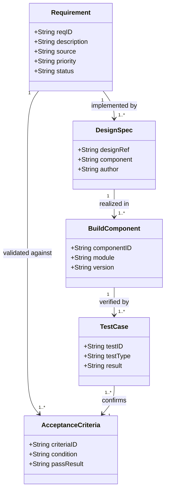

# Module 08 — Scope and Requirements Management


> **Most project failures can be traced to poor scope definition or requirements management.** This module dives deep into the full requirements lifecycle — from elicitation through to acceptance — and covers how to keep scope under control throughout delivery.

---

## Learning outcomes

By the end of this module you will be able to:

- Elicit, document, and accept requirements
- Keep informal requests from bypassing change control
- Trace a requirement from the need to the test that proves it

---

## Table of Contents

- [Learning outcomes](#learning-outcomes)
- [1. The Requirements Lifecycle](#1-the-requirements-lifecycle)
- [2. Types of Requirements](#2-types-of-requirements)
- [3. Requirements Elicitation Techniques](#3-requirements-elicitation-techniques)
  - [Choosing the right technique](#choosing-the-right-technique)
  - [The hidden requirement problem](#the-hidden-requirement-problem)
- [4. Requirements Analysis and Specification](#4-requirements-analysis-and-specification)
  - [From raw input to clear requirements](#from-raw-input-to-clear-requirements)
  - [Writing good requirements](#writing-good-requirements)
  - [User stories as an alternative format](#user-stories-as-an-alternative-format)
- [5. Requirements Prioritization](#5-requirements-prioritization)
  - [MoSCoW](#moscow)
  - [Kano model](#kano-model)
- [6. Requirements Traceability](#6-requirements-traceability)
  - [Why trace requirements?](#why-trace-requirements)
  - [The Requirements Traceability Matrix (RTM)](#the-requirements-traceability-matrix-rtm)
  - [Bidirectional traceability](#bidirectional-traceability)
- [7. Managing Requirements Change](#7-managing-requirements-change)
  - [Requirements will change](#requirements-will-change)
  - [The requirements change process](#the-requirements-change-process)
  - [Version control for requirements](#version-control-for-requirements)
- [8. Scope Creep vs. Scope Change](#8-scope-creep-vs-scope-change)
  - [Scope change is healthy; scope creep is not](#scope-change-is-healthy-scope-creep-is-not)
  - [How scope creep happens](#how-scope-creep-happens)
  - [Preventing scope creep](#preventing-scope-creep)
- [9. Acceptance Criteria](#9-acceptance-criteria)
  - [What are acceptance criteria?](#what-are-acceptance-criteria)
  - [Writing good acceptance criteria](#writing-good-acceptance-criteria)
  - [Acceptance criteria must be agreed before work starts](#acceptance-criteria-must-be-agreed-before-work-starts)
- [Artifacts](#artifacts)
- [Exercises](#exercises)
  - [Exercise 8.1 — Improve vague requirements](#exercise-81--improve-vague-requirements)
  - [Exercise 8.2 — MoSCoW prioritization](#exercise-82--moscow-prioritization)
  - [Exercise 8.3 — Build a mini RTM](#exercise-83--build-a-mini-rtm)
- [Quiz](#quiz)
- [Related Modules](#related-modules)

---

## 1. The Requirements Lifecycle

Requirements management is not a single event at the start of a project — it is a continuous process:

```mermaid
flowchart LR
    E["📋 Elicit (gather from stakeholders)"]
    A["🔍 Analyse (refine & resolve conflicts)"]
    S["📝 Specify (document clearly)"]
    V["✅ Validate (confirm with stakeholders)"]
    B["🔒 Baseline (approve & freeze)"]
    MC["🔄 Manage Change (formal CCB)"]
    T["🔗 Trace (link reqs to deliverables)"]
    VE["🧪 Verify (test against requirements)"]
    AC["🎯 Accept (formal sign-off)"]
    E --> A --> S --> V --> B --> MC
    B --> T --> VE --> AC
    MC --> T
```


*The requirements lifecycle is continuous — change requests re-enter at the Manage Change stage and flow through Trace, Verify, and Accept.*

| Stage | What Happens |
|---|---|
| **Elicit** | Gather raw requirements from stakeholders using various techniques |
| **Analyse** | Examine, refine, and resolve conflicts between requirements |
| **Specify** | Document requirements clearly and unambiguously |
| **Validate** | Confirm with stakeholders that documented requirements reflect their real needs |
| **Baseline** | Approve and freeze the requirements as the scope baseline |
| **Manage Change** | Handle new or changed requirements through formal change control |
| **Trace** | Maintain links between requirements and deliverables throughout delivery |
| **Verify** | Confirm that deliverables meet the requirements (testing) |
| **Accept** | Obtain formal sign-off from the customer |

[↑ Back to top](#table-of-contents)

---

## 2. Types of Requirements

Understanding the different types of requirements prevents gaps and conflicts:

| Type | Definition | Example |
|---|---|---|
| **Business requirements** | High-level organizational needs that the project must address | "Reduce customer onboarding time by 50%" |
| **Stakeholder requirements** | Specific needs of individual stakeholder groups | "Call center agents need to see full customer history on one screen" |
| **Solution requirements — functional** | What the system/product must do | "The system must send an automated welcome email on account creation" |
| **Solution requirements — non-functional** | How the system must perform | "Page load time must be < 2 seconds for 95% of requests" |
| **Transition requirements** | Requirements for getting from current state to future state | "All existing customer data must be migrated with 100% accuracy" |
| **Regulatory requirements** | Legal or compliance mandates | "Personal data must be handled under the applicable privacy requirements" |

Missing requirement types — especially non-functional and transition requirements — are one of the most common causes of project overruns.

[↑ Back to top](#table-of-contents)

---

## 3. Requirements Elicitation Techniques

### Choosing the right technique

No single technique works in all situations. Good requirements elicitation uses a combination:

| Technique | Best Used When | Watch Out For |
|---|---|---|
| **Interviews** | Deep individual input; sensitive topics; senior stakeholders | Interviewee says what they think you want to hear |
| **Workshops** | Group alignment; surfacing conflicts; complex domain | Dominant voices; groupthink; poor facilitation |
| **Observation (shadowing)** | Understanding real workflows; operational processes | Disrupts normal work; subjects may behave differently when observed |
| **Document analysis** | Existing system documentation; legacy requirements | Documents may be outdated or incorrect |
| **Prototyping** | Requirements are hard to articulate verbally | Stakeholders fixate on the prototype rather than underlying need |
| **Surveys / questionnaires** | Large, dispersed user population; quantitative data | Low response rates; cannot probe answers |
| **Brainstorming** | Generating a wide range of possibilities | Can produce noise; needs structured follow-up |
| **Focus groups** | User experience requirements; diverse perspectives | Small, unrepresentative groups; facilitation-sensitive |

### The hidden requirement problem

Stakeholders often cannot fully articulate what they need until they see something. This leads to:

- **Tacit knowledge**: experts know how the process works but have never had to describe it
- **Unknown unknowns**: stakeholders don't know what they don't know they need
- **Gold plating by omission**: requirements are assumed to be understood and are never stated

Mitigation: use multiple techniques, validate early, and iterate.

[↑ Back to top](#table-of-contents)

---

## 4. Requirements Analysis and Specification

### From raw input to clear requirements

Raw elicitation output is typically messy, ambiguous, and contradictory. Analysis involves:

- **Organizing**: grouping related requirements
- **Deduplicating**: removing redundant statements
- **Resolving conflicts**: where two stakeholders have contradictory requirements
- **Clarifying ambiguity**: rewriting vague statements into testable ones
- **Decomposing**: breaking high-level needs into specific, implementable requirements

### Writing good requirements

A well-written requirement is:

| Property | What It Means |
|---|---|
| **Clear** | Unambiguous — only one interpretation possible |
| **Complete** | Contains all necessary information |
| **Consistent** | Does not contradict other requirements |
| **Testable** | There is a clear pass/fail criterion |
| **Traceable** | Can be linked to its source and to the deliverable that implements it |
| **Necessary** | Removing it would cause a gap in the stakeholder's needs |

**Vague requirement:** "The system should be easy to use."
**Testable requirement:** "A new user with no training must be able to complete the account registration process in under 3 minutes in usability testing."

### User stories as an alternative format

For product-type projects, user stories are an effective format:

```
As a [type of user],
I want to [do something],
So that [I can achieve this goal].
```

User stories are not a replacement for full specification — they are a starting point for conversation. Acceptance criteria must still be defined for each story.

[↑ Back to top](#table-of-contents)

---

## 5. Requirements Prioritization

Not all requirements are equally important. Prioritization enables:

- Delivery of the highest-value requirements first
- Informed decisions when scope must be reduced under time/cost pressure
- Clearer scope negotiation with stakeholders

### MoSCoW

The most widely used prioritization technique in project management:

| Priority | Meaning | Guidance |
|---|---|---|
| **Must have** | Non-negotiable; without these the solution fails | Typically 60–70% of scope maximum |
| **Should have** | Important but not critical; can be delivered in a later phase | Aim to include; defer if necessary |
| **Could have** | Desirable; included if time and budget allow | Cut first under pressure |
| **Won't have** | Explicitly out of scope for this delivery | Manages stakeholder expectations |

"Won't have" is not "never" — it means "not this time." Recording it prevents these items from being raised as missed requirements at acceptance.

### Kano model

Classifies features by their impact on customer satisfaction:

| Category | Effect |
|---|---|
| **Basic needs** | Expected; their absence causes dissatisfaction; their presence does not delight |
| **Performance needs** | More = better; linear relationship with satisfaction |
| **Delighters** | Unexpected; their presence creates high satisfaction; their absence is not noticed |

The Kano model helps PMs and business analysts distinguish between table-stakes requirements and value-differentiating ones.

[↑ Back to top](#table-of-contents)

---

## 6. Requirements Traceability

### Why trace requirements?

Requirements traceability ensures that:

- Every requirement is implemented somewhere in the solution
- Every component of the solution maps back to a requirement (nothing unnecessary has been built)
- Every test case verifies at least one requirement

Without traceability, it is impossible to confirm completeness at acceptance.

### The Requirements Traceability Matrix (RTM)

The RTM links requirements horizontally through the project:

| Req ID | Requirement | Source | Design Ref | Build Component | Test Case | Status |
|---|---|---|---|---|---|---|
| REQ-001 | Self-service password reset | User workshop | DS-042 | AuthService v2 | TC-023 | Passed |
| REQ-002 | Personal-data export | Legal | DS-019 | DataExportAPI | TC-047 | In test |
| REQ-003 | Mobile-responsive login | Marketing | DS-031 | UIComponents | TC-012 | Passed |

### Bidirectional traceability

Good traceability works both ways:

- **Forward**: requirement → design → build → test (ensures everything is implemented)
- **Backward**: test → build → design → requirement (ensures nothing unnecessary was built)


*The RTM links requirements bidirectionally through design, build, and test — forward to confirm completeness, backward to confirm nothing unnecessary was built.*

[↑ Back to top](#table-of-contents)

---

## 7. Managing Requirements Change

### Requirements will change

In most projects, some requirements will change after the baseline is set. This is normal and acceptable — what is unacceptable is allowing requirements to change without formal assessment and approval.

### The requirements change process

1. **Request received** (from any stakeholder)
2. **Log in the change register**
3. **Impact assessment**: scope, schedule, cost, risk, dependencies
4. **Present to CCB / sponsor** with a recommendation
5. **Decision**: approve, reject, or defer
6. **Update RTM, scope baseline, and plan** if approved
7. **Notify affected parties**

### Version control for requirements

Requirements documents must be version-controlled. When a requirement changes:

- The old version is retained
- The new version is clearly marked as superseded
- The change is documented with reason and approval record

[↑ Back to top](#table-of-contents)

---

## 8. Scope Creep vs. Scope Change

### Scope change is healthy; scope creep is not

| Scope Change | Scope Creep |
|---|---|
| Formally requested through the change control process | Informally added, often without PM awareness |
| Impact assessed against scope, schedule, and cost | No impact assessment performed |
| Approved by the appropriate authority | No approval obtained |
| Baselines updated to reflect the change | Baselines not updated |
| Team is directed to implement the approved change | Developer adds features "because it seems obvious" |

### How scope creep happens

- Stakeholders bypass the PM and ask developers directly
- "Small" requests are accommodated without change control ("it'll only take an hour")
- Poorly defined acceptance criteria allow gold-plating
- Developers over-engineer solutions beyond specification
- The word "and" in requirements ("...and it should also do...")

### Preventing scope creep

1. **Define scope explicitly** — especially what is out of scope
2. **Train the team** — all requests go through the PM, always
3. **Apply change control consistently** — no exceptions, even for tiny changes
4. **Review scope at every status meeting** — is anything being done that wasn't planned?
5. **Use the RTM** — deliverables without a requirement are out of scope

[↑ Back to top](#table-of-contents)

---

## 9. Acceptance Criteria

### What are acceptance criteria?

Acceptance criteria are the specific, measurable conditions that a deliverable must satisfy to be accepted by the customer. They:

- Remove ambiguity about what "done" means
- Enable objective testing and verification
- Prevent disputes at the acceptance stage
- Give the development team a clear target

### Writing good acceptance criteria

Use the **Given/When/Then** format for functional criteria:

```
Given [a context or precondition],
When [an action is taken],
Then [the expected outcome occurs].
```

**Example:**
> Given a registered user is on the login page,
> When they enter incorrect credentials three times,
> Then their account is locked and they receive an email with reset instructions.

For non-functional criteria, specify measurable thresholds:

> The search results page must load in under 1.5 seconds for 95% of queries under a load of 1,000 concurrent users.

### Acceptance criteria must be agreed before work starts

Criteria defined after a deliverable is built often reflect what was actually built rather than what was needed. Pre-agreed criteria hold the team accountable to the genuine need.

[↑ Back to top](#table-of-contents)

---

## Artifacts

| Artifact | Description | Template |
|---|---|---|
| **Requirements Documentation (BRD)** | Elicited and analysed requirements | — |
| **Requirements Traceability Matrix (RTM)** | Links requirements to design, build, test, and status | — |
| **Acceptance Criteria Document** | Testable pass/fail conditions for each deliverable | — |
| **Scope Statement** | Defines in-scope, out-of-scope, constraints | — |
| **Scope Change Request** | Formal request to alter the scope baseline | [change-request.md](../templates/change-request.md) |
| **Change Log** | Running record of all scope change requests | [change-log.md](../templates/change-log.md) |

[↑ Back to top](#table-of-contents)

---

## Exercises

### Exercise 8.1 — Improve vague requirements

Rewrite each of the following vague requirements as testable, unambiguous statements. Add acceptance criteria in Given/When/Then format for at least two.

1. "The system should be fast."
2. "Users should be able to find what they're looking for easily."
3. "The report should show all the important data."
4. "The portal must be secure."
5. "Notifications should be sent when something happens."

**Expected output:** Five rewritten requirements plus two Given/When/Then acceptance criteria.

---

### Exercise 8.2 — MoSCoW prioritization

You are managing a 12-week project to build an internal expense management system. Budget: $85,000. The stakeholder workshop produced the following requirements list. Prioritize them using MoSCoW and justify your decisions.

1. Submit expense claims with receipt photos
2. Multi-currency support (the company operates in 3 countries)
3. Automatic VAT calculation
4. Integration with the payroll system
5. Mobile app (in addition to web)
6. Approval workflow (manager approves before payment)
7. Reporting dashboard for Finance
8. AI-powered receipt data extraction (no manual entry needed)
9. Audit trail for all expense submissions
10. Employee self-service history of all past claims

**Expected output:** A MoSCoW table with all 10 requirements classified and one sentence of justification per item.

---

### Exercise 8.3 — Build a mini RTM

Using the expense management system from Exercise 8.2, take your Must Have requirements and create a Requirements Traceability Matrix with columns for: Req ID, Description, Source, Priority, Test Case ID, and Status. (For this exercise, invent plausible test case IDs.)

**Expected output:** An RTM with at least 5 rows covering all Must Have requirements.

[↑ Back to top](#table-of-contents)

---

## Quiz

**Question 1:** What makes a requirement "testable"?

- A) It can be implemented by the development team
- B) There is a clear, objective pass/fail criterion
- C) It is measurable in financial terms
- D) It has been approved by the sponsor

<details>
<summary>Reveal Answer</summary>

**B) There is a clear, objective pass/fail criterion.** A testable requirement specifies exactly what must be true for the requirement to be satisfied — removing subjective interpretation.

</details>

---

**Question 2:** In MoSCoW prioritization, "Won't have" means:

- A) This requirement has been rejected permanently
- B) This requirement will be cut if budget runs out
- C) This requirement is explicitly out of scope for this delivery, but may be addressed later
- D) This requirement is too complex to implement

<details>
<summary>Reveal Answer</summary>

**C) This requirement is explicitly out of scope for this delivery, but may be addressed later.** Won't have manages stakeholder expectations by making the boundary explicit. It is not a permanent rejection — it means "not this time."

</details>

---

**Question 3:** What is the purpose of bidirectional traceability in an RTM?

- A) Forward trace confirms all requirements are implemented; backward trace confirms nothing unnecessary was built
- B) Forward trace confirms cost; backward trace confirms schedule
- C) Bidirectional traceability is only used in regulated industries
- D) It tracks requirements changes over time

<details>
<summary>Reveal Answer</summary>

**A) Forward trace confirms all requirements are implemented; backward trace confirms nothing unnecessary was built.** Together, both directions ensure completeness and prevent gold-plating.

</details>

---

**Question 4:** A developer adds a "dark mode" feature to the application because they personally think it would be useful, without any requirement or change request. This is an example of:

- A) Scope change
- B) Progressive elaboration
- C) Scope creep (gold-plating)
- D) A legitimate enhancement

<details>
<summary>Reveal Answer</summary>

**C) Scope creep (gold-plating).** Adding unrequested features without going through change control — even well-intentioned ones — is scope creep. It consumes time and budget, and may introduce unintended complexity or defects.

</details>

---

**Question 5:** Which type of requirements is most commonly missed in initial requirements gathering?

- A) Business requirements
- B) Non-functional and transition requirements
- C) Functional requirements
- D) Stakeholder requirements

<details>
<summary>Reveal Answer</summary>

**B) Non-functional and transition requirements.** Non-functional requirements (performance, security, scalability) and transition requirements (data migration, training, cutover) are frequently overlooked because stakeholders focus on features. Their absence causes significant overruns when discovered late.

</details>

[↑ Back to top](#table-of-contents)

---

**Previous Module:** [Module 07 — Project Closing](07-closing.md)
**Next Module:** [Module 09 — Stakeholder Management](09-stakeholder-management.md)

---

## Related Modules

| Module | Relationship |
|---|---|
| [Module 03 — Project Initiation](03-initiation.md) | High-level scope is defined in initiation; detailed requirements elaboration begins here |
| [Module 04 — Project Planning](04-planning.md) | The WBS and scope baseline are planning outputs; requirements drive schedule and cost estimates |
| [Module 05 — Project Execution](05-execution.md) | Scope is delivered during execution; change requests update the scope baseline throughout delivery |
| [Module 15a — Integration, Hybrid Approaches, and Agile](15a-integration-hybrid-agile.md) | Agile treats scope as a prioritized backlog rather than a fixed baseline — a fundamental shift covered in 15a |

---

&copy; 2026 UncleJs &mdash; Licensed under [CC BY-NC-SA 4.0](https://creativecommons.org/licenses/by-nc-sa/4.0/)
