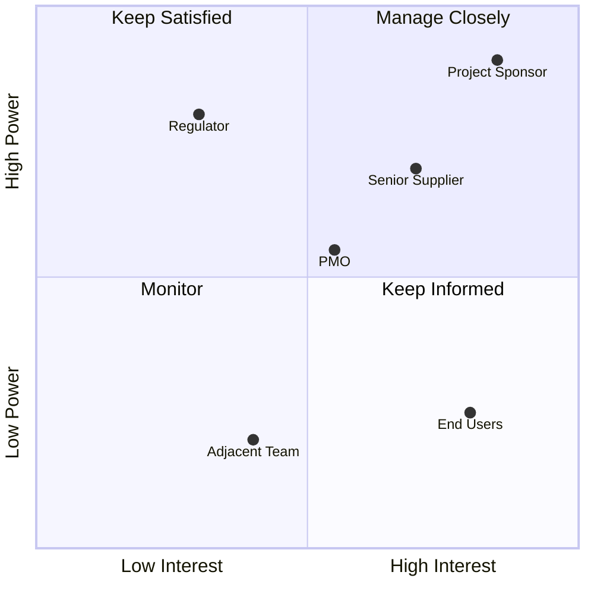
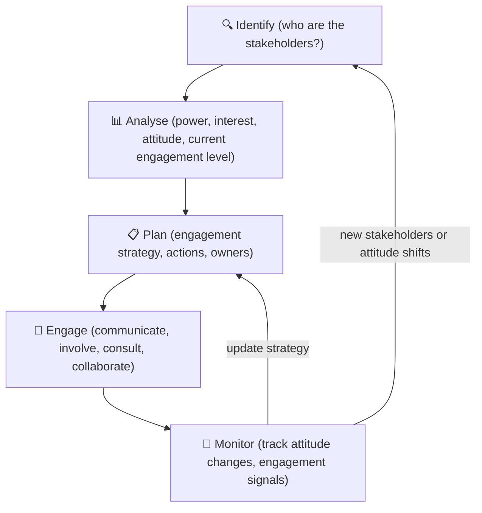

# Module 09 — Stakeholder Management

> **Projects are delivered by people and for people — and managing the human dimension is where most PMs either excel or fail.** This module covers how to identify, analyse, engage, and manage stakeholders throughout the entire project lifecycle.

---

## Table of Contents

- [1. Who Are Stakeholders?](#1-who-are-stakeholders)
  - [Stakeholder types](#stakeholder-types)
- [2. Stakeholder Identification](#2-stakeholder-identification)
  - [When to identify stakeholders](#when-to-identify-stakeholders)
  - [How to identify stakeholders](#how-to-identify-stakeholders)
  - [The Stakeholder Register](#the-stakeholder-register)
- [3. Stakeholder Analysis](#3-stakeholder-analysis)
  - [Power/Interest Grid](#powerinterest-grid)
  - [Salience model](#salience-model)
  - [Moving beyond categories](#moving-beyond-categories)
- [4. Engagement Levels](#4-engagement-levels)
- [5. Developing a Stakeholder Engagement Strategy](#5-developing-a-stakeholder-engagement-strategy)
  - [Engagement is not just communication](#engagement-is-not-just-communication)
  - [The Stakeholder Engagement Plan](#the-stakeholder-engagement-plan)
  - [Cultural considerations](#cultural-considerations)
- [6. Managing Difficult Stakeholders](#6-managing-difficult-stakeholders)
  - [Why stakeholders resist](#why-stakeholders-resist)
  - [The engagement not confrontation principle](#the-engagement-not-confrontation-principle)
  - [When to escalate](#when-to-escalate)
- [7. Ongoing Stakeholder Monitoring](#7-ongoing-stakeholder-monitoring)
  - [Stakeholder positions are not static](#stakeholder-positions-are-not-static)
  - [Monitoring signals](#monitoring-signals)
  - [Re-engaging lapsed stakeholders](#re-engaging-lapsed-stakeholders)
- [8. Ethics and Transparency in Stakeholder Management](#8-ethics-and-transparency-in-stakeholder-management)
  - [The boundaries of engagement](#the-boundaries-of-engagement)
  - [Conflict of interest](#conflict-of-interest)
- [Artifacts](#artifacts)
- [Exercises](#exercises)
  - [Exercise 9.1 — Stakeholder identification](#exercise-91--stakeholder-identification)
  - [Exercise 9.2 — Power/Interest grid mapping](#exercise-92--powerinterest-grid-mapping)
  - [Exercise 9.3 — Resistant stakeholder scenario](#exercise-93--resistant-stakeholder-scenario)
- [Quiz](#quiz)
- [Related Modules](#related-modules)

---

## 1. Who Are Stakeholders?

A **stakeholder** is any individual, group, or organization that:

- May affect the project (decision-makers, regulators, resource owners)
- May be affected by the project (users, communities, downstream processes)
- May perceive themselves to be affected by the project (lobby groups, media, competitors)

The third category is often overlooked. Perception matters — a stakeholder who believes they are affected can influence the project's success whether or not their belief is accurate.

### Stakeholder types

| Category | Examples |
|---|---|
| **Internal stakeholders** | Sponsor, project board, project team, functional managers, PMO |
| **External stakeholders** | Customers, end users, regulators, suppliers, community groups, media |
| **Primary stakeholders** | Directly affected by the project's outputs (users, operational teams) |
| **Secondary stakeholders** | Indirectly affected (adjacent business units, downstream service providers) |
| **Positive stakeholders** | Stand to benefit; generally supportive |
| **Negative stakeholders** | Believe they will be disadvantaged; may actively resist |

[↑ Back to top](#table-of-contents)

---

## 2. Stakeholder Identification

### When to identify stakeholders

Stakeholder identification should begin **as early as possible** — ideally during initiation — and continue throughout the project. Late stakeholder discovery is expensive:

- Missed requirements discovered at acceptance
- Resistance from groups who were not consulted
- Change requests caused by unidentified needs
- Political opposition from influential parties who feel excluded

### How to identify stakeholders

**Structured approaches:**

1. **Organizational chart analysis** — who in the organization will be touched by the change?
2. **Process mapping** — which teams or individuals are involved in the processes the project will affect?
3. **Regulatory scan** — which bodies have oversight or approval rights?
4. **Supplier and partner review** — which external parties interact with the project's scope?
5. **Stakeholder snowball** — ask each identified stakeholder "Who else should we be talking to?"
6. **PESTLE analysis** — Political, Economic, Social, Technological, Legal, Environmental — surfaces non-obvious external stakeholders

### The Stakeholder Register

For each identified stakeholder, capture at minimum:

| Field | Description |
|---|---|
| Name / role | Individual name or role title |
| Organization / department | Where they sit |
| Contact details | For communication planning |
| Interest in the project | What they care about |
| Level of influence | How much power they have over the project's success |
| Current attitude | Supportive / neutral / resistant |
| Preferred communication | Email, meeting, formal report, etc. |

[↑ Back to top](#table-of-contents)

---

## 3. Stakeholder Analysis

### Power/Interest Grid

The most widely used stakeholder analysis tool. Plot each stakeholder on a two-dimensional grid:

*Plot each stakeholder by their level of interest in and power over the project — the quadrant determines the management strategy.*

**Strategy by quadrant:**

| Quadrant | Strategy |
|---|---|
| **Manage closely** | Engage actively; involve in decisions; regular two-way communication |
| **Keep satisfied** | Address their interests proactively; don't burden them with detail |
| **Keep informed** | Regular updates; don't need to involve in decisions |
| **Monitor** | Minimal effort; watch for attitude or influence changes |

### Salience model

A more nuanced three-dimensional model assessing:

- **Power**: ability to influence the project
- **Legitimacy**: degree to which involvement is appropriate
- **Urgency**: time-sensitivity of their concerns

Stakeholders scoring high on all three (high salience) require the most attention.

### Moving beyond categories

Analysis tools are starting points, not conclusions. Real stakeholders are complex:

- A "low power" stakeholder may have informal influence that does not show up in the org chart
- Attitudes change — a supportive stakeholder can become resistant if they feel ignored
- Groups have internal politics — a "stakeholder" group may have multiple, conflicting views

*Stakeholder engagement is a continuous cycle — not a one-time analysis at initiation.*

[↑ Back to top](#table-of-contents)

---

## 4. Engagement Levels

The **Stakeholder Engagement Assessment Matrix** maps the current and desired engagement level for each stakeholder:

| Level | Description |
|---|---|
| **Unaware** | Does not know the project exists |
| **Resistant** | Aware but actively opposed |
| **Neutral** | Aware but neither supportive nor opposed |
| **Supportive** | Aware and supportive |
| **Leading** | Actively engaged; champions the project |

| Stakeholder | Current (C) | Desired (D) |
|---|---|---|
| Operations Director | Resistant | Supportive |
| IT Manager | Neutral | Supportive |
| End Users | Unaware | Supportive |
| Regulator | Neutral | Neutral |

The gap between C and D defines the engagement work needed. A "Leading" stakeholder does not need to be moved — but they need to be maintained and not alienated.

[↑ Back to top](#table-of-contents)

---

## 5. Developing a Stakeholder Engagement Strategy

### Engagement is not just communication

Many PMs confuse stakeholder management with stakeholder communication. Communication is one tactic. Engagement is broader:

- **Involvement**: inviting stakeholders to contribute to decisions
- **Consultation**: seeking input before decisions are made
- **Collaboration**: working jointly on solutions
- **Empowerment**: giving stakeholders the authority to make certain decisions

The appropriate level depends on the stakeholder's position in the power/interest grid and the nature of the decision.

### The Stakeholder Engagement Plan

The engagement plan documents:

- Which stakeholders need what level of engagement
- What the engagement objectives are for each
- Specific actions to be taken (e.g., "monthly briefing with Ops Director"; "workshop with user group in month 3")
- Who is responsible for each engagement activity
- How engagement will be monitored and measured

### Cultural considerations

Stakeholder engagement is deeply influenced by culture — organizational and national. What counts as "appropriate engagement" varies:

- **Communication style**: direct vs. indirect; formal vs. informal
- **Decision-making norms**: consensus-based vs. hierarchical
- **Relationship expectations**: transactional vs. relationship-first
- **Time orientation**: short-term results vs. long-term relationship building

PMs working with internationally diverse stakeholder groups must research and adapt to these differences.

[↑ Back to top](#table-of-contents)

---

## 6. Managing Difficult Stakeholders

### Why stakeholders resist

Resistance is rarely irrational. Common causes:

| Cause | What the Stakeholder Experiences |
|---|---|
| **Loss of control** | The project changes how they work without their input |
| **Previous bad experience** | A similar project failed or created problems for them |
| **Competing priorities** | The project adds demands to an already overloaded workload |
| **Genuine concern** | They see a real problem with the project's approach |
| **Politics** | They oppose the project for reasons unrelated to its merits |

### The engagement not confrontation principle

Confronting resistance with argument typically hardens it. More effective approaches:

1. **Listen first** — understand the specific concern before responding
2. **Acknowledge legitimacy** — validate the concern without necessarily agreeing
3. **Address the root cause** — adjust approach, provide information, escalate real problems
4. **Involve the resistor** — people who helped design the solution are less likely to resist it
5. **Find shared interests** — what does the stakeholder value that the project can help deliver?

### When to escalate

If a resistant stakeholder has significant influence and engagement efforts are not working, escalate:

- Brief the sponsor on the situation
- Ask the sponsor to engage with the resistant stakeholder directly (peer-to-peer influence is often more effective)
- Document the engagement attempts for the record

[↑ Back to top](#table-of-contents)

---

## 7. Ongoing Stakeholder Monitoring

### Stakeholder positions are not static

Stakeholders who were supportive at initiation may become resistant as the project's impact on them becomes clearer. Stakeholders who were neutral may become advocates once they see early results.

The PM must **continuously monitor** stakeholder engagement and update the register accordingly.

### Monitoring signals

Watch for:

- Missed meetings or unreturned communications (disengagement)
- Escalating volume of complaints or objections (increasing resistance)
- Requests for information outside normal reporting channels (anxiety or loss of confidence)
- Lateral stakeholder conversations (building opposition coalitions)
- Sudden renewed interest (may signal a positive shift — or a concern they are raising elsewhere)

### Re-engaging lapsed stakeholders

When a previously engaged stakeholder has drifted:

1. Check whether there is a specific grievance (address it)
2. Re-brief them on project status and impact
3. Find a meaningful way to involve them (give them something to contribute)
4. Escalate to the sponsor if re-engagement fails

[↑ Back to top](#table-of-contents)

---

## 8. Ethics and Transparency in Stakeholder Management

### The boundaries of engagement

Stakeholder management involves influence — and influence can be misused. Ethical boundaries:

- **Transparency**: stakeholders should know when they are being managed; manipulation is unacceptable
- **Honesty**: never mislead a stakeholder about project status, impact, or outcomes
- **Inclusivity**: do not exclude stakeholder groups because their views are inconvenient
- **Consent**: for external communities, ensure genuine consultation processes, not performative ones
- **Confidentiality**: some stakeholder information (political positions, personal concerns) must be handled with discretion

### Conflict of interest

A PM must manage their own potential conflicts of interest in stakeholder engagement — for example, if a key stakeholder is a personal friend, or if the PM has a financial interest in a particular outcome.

Disclose conflicts of interest to the sponsor. Where necessary, recuse yourself from specific decisions.

[↑ Back to top](#table-of-contents)

---

## Artifacts

| Artifact | Description | Template |
|---|---|---|
| **Stakeholder Register** | Full catalog of stakeholders with analysis data | [stakeholder-register.md](../templates/stakeholder-register.md) |
| **Power/Interest Grid** | Visual analysis of stakeholder influence and interest | — |
| **Stakeholder Engagement Assessment Matrix** | Current vs. desired engagement levels | — |
| **Stakeholder Engagement Plan** | Planned engagement actions, owners, and schedule | — |
| **Communication Schedule** | Derived from the engagement plan | [communications-plan.md](../templates/communications-plan.md) |

[↑ Back to top](#table-of-contents)

---

## Exercises

### Exercise 9.1 — Stakeholder identification

You are managing a project to relocate a company's head office from the city center to a business park 8 miles away. The company has 300 staff.

Identify at least 12 stakeholders, covering internal, external, primary, and secondary categories. For each, note their primary interest and your initial estimate of their attitude (supportive / neutral / resistant) and why.

**Expected output:** A stakeholder register with at least 12 entries.

---

### Exercise 9.2 — Power/Interest grid mapping

Using your stakeholder register from Exercise 9.1, plot all 12 stakeholders on a Power/Interest grid and assign a management strategy to each.

Identify at least one stakeholder in each quadrant. For the "Manage closely" quadrant, describe a specific engagement activity you would undertake.

**Expected output:** A completed Power/Interest grid (table format is fine) and engagement activity descriptions for the "Manage closely" group.

---

### Exercise 9.3 — Resistant stakeholder scenario

The Head of IT at the relocation company is strongly resistant to the office move. They believe the new business park has poor connectivity infrastructure and that the project team has not adequately assessed the technical requirements. They have begun lobbying the CEO directly.

1. Diagnose the root cause of their resistance
2. Identify the appropriate conflict resolution mode
3. Describe the engagement steps you would take over the next 2 weeks
4. What would you include in a briefing to the project sponsor about this situation?

**Expected output:** A one-page engagement action plan.

[↑ Back to top](#table-of-contents)

---

## Quiz

**Question 1:** Which stakeholder analysis tool uses power and interest as its two dimensions?

- A) Salience model
- B) RACI matrix
- C) Power/Interest grid
- D) MoSCoW prioritization

Reveal Answer

**C) Power/Interest grid.** The Power/Interest grid (also called the stakeholder matrix) plots stakeholders by their level of power/influence and their level of interest in the project.

---

**Question 2:** In the Stakeholder Engagement Assessment Matrix, what does the "C" column represent?

- A) Capability level
- B) Current engagement level
- C) Communication frequency
- D) Cost of engagement

Reveal Answer

**B) Current engagement level.** The matrix contrasts Current (C) engagement with Desired (D) engagement. The gap between C and D defines the engagement work needed.

---

**Question 3:** A stakeholder in the "Keep Satisfied" quadrant (high power, low interest) should be managed by:

- A) Involving them deeply in all project decisions
- B) Sending them minimal communication
- C) Proactively addressing their interests without overwhelming them with project detail
- D) Ignoring them until they become more interested

Reveal Answer

**C) Proactively addressing their interests without overwhelming them with project detail.** High-power, low-interest stakeholders can derail a project if their concerns are not addressed — but they do not want operational details. Keep them satisfied with concise, relevant communication.

---

**Question 4:** Stakeholder identification should be done:

- A) Only at project initiation
- B) Only when a new risk is identified
- C) Continuously throughout the project lifecycle
- D) Once per project stage

Reveal Answer

**C) Continuously throughout the project lifecycle.** New stakeholders emerge as the project progresses and its impact becomes clearer. Stopping identification after initiation is a common source of late-project surprises.

---

**Question 5:** Which of the following is NOT an ethical principle in stakeholder management?

- A) Transparency about the project's actual status
- B) Excluding stakeholders whose views would complicate the project
- C) Disclosing conflicts of interest
- D) Genuine consultation processes for affected communities

Reveal Answer

**B) Excluding stakeholders whose views would complicate the project.** This is a manipulation tactic, not ethical practice. All legitimate stakeholder groups should be identified and engaged, even when their views create challenges.

[↑ Back to top](#table-of-contents)

---

**Previous Module:** [Module 08 — Scope and Requirements Management](08-scope-requirements.md)
**Next Module:** [Module 10 — Communications Management](10-communications.md)

---

## Related Modules

| Module | Relationship |
|---|---|
| [Module 03 — Project Initiation](03-initiation.md) | Stakeholder identification starts at initiation; the stakeholder register is a key PID component |
| [Module 10 — Communications Management](10-communications.md) | Communications is the primary vehicle for stakeholder engagement; the two modules are tightly linked |
| [Module 15b — Professional Practice and Career Development](15b-professional-practice.md) | Covers ethical dimensions of stakeholder engagement, influence without authority, and handling difficult stakeholders |

---

&copy; 2026 UncleJs &mdash; Licensed under [CC BY-NC-SA 4.0](https://creativecommons.org/licenses/by-nc-sa/4.0/)
