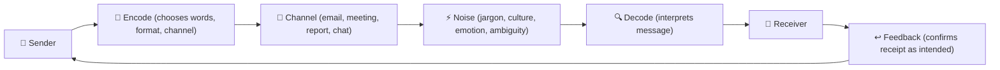
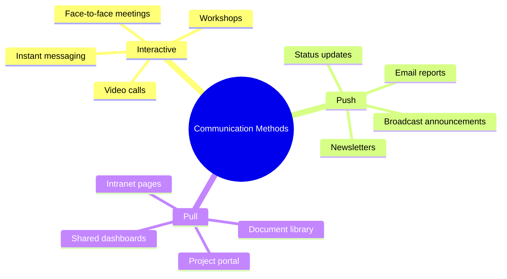

# Module 10 — Communications Management


> **The #1 cited cause of project failure is poor communication.** This module covers how to plan, execute, and manage information flows so that the right people get the right information at the right time in the right format.

---

## Table of Contents

- [1. Why Communications Management Matters](#1-why-communications-management-matters)
- [2. Communication Planning](#2-communication-planning)
  - [The Communications Management Plan](#the-communications-management-plan)
  - [The Communication Matrix](#the-communication-matrix)
  - [Communication with a purpose](#communication-with-a-purpose)
- [3. Communication Models and Channels](#3-communication-models-and-channels)
  - [The communication model](#the-communication-model)
  - [Channel selection](#channel-selection)
  - [Communication channels formula](#communication-channels-formula)
- [4. Formal vs. Informal Communication](#4-formal-vs-informal-communication)
  - [Formal communication](#formal-communication)
  - [Informal communication](#informal-communication)
  - [Push vs. pull vs. interactive communication](#push-vs-pull-vs-interactive-communication)
- [5. Written Communication in Projects](#5-written-communication-in-projects)
  - [Principles of effective project writing](#principles-of-effective-project-writing)
  - [Common project reports](#common-project-reports)
  - [The executive summary](#the-executive-summary)
- [6. Meeting Management](#6-meeting-management)
  - [Meetings are not free](#meetings-are-not-free)
  - [Before the meeting](#before-the-meeting)
  - [During the meeting](#during-the-meeting)
  - [After the meeting](#after-the-meeting)
- [7. Digital and Information Management](#7-digital-and-information-management)
  - [The project information environment](#the-project-information-environment)
  - [Information management principles](#information-management-principles)
  - [Project portal / collaboration platform](#project-portal-collaboration-platform)
  - [Data governance on projects](#data-governance-on-projects)
- [8. Virtual and Distributed Teams](#8-virtual-and-distributed-teams)
  - [The communications challenge in virtual teams](#the-communications-challenge-in-virtual-teams)
  - [Effective virtual team communication](#effective-virtual-team-communication)
  - [Asynchronous communication](#asynchronous-communication)
- [9. Managing Information Overload](#9-managing-information-overload)
  - [The overloaded stakeholder](#the-overloaded-stakeholder)
  - [Signs of communication overload](#signs-of-communication-overload)
  - [Practical solutions](#practical-solutions)
- [10. Escalation Protocols](#10-escalation-protocols)
  - [What is an escalation protocol?](#what-is-an-escalation-protocol)
  - [Escalation levels](#escalation-levels)
  - [Escalation culture](#escalation-culture)
- [Artifacts](#artifacts)
- [Exercises](#exercises)
  - [Exercise 10.1 — Build a Communication Matrix](#exercise-101-build-a-communication-matrix)
  - [Exercise 10.2 — Write a Highlight Report](#exercise-102-write-a-highlight-report)
  - [Exercise 10.3 — Meeting audit](#exercise-103-meeting-audit)
- [Quiz](#quiz)
- [Related Modules](#related-modules)

---

## 1. Why Communications Management Matters

Studies consistently find that poor communication is the single most frequently cited factor in project failure. The consequences of poor communication:

- Decisions made on incorrect or incomplete information
- Stakeholders surprised by developments they should have known about
- Team members working at cross-purposes due to unclear direction
- Escalation failures — problems not surfaced until they become crises
- Loss of stakeholder confidence and trust

Effective communication is not the same as frequent communication. Bombarding stakeholders with emails and meetings is its own failure mode. The goal is **purposeful, appropriately-targeted communication** that creates alignment and enables good decisions.

[↑ Back to top](#table-of-contents)

---

## 2. Communication Planning

### The Communications Management Plan

The plan answers five core questions for each piece of information:

1. **What** — what information needs to be communicated?
2. **To whom** — which audience needs this information?
3. **When** — how often and at what trigger points?
4. **How** — what channel or format?
5. **Who is responsible** — who produces and distributes it?

### The Communication Matrix

A practical tool derived from the plan — a grid mapping audiences to messages:

| Information | Audience | Frequency | Channel | Format | Owner |
|---|---|---|---|---|---|
| Project status | Sponsor | Bi-weekly | Email | Highlight Report | PM |
| Progress update | Project board | Monthly | Meeting | Formal presentation | PM |
| Work package status | PM | Weekly | Meeting | Checkpoint report | Team leads |
| Go-live notice | All staff | Once | Intranet post | Article | Comms manager |
| Risk summary | Project board | Monthly | Report | Risk report section | PM |

### Communication with a purpose

Every communication should have a defined purpose:

- **Inform** — share information without expecting a response
- **Request** — ask for input, feedback, or approval
- **Update** — provide revised status or information
- **Escalate** — flag a problem requiring a decision
- **Celebrate** — recognise achievement

[↑ Back to top](#table-of-contents)

---

## 3. Communication Models and Channels

### The communication model


*Noise distorts the message at any point in the chain — feedback is the only way to verify the message was received as intended.*

**Noise** is anything that distorts the message: technical jargon, cultural differences, emotional state, medium limitations, ambiguous language.

**Feedback** confirms whether the message was received as intended. Without feedback mechanisms, communication is one-directional and unverifiable.

### Channel selection

| Channel | Best For | Not Suitable For |
|---|---|---|
| **Face-to-face meeting** | Complex issues; sensitive conversations; relationship building | Routine updates to large groups |
| **Video call** | Distributed teams; semi-formal discussions | Quick simple questions |
| **Email** | Formal record; non-urgent information sharing; documentation | Urgent issues; complex discussions |
| **Instant messaging** | Quick questions; informal coordination | Formal decisions; sensitive issues |
| **Formal report** | Governance reporting; decision-making documents | Day-to-day coordination |
| **Project portal / intranet** | Reference information; document sharing | Urgent or time-sensitive communication |

**Rule of thumb:** The more complex, sensitive, or important the message, the richer the channel should be. Delivering bad news by email is almost always the wrong choice.

### Communication channels formula

For a project team of *n* people, the number of potential communication channels is:

**n × (n − 1) ÷ 2**

A team of 10 has 45 channels. A team of 50 has 1,225. As project size grows, managing communication complexity becomes exponentially harder — one of the key reasons large projects need dedicated communication planning.

[↑ Back to top](#table-of-contents)

---

## 4. Formal vs. Informal Communication

### Formal communication

Formal communication follows planned channels, uses defined formats, and creates a record:

- Highlight reports, status reports, exception reports
- Board presentations
- Change requests and approvals
- Formal meeting minutes
- Contract correspondence

Formal communication creates accountability, provides an audit trail, and ensures key information reaches decision-makers.

### Informal communication

Informal communication happens outside planned channels:

- Corridor conversations
- Instant messages
- Ad-hoc calls
- Social interactions

Informal communication is essential for building relationships, sensing team morale, and surfacing issues before they become formal problems. PMs who communicate only formally miss critical signals.

### Push vs. pull vs. interactive communication

| Type | Description | Examples |
|---|---|---|
| **Push** | PM sends information to specific recipients | Email, report distribution |
| **Pull** | Information is available for recipients to access when they choose | Project portal, document library |
| **Interactive** | Real-time exchange between parties | Meetings, calls, instant messaging |

A good communications plan uses all three. Interactive is most effective for complex topics; push is efficient for status updates; pull is best for reference materials.


*Choose the method based on urgency, complexity, and sensitivity — the richer the channel, the more effective for difficult messages.*

[↑ Back to top](#table-of-contents)

---

## 5. Written Communication in Projects

### Principles of effective project writing

1. **Lead with the key message** — state the purpose or conclusion first; don't make readers wade through context to find the point
2. **Know your audience** — a technical report for the development team is different from an executive summary for the board
3. **Be concise** — every sentence should justify its presence
4. **Use structure** — headings, bullet points, and tables aid scanability
5. **Be specific** — "the project is behind schedule" is less useful than "Phase 2 testing is 8 days behind, impacting the Go Live milestone on 15 March"
6. **State what you need** — if you are requesting a decision or action, make that explicit

### Common project reports

**Highlight Report (Status Report):**
- Period covered
- Overall RAG status and rationale
- Progress this period: key accomplishments
- Plan next period
- Risks and issues summary
- Decisions required from the sponsor

**Checkpoint Report:**
- Work completed this period (vs. plan)
- Work planned next period
- Issues and risks identified
- Resources required and available

**Exception Report:**
- What has happened / is forecast to happen
- Cause
- Impact on project objectives, business case, tolerances
- Options for response
- Recommendation

### The executive summary

For any document read by senior stakeholders, a one-page executive summary is essential. It answers:

- What is this document about?
- What is the current situation?
- What do you need me to do (decision, approval, awareness)?

[↑ Back to top](#table-of-contents)

---

## 6. Meeting Management

### Meetings are not free

A one-hour meeting with 10 participants costs 10 person-hours. At an average fully-loaded cost of £50/hour, that is £500 per meeting. A project with 5 weekly standing meetings running for a year costs over £125,000 in meeting time alone.

This does not mean avoid meetings — it means make every meeting earn its cost.

### Before the meeting

- **Define the purpose**: what decision or outcome is needed?
- **Write an agenda**: with items, owners, and time allocations
- **Invite only necessary participants**: everyone else gets the minutes
- **Distribute materials in advance**: decision-making requires preparation
- **Choose the right format**: some "meetings" are better as emails

### During the meeting

- **Start and end on time**: always
- **Assign a facilitator and a note-taker**: the PM should not do both
- **Follow the agenda**: timekeeper discipline is a kindness, not a rudeness
- **Capture decisions and actions**: with named owner and due date
- **Park off-topic items**: note them; address them separately

### After the meeting

- **Distribute minutes within 24 hours**: while memories are fresh
- **Chase overdue actions**: at the next meeting, open actions are the first agenda item
- **Cancel meetings when they serve no purpose**: a standing meeting that has run out of purpose should be stopped

[↑ Back to top](#table-of-contents)

---

## 7. Digital and Information Management

### The project information environment

Modern projects generate enormous volumes of information: plans, reports, specifications, correspondence, decisions, change requests. Without intentional management, this becomes an information archaeology problem — finding what you need when you need it.

### Information management principles

1. **Single source of truth**: one repository for each type of document; no duplicates
2. **Clear naming conventions**: files named consistently so content is identifiable without opening
3. **Version control**: every document version numbered; superseded versions retained but clearly marked
4. **Access control**: not everyone needs access to everything; sensitive information (HR, commercial) must be appropriately restricted
5. **Retention policy**: know which records must be kept, for how long, and in what format

### Project portal / collaboration platform

Most projects benefit from a shared workspace — whether SharePoint, Confluence, Teams, or a simple shared folder structure. Define and enforce:

- Folder structure (don't let it grow organically)
- Naming conventions
- Who can edit vs. read-only
- How documents are approved and version-controlled

### Data governance on projects

Projects that handle personal data, commercially sensitive information, or regulated data must have explicit data governance:

- What data does the project process?
- Who has access and on what basis?
- How is the data stored and protected?
- What happens to the data at project closure?

[↑ Back to top](#table-of-contents)

---

## 8. Virtual and Distributed Teams

### The communications challenge in virtual teams

When team members work in different locations, time zones, and cultures, the natural informal communication that holds teams together does not happen. The PM must actively compensate.

### Effective virtual team communication

| Challenge | Response |
|---|---|
| **Lack of informal contact** | Schedule regular one-to-one check-ins; use video (not just audio or text) |
| **Time zone differences** | Rotate meeting times so the burden of inconvenient hours is shared |
| **Cultural communication differences** | Invest time in understanding cultural norms; be explicit about expectations |
| **Technology barriers** | Agree on a standard toolset; ensure everyone has adequate access |
| **Reduced visibility of team morale** | Watch for signals; create channels for informal discussion |
| **Decision-making delays** | Define clear decision rights; use asynchronous decision-making tools for lower-stakes decisions |

### Asynchronous communication

Not all virtual communication needs to be synchronous. For distributed teams:

- Use threaded discussion tools for decisions that don't require real-time input
- Document decisions in writing regardless of how they were made
- Create explicit "response expected by" deadlines for asynchronous requests

[↑ Back to top](#table-of-contents)

---

## 9. Managing Information Overload

### The overloaded stakeholder

Senior stakeholders are typically overloaded with information. A PM who sends voluminous, unstructured reports will find them unread. The result is stakeholders who are technically "informed" but functionally unaware.

### Signs of communication overload

- Reports are acknowledged but not acted upon
- Stakeholders ask questions that were answered in a recent report
- Meeting attendance drops
- Escalations arrive without prior warning (stakeholders stopped reading reports)

### Practical solutions

- **Ruthlessly edit** reports — every sentence earns its place
- **Lead with the exception**: structure reports so the key message is on the first half-page
- **Use visual formats**: dashboards, traffic lights, charts convey more information faster than prose
- **Reduce frequency where appropriate**: if nothing significant changed, a brief "all green, no actions required" is better than a long report
- **Ask stakeholders what they actually want**: communication preferences vary; ask rather than assume

[↑ Back to top](#table-of-contents)

---

## 10. Escalation Protocols

### What is an escalation protocol?

An escalation protocol defines the path for raising issues, exceptions, and decisions that cannot be resolved at the current level. It answers:

- What triggers escalation? (thresholds, issue types)
- Who escalates to whom?
- In what timeframe?
- Via what channel?
- With what information?

### Escalation levels

```
Team member → Work Package issue → Team Leader
Team Leader → Work Package cannot be resolved → Project Manager
Project Manager → Tolerance breached / cannot resolve → Project Board
Project Board → Programme-level issue → Programme Manager / Executive Board
```

### Escalation culture

Many teams resist escalation because it feels like failure. Effective PMs establish a culture in which early escalation is valued:

- "Escalating early" is professional behaviour, not weakness
- Holding a problem at a level where it cannot be resolved is the real failure
- Surprises at senior level — caused by failure to escalate — damage trust far more than proactive escalation

[↑ Back to top](#table-of-contents)

---

## Artifacts

| Artifact | Description | Template |
|---|---|---|
| **Communications Management Plan** | Who gets what information, when, how, and from whom | [communications-plan.md](../templates/communications-plan.md) |
| **Communication Matrix** | Audience × message × frequency × channel × owner | — |
| **Status Report / Highlight Report** | Periodic progress update for stakeholders | [status-report.md](../templates/status-report.md) |
| **Meeting Agenda** | Standard structure for project meetings | [meeting-agenda.md](../templates/meeting-agenda.md) |
| **Meeting Minutes** | Record of decisions, actions, and attendees | [meeting-minutes.md](../templates/meeting-minutes.md) |
| **Escalation Protocol** | Defines escalation paths, triggers, and timeframes | — |
| **Information Management Plan** | Document naming, storage, access, and retention | — |

[↑ Back to top](#table-of-contents)

---

## Exercises

### Exercise 10.1 — Build a Communication Matrix

You are PM for a 9-month project to implement a new Learning Management System (LMS) at a university. Stakeholders include: the Provost (sponsor), Head of IT, Head of HR, academic staff (200 people), students (8,000), the LMS vendor, and the IT project team (5 people).

Produce a Communication Matrix that covers:

- At least 6 distinct communication events or standing communications
- All major stakeholder groups
- Appropriate frequency, channel, and format for each

**Expected output:** A completed Communication Matrix with at least 6 rows.

---

### Exercise 10.2 — Write a Highlight Report

Using the data from the EVM exercise in Module 06 (project at month 4, SPI 0.83, CPI 0.89, EAC £112,360), write a Highlight Report for the project sponsor. The project is a system integration project for a healthcare provider.

Include all standard sections: period covered, RAG status, progress, plan, risks, issues, decisions required.

**Expected output:** A complete one-page Highlight Report.

---

### Exercise 10.3 — Meeting audit

Examine the following scenario and identify what went wrong. Propose corrective actions.

*A 90-minute weekly project status meeting has 15 attendees. There is no agenda. The PM goes around the room asking each person to give a status update. Half the updates are relevant to only one or two other people. The last 20 minutes run over because two developers get into a technical argument. Minutes are distributed 5 days later. Three people in the room were not sure why they were invited.*

List at least 6 specific problems and a corrective action for each.

**Expected output:** A structured meeting audit table with problems and corrective actions.

[↑ Back to top](#table-of-contents)

---

## Quiz

**Question 1:** For a project team of 8 people, how many potential communication channels exist?

- A) 8
- B) 16
- C) 28
- D) 56

<details>
<summary>Reveal Answer</summary>

**C) 28.** Using the formula n × (n − 1) ÷ 2: 8 × 7 ÷ 2 = 28. This illustrates why communication complexity grows so rapidly as team size increases.

</details>

---

**Question 2:** "Push" communication means:

- A) Persuading stakeholders to accept a decision
- B) The PM sending information to specific recipients
- C) Information available for recipients to access when they choose
- D) Real-time interactive exchange

<details>
<summary>Reveal Answer</summary>

**B) The PM sending information to specific recipients.** Push communication is directed — the sender distributes to a defined audience. Pull communication is available on demand (e.g., a project portal). Interactive is two-way in real time.

</details>

---

**Question 3:** When should bad news be communicated to the project sponsor?

- A) Only after the PM has a solution ready
- B) Only in the monthly status report
- C) As soon as the PM is aware, using an appropriately rich channel
- D) At the next project board meeting

<details>
<summary>Reveal Answer</summary>

**C) As soon as the PM is aware, using an appropriately rich channel.** Delaying bad news is an ethical failure and a governance failure. Sponsors need accurate, timely information to make good decisions. Bad news should not be delivered by email if it is significant.

</details>

---

**Question 4:** What is the "noise" element in a communication model?

- A) Loud background sound during a meeting
- B) Any distortion or interference that prevents a message from being received as intended
- C) The number of people in a communication chain
- D) Informal communication that bypasses the PM

<details>
<summary>Reveal Answer</summary>

**B) Any distortion or interference that prevents a message from being received as intended.** Noise includes technical jargon, cultural differences, ambiguous language, emotional state, and medium limitations — anything that distorts the intended message.

</details>

---

**Question 5:** Which of the following is a sign that a project's communication approach may be causing information overload?

- A) Stakeholders ask for more detailed reports
- B) Stakeholders ask questions that were already answered in recent reports
- C) Team meetings are well-attended
- D) Change requests are submitted promptly

<details>
<summary>Reveal Answer</summary>

**B) Stakeholders ask questions that were already answered in recent reports.** This indicates the reports are not being read — likely because they are too long, too frequent, or poorly structured. The PM needs to redesign the communication approach.

</details>

[↑ Back to top](#table-of-contents)

---

**Previous Module:** [Module 09 — Stakeholder Management](09-stakeholder-management.md)
**Next Module:** [Module 11 — Risk Management](11-risk-management.md)

---

## Related Modules

| Module | Relationship |
|---|---|
| [Module 09 — Stakeholder Management](09-stakeholder-management.md) | The communications plan is driven by stakeholder analysis; engagement strategies translate directly into communication activities |
| [Module 05 — Project Execution](05-execution.md) | Status reporting, issue logs, and team communications are active execution activities governed by the comms plan |
| [Module 15b — Professional Practice and Career Development](15b-professional-practice.md) | Covers assertive communication, upward management, and presenting difficult messages to senior stakeholders |

---

&copy; 2026 UncleJs &mdash; Licensed under [CC BY-NC-SA 4.0](https://creativecommons.org/licenses/by-nc-sa/4.0/)
