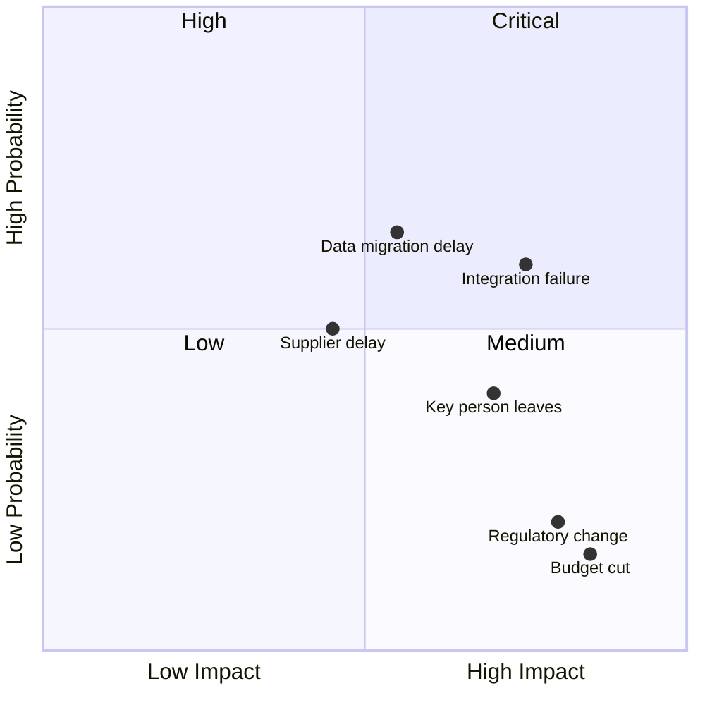
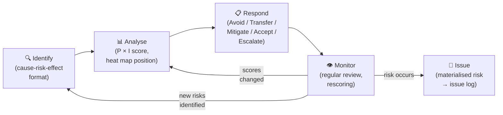
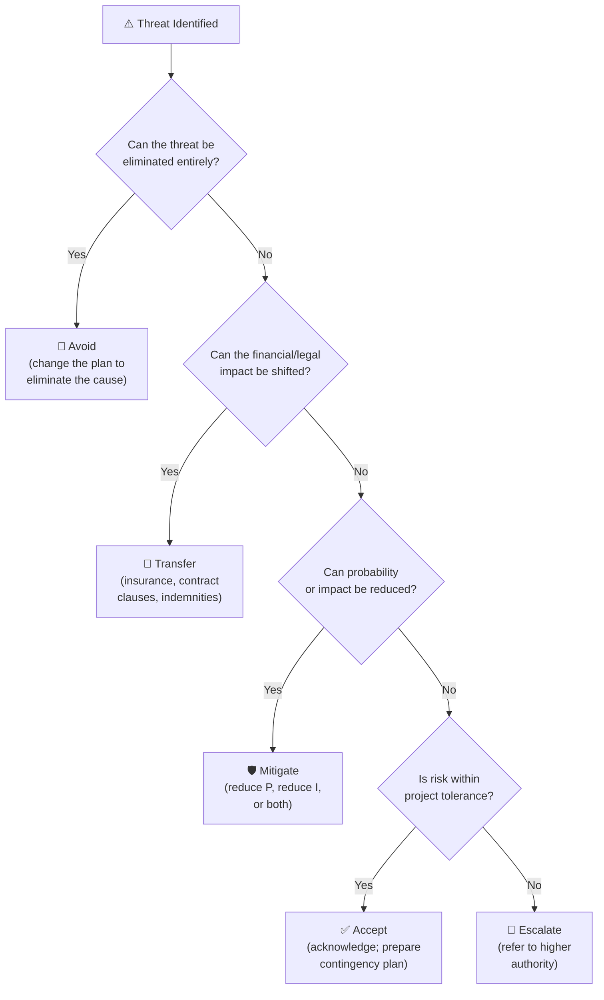
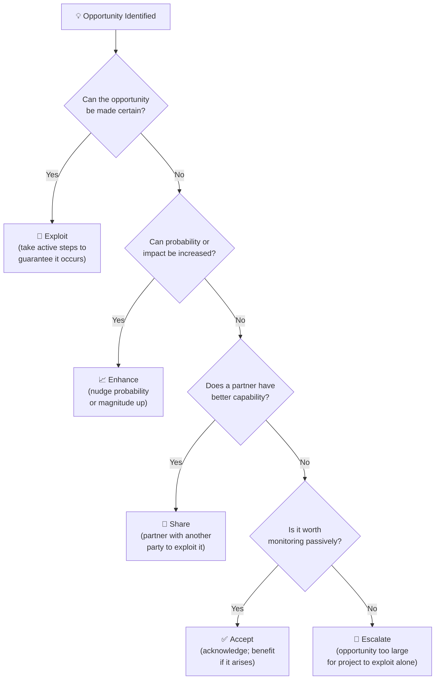

# Module 11 — Risk Management

> **Risk management is not about eliminating uncertainty — it is about making deliberate decisions in the face of it.** This module covers how to identify, analyse, respond to, and monitor risks across the full project lifecycle, including the often-neglected management of opportunities.

---

## Table of Contents

- [1. Risk Concepts and Definitions](#1-risk-concepts-and-definitions)
- [2. Risk Management Planning](#2-risk-management-planning)
- [3. Risk Identification](#3-risk-identification)
- [4. Qualitative Risk Analysis](#4-qualitative-risk-analysis)
- [5. Quantitative Risk Analysis](#5-quantitative-risk-analysis)
- [6. Risk Response Planning — Threats](#6-risk-response-planning--threats)
- [7. Risk Response Planning — Opportunities](#7-risk-response-planning--opportunities)
- [8. Risk Monitoring and Review](#8-risk-monitoring-and-review)
- [9. Organisational Risk Culture and Appetite](#9-organisational-risk-culture-and-appetite)
- [Artifacts](#artifacts)
- [Exercises](#exercises)
- [Quiz](#quiz)

---

## 1. Risk Concepts and Definitions

### What is a risk?

A **risk** is an uncertain event or condition that, if it occurs, has a positive or negative effect on one or more project objectives (scope, schedule, cost, quality).

Key characteristics:
- **Uncertain**: it may or may not happen
- **Future**: it has not yet occurred (once it occurs, it becomes an issue)
- **Consequential**: it affects the project if it materialises

### Threats and opportunities

Risks are often thought of only as threats. This is a significant blind spot. The discipline includes:

| Type | Definition | Management Goal |
|---|---|---|
| **Threat** | A risk with a negative effect on objectives | Reduce probability or impact; avoid; transfer |
| **Opportunity** | A risk with a positive effect on objectives | Increase probability or impact; exploit; enhance |

Example opportunities: a supplier offering early delivery at a discount; a team member completing a task faster than estimated; favourable regulatory changes.

### Uncertainty vs. risk

**Uncertainty** is the broader condition — the unknown. Not all uncertainty constitutes a risk. A risk has:

- An identifiable cause or trigger
- An estimable probability
- A definable impact

Pure uncertainty (we simply don't know what we don't know) is managed through contingency, adaptive planning, and robust governance — not a risk register entry.

[↑ Back to top](#table-of-contents)

---

## 2. Risk Management Planning

### The Risk Management Plan

Before identifying risks, plan how risk will be managed. The **Risk Management Plan** defines:

| Element | Description |
|---|---|
| **Methodology** | How risk management will be performed on this project |
| **Roles and responsibilities** | Who identifies, owns, and responds to risks |
| **Risk appetite** | How much risk the organisation is willing to accept |
| **Thresholds** | The levels at which risks trigger escalation or action |
| **Probability and impact scales** | Agreed definitions for scoring (e.g., what counts as "high" probability?) |
| **Risk register format** | What fields are tracked |
| **Review cadence** | How often risks will be formally reviewed |
| **Reporting** | How risk status is communicated to the project board |

### Tailoring risk management

Risk management effort should match the project's risk profile:

- A low-risk, 4-week internal project may need only a simple register and a weekly review
- A high-risk, multi-year capital programme needs rigorous quantitative analysis, dedicated risk owners, and regular board reporting

[↑ Back to top](#table-of-contents)

---

## 3. Risk Identification

### Identification is a team sport

The PM should not identify risks alone. Different perspectives reveal different risks:

- Technical risks: the development team
- Supplier risks: procurement
- User adoption risks: business analysts and change managers
- Regulatory risks: legal and compliance
- Political risks: the sponsor and senior stakeholders

### Identification techniques

| Technique | How It Works |
|---|---|
| **Brainstorming** | Facilitated group session to generate risk ideas freely |
| **Delphi technique** | Expert opinions gathered independently, then converged through iterations |
| **Interviews** | One-to-one conversations with experts and key stakeholders |
| **Checklists** | Pre-built lists of common risks for the project type |
| **Assumptions analysis** | Every project assumption is a potential risk if it proves false |
| **SWOT analysis** | Strengths, Weaknesses, Opportunities, Threats — surfaces both internal and external risks |
| **Prompt lists** | Categories (technical, commercial, environmental) used to trigger thinking |
| **Cause-and-effect (Ishikawa) diagram** | Works backward from a potential risk event to identify causes |
| **Document review** | Historical records from similar projects |

### Risk description format

Use the cause-risk-effect format for clarity:

> "Due to **[cause]**, there is a risk that **[uncertain event]**, which would result in **[effect on objectives]**."

**Example:**
> "Due to the limited pool of qualified data migration specialists, there is a risk that we cannot recruit a specialist in time, which would result in a 4-week delay to the migration phase and associated cost overrun."

This format makes the cause visible (enabling preventive action) and the effect specific (enabling impact assessment).

[↑ Back to top](#table-of-contents)

---

## 4. Qualitative Risk Analysis

### Scoring risks

Qualitative analysis assigns **probability** and **impact** scores to each risk, enabling prioritisation.

**Probability scale example:**

| Score | Label | Definition |
|---|---|---|
| 0.1 | Rare | Less than 10% chance of occurring |
| 0.3 | Unlikely | 10–30% chance |
| 0.5 | Possible | 30–50% chance |
| 0.7 | Likely | 50–70% chance |
| 0.9 | Almost certain | Over 70% chance |

**Impact scale example** (for cost):

| Score | Label | Definition |
|---|---|---|
| 0.05 | Negligible | < 5% cost increase |
| 0.10 | Minor | 5–10% cost increase |
| 0.20 | Moderate | 10–20% cost increase |
| 0.40 | Major | 20–40% cost increase |
| 0.80 | Catastrophic | > 40% cost increase |

### Risk score = Probability × Impact

A risk with 0.5 probability and 0.40 impact scores 0.20 — in the "high" range on most heat maps.

### The Probability-Impact Matrix (Risk Heat Map)

*Risks in the top-right (Critical) quadrant require immediate action plans; top-left (High) need active management; bottom-right (Medium) need monitoring; bottom-left (Low) can be accepted with periodic review.*

**Critical** risks require immediate attention. **High** risks need active management. **Medium** risks require monitoring. **Low** risks can be accepted with periodic review.

### Risk scoring limitations

Qualitative scores are subjective. Two experts may score the same risk differently. Mitigation:

- Use defined scales agreed by the team
- Have multiple people score high-stakes risks independently, then discuss
- Treat scores as relative rankings, not absolute measures

*The risk lifecycle is iterative — newly identified risks enter at Identify; materialised risks exit to the issue log.*

[↑ Back to top](#table-of-contents)

---

## 5. Quantitative Risk Analysis

Quantitative analysis is used for high-stakes risks or projects where a more rigorous financial assessment is needed.

### Monte Carlo Simulation

Monte Carlo simulation runs thousands of project schedule or cost scenarios, each using randomly sampled values within the estimated ranges for each input, to produce a probability distribution of outcomes.

**Output example:**

> "Based on Monte Carlo simulation, the project has a 50% probability of completing within 14 months and a 90% probability of completing within 17 months."

This enables the PM to set a completion date with a known confidence level, and to size contingency reserve appropriately.

### Sensitivity Analysis

Determines which risks have the most impact on project objectives. Produces a "tornado diagram" showing risks ranked by their influence on the outcome.

### Decision Tree Analysis

Used for discrete decision points with probabilistic outcomes. Calculates the expected monetary value (EMV) of each option:

**EMV = Probability × Impact**

For a risk with 30% probability of a £50,000 cost impact:
EMV = 0.30 × £50,000 = **£15,000**

This is the theoretically correct amount to hold in contingency reserve for this single risk.

[↑ Back to top](#table-of-contents)

---

## 6. Risk Response Planning — Threats

Five strategies for managing threats:

| Strategy | Description | When to Use |
|---|---|---|
| **Avoid** | Eliminate the threat by changing the plan | High-probability, high-impact risks that can be avoided without unreasonable cost |
| **Transfer** | Shift the impact to a third party (insurance, contract clauses) | Financial risks where cost certainty is worth the premium |
| **Mitigate** | Reduce probability and/or impact | Most risks — the default active response |
| **Accept** | Acknowledge the risk and take no proactive action | Low-impact risks below the response threshold |
| **Escalate** | Refer to a higher level of authority if it is outside the PM's authority to manage | Risks that exceed project tolerance; require organisational-level response |

### Contingency plans (fallback plans)

For "accept" risks, develop a **contingency plan** — actions to take if the risk occurs. Having a plan ready reduces response time when the risk materialises.

### Residual and secondary risks

- **Residual risk**: the remaining risk after the response has been implemented (avoidance may not be 100% complete; mitigation may only partially reduce the risk)
- **Secondary risk**: a new risk created by the response (adding more contractors to mitigate a resource risk creates vendor management risk)

Both must be logged in the risk register.

*Work through the decision tree for each threat — the goal is to select the most appropriate response, not the cheapest one.*

[↑ Back to top](#table-of-contents)

---

## 7. Risk Response Planning — Opportunities

Five strategies for managing opportunities:

| Strategy | Description | When to Use |
|---|---|---|
| **Exploit** | Ensure the opportunity definitely occurs | High-value opportunities where the benefit justifies action |
| **Enhance** | Increase probability or impact | Opportunities that can be nudged with moderate effort |
| **Share** | Partner with another party better positioned to exploit the opportunity | Opportunities requiring capabilities the project doesn't have |
| **Accept** | Acknowledge the opportunity; take advantage if it occurs | Low-effort opportunities; passive acceptance |
| **Escalate** | Refer to a higher level where the opportunity is too large for the project to exploit alone | Strategic opportunities requiring organisation-level decision |

### Opportunity management is underused

Most risk registers are entirely focused on threats. This creates an asymmetric view of uncertainty. Actively managing opportunities can:

- Reduce costs (exploit cheaper alternative)
- Accelerate delivery (exploit faster delivery path)
- Improve quality (exploit unexpected resources)
- Create additional value beyond the original scope

*Mirror of the threat tree — actively managing opportunities turns uncertainty into advantage.*

[↑ Back to top](#table-of-contents)

---

## 8. Risk Monitoring and Review

### The risk register is not a filing exercise

A risk register completed at the start of a project and never reviewed is worse than no register — it creates false confidence. Risks must be reviewed regularly throughout the project.

### Risk review process

At each review:

1. **Review existing risks**: have probability or impact changed? Are responses working?
2. **Identify new risks**: what has changed since the last review?
3. **Close resolved risks**: risks that are no longer applicable
4. **Promote materialised risks**: risks that have occurred become issues
5. **Update the register**: record changes with date and rationale
6. **Report**: risk summary to the project board as part of regular reporting

### Risk review cadence

| Project Risk Level | Suggested Review Frequency |
|---|---|
| Low | Monthly |
| Medium | Bi-weekly |
| High | Weekly |
| In a period of high risk activity | Daily (brief team check-in) |

[↑ Back to top](#table-of-contents)

---

## 9. Organisational Risk Culture and Appetite

### Risk appetite

**Risk appetite** is the level and type of risk an organisation is willing to accept in pursuit of its objectives. It is set at the organisational level and cascades to projects as **risk thresholds**.

| Risk Appetite Level | Characteristics |
|---|---|
| **Risk averse** | Prefers certainty; accepts lower returns for reduced risk |
| **Risk neutral** | Balances risk and return; accepts risk proportionate to benefit |
| **Risk seeking** | Accepts high risk for potentially high reward; tolerates uncertainty |

No appetite level is inherently right or wrong — it depends on the organisation's strategy, governance, and stakeholder expectations.

### Risk culture

Risk culture refers to how an organisation actually behaves toward risk:

- Are bad news and early warnings welcomed or suppressed?
- Is escalation of risk concerns encouraged or penalised?
- Are contingency reserves adequate, or is there pressure to plan optimistically?
- Is the risk register reviewed seriously, or is it a compliance tick-box?

Poor risk culture — typically characterised by optimism bias, fear of escalation, and pressure to report projects as green — is one of the most dangerous conditions for project success.

[↑ Back to top](#table-of-contents)

---

## Artifacts

| Artifact | Description | Template |
|---|---|---|
| **Risk Management Plan** | How risk management will be performed | — |
| **Risk Register** | Log of identified risks with scores, owners, responses | [risk-register.md](../templates/risk-register.md) |
| **Probability-Impact Matrix** | Heat map for risk prioritisation | — |
| **Risk Response Action Plan** | Specific actions for each response strategy | — |
| **Risk Report** | Summary of risk status for project board | — |
| **Issue Log** | Risks that have materialised become issues | [issue-log.md](../templates/issue-log.md) |

[↑ Back to top](#table-of-contents)

---

## Exercises

### Exercise 11.1 — Risk identification workshop

You are managing a project to launch a new mobile banking app for a mid-sized regional bank. Budget: £2M. Duration: 12 months.

Using at least 3 identification techniques, identify 10 risks across the following categories: technical, commercial, regulatory, resource, and stakeholder.

For each risk, write it in cause-risk-effect format.

**Expected output:** A table of 10 identified risks in cause-risk-effect format.

---

### Exercise 11.2 — Score and respond

Take the 10 risks from Exercise 11.1. For each:

1. Assign a probability score and an impact score (use a 0.1–0.9 scale)
2. Calculate the risk score (P × I)
3. Classify as Critical / High / Medium / Low
4. Select the appropriate response strategy
5. Define one specific response action

**Expected output:** A completed risk register table with all fields populated.

---

### Exercise 11.3 — Contingency calculation

Using Expected Monetary Value (EMV):

1. Calculate the EMV for each of your 10 risks
2. Sum the EMVs to determine the theoretical minimum contingency reserve
3. Compare this to a flat 10% contingency on a £2M project (£200,000). Is the flat percentage adequate?
4. What does this tell you about the risk profile of this project?

**Expected output:** An EMV table with total and a written analysis of at least 150 words.

[↑ Back to top](#table-of-contents)

---

## Quiz

**Question 1:** What is the difference between a risk and an issue?

- A) Risks are documented; issues are not
- B) A risk is a future uncertainty; an issue has already occurred
- C) Risks are owned by the PM; issues are owned by the team
- D) Risks affect cost; issues affect schedule

Reveal Answer

**B) A risk is a future uncertainty; an issue has already occurred.** When a risk materialises, it becomes an issue and moves from the risk register to the issue log, triggering reactive management.

---

**Question 2:** A risk response strategy where the impact of a risk is shifted to a third party (e.g., through insurance) is called:

- A) Avoidance
- B) Mitigation
- C) Transfer
- D) Acceptance

Reveal Answer

**C) Transfer.** Transfer does not eliminate the risk — it assigns the financial or operational consequences to another party (insurer, contractor, etc.).

---

**Question 3:** The opportunity response strategy of "exploit" means:

- A) Taking advantage of an opportunity passively if it arises
- B) Ensuring the opportunity definitely occurs through active effort
- C) Partnering with another party to share the benefit
- D) Increasing the probability of the opportunity occurring

Reveal Answer

**B) Ensuring the opportunity definitely occurs through active effort.** Exploit is the most aggressive positive risk strategy — the equivalent of "avoid" for threats. It removes the uncertainty by making the positive outcome a certainty.

---

**Question 4:** A project with a CPI of 0.82 and multiple high-risk activities remaining has a risk register showing all risks as "Low." This is most likely an indicator of:

- A) Excellent risk management
- B) Poor risk culture — risks are being under-reported
- C) The project is performing well
- D) The contingency reserve is adequate

Reveal Answer

**B) Poor risk culture — risks are being under-reported.** A project performing significantly below budget targets while reporting all risks as low is a classic indicator of optimism bias or suppression of bad news. The risk register does not reflect reality.

---

**Question 5:** What is a secondary risk?

- A) A risk with low probability
- B) A risk that only affects secondary objectives (not scope/schedule/cost)
- C) A new risk created by a risk response
- D) A risk identified after the planning phase

Reveal Answer

**C) A new risk created by a risk response.** Responses to risks can introduce new risks. Example: fast-tracking a schedule (response to a schedule threat) introduces the risk of increased rework from parallel activities.

[↑ Back to top](#table-of-contents)

---

**Previous Module:** [Module 10 — Communications Management](10-communications.md)
**Next Module:** [Module 12 — Quality Management](12-quality-management.md)

---

## Related Modules

| Module | Relationship |
|---|---|
| [Module 04 — Project Planning](04-planning.md) | Risk management planning is a core planning activity; risk reserves are included in the cost and schedule baselines |
| [Module 05 — Project Execution](05-execution.md) | Risks are actively monitored during execution; risk responses are implemented as part of delivery |
| [Module 06 — Monitoring and Controlling](06-monitoring-control.md) | Risk reviews are a key monitoring activity; escalating risks drive exception reports and change requests |
| [Module 15a — Integration, Hybrid Approaches, and Agile](15a-integration-hybrid-agile.md) | Covers how agile approaches treat risk differently — through iteration, early delivery, and continuous re-prioritisation |

---

&copy; 2026 UncleJs &mdash; Licensed under [CC BY-NC-SA 4.0](https://creativecommons.org/licenses/by-nc-sa/4.0/)
