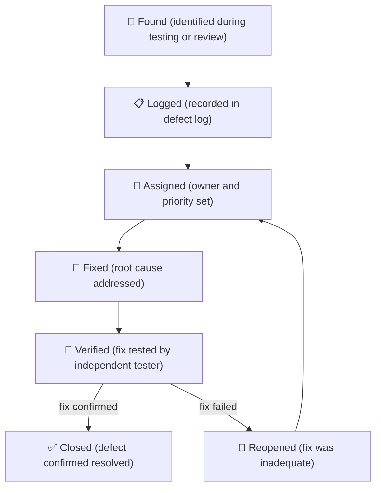
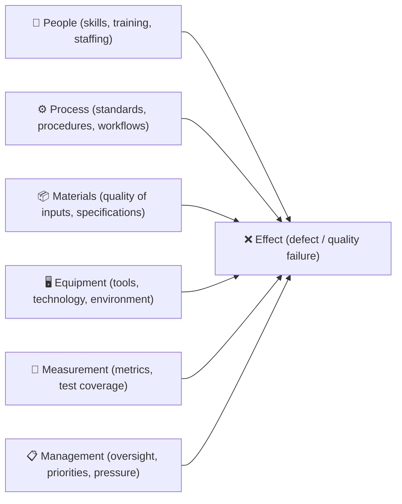
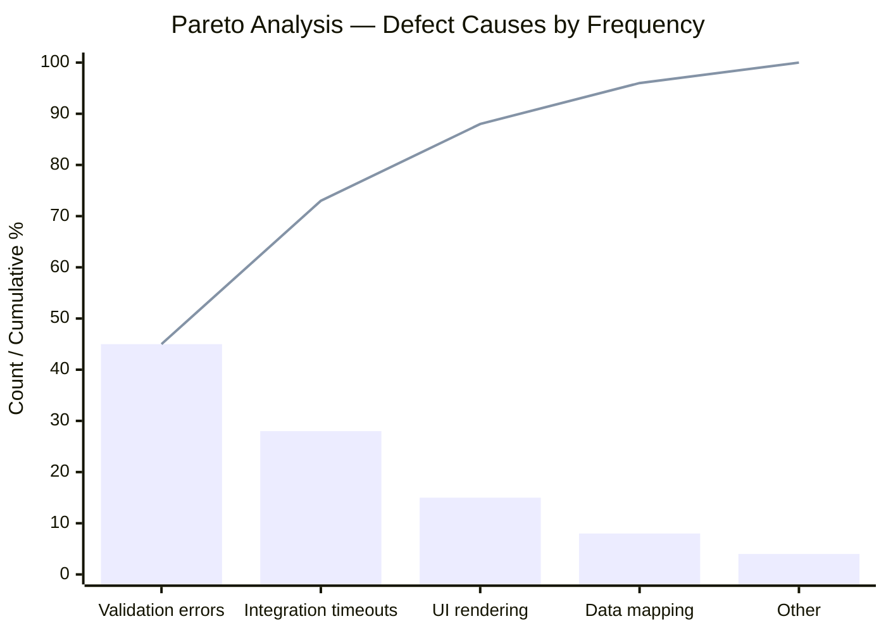
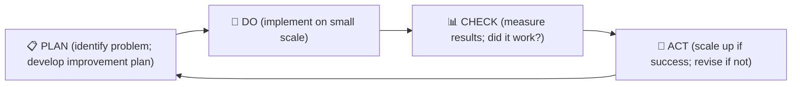

# Module 12 — Quality Management

> **Quality is not an inspection at the end — it is a discipline built into every step.** This module covers how to plan for quality, assure it during delivery, control it through inspection, and continuously improve.

---

## Learning outcomes

By the end of this module you will be able to:

- Plan quality into the work rather than inspecting it only at the end
- Distinguish quality assurance from quality control
- Record defects, retests, and acceptance so the quality story stays in one place

---

## Table of Contents

- [Learning outcomes](#learning-outcomes)
- [1. Quality Concepts](#1-quality-concepts)
  - [What is quality?](#what-is-quality)
  - [Quality vs. grade](#quality-vs-grade)
  - [Prevention vs. inspection](#prevention-vs-inspection)
- [2. Cost of Quality](#2-cost-of-quality)
  - [Prevention costs](#prevention-costs)
  - [Appraisal costs](#appraisal-costs)
  - [Failure costs](#failure-costs)
  - [The optimal quality point](#the-optimal-quality-point)
- [3. Quality Standards and References](#3-quality-standards-and-references)
  - [ISO 9001](#iso-9001)
  - [Industry-specific standards](#industry-specific-standards)
- [4. Quality Planning](#4-quality-planning)
  - [Quality planning asks three questions](#quality-planning-asks-three-questions)
  - [The Quality Management Plan](#the-quality-management-plan)
  - [Quality criteria per deliverable](#quality-criteria-per-deliverable)
- [5. Quality Assurance](#5-quality-assurance)
  - [What QA does](#what-qa-does)
  - [Who performs QA?](#who-performs-qa)
  - [Quality audit findings](#quality-audit-findings)
- [6. Quality Control](#6-quality-control)
  - [What QC does](#what-qc-does)
  - [QC techniques](#qc-techniques)
  - [The defect lifecycle](#the-defect-lifecycle)
  - [Test management](#test-management)
- [7. Quality Review Technique](#7-quality-review-technique)
  - [Roles](#roles)
  - [Quality review process](#quality-review-process)
- [8. Root Cause Analysis](#8-root-cause-analysis)
  - [The 5 Whys](#the-5-whys)
  - [Fishbone (Ishikawa) diagram](#fishbone-ishikawa-diagram)
  - [Pareto analysis](#pareto-analysis)
- [9. Continuous Improvement: PDCA](#9-continuous-improvement-pdca)
  - [Applying PDCA in projects](#applying-pdca-in-projects)
- [Artifacts](#artifacts)
- [Exercises](#exercises)
  - [Exercise 12.1 — Cost of quality analysis](#exercise-121--cost-of-quality-analysis)
  - [Exercise 12.2 — Quality criteria definition](#exercise-122--quality-criteria-definition)
  - [Exercise 12.3 — Root cause analysis](#exercise-123--root-cause-analysis)
- [Quiz](#quiz)
- [Related Modules](#related-modules)

---

## 1. Quality Concepts

### What is quality?

**Quality** is the degree to which a set of inherent characteristics fulfills stated or implied requirements. In project management, this means:

- **Conformance to specification**: the deliverable does what it was designed to do
- **Fitness for purpose**: the deliverable actually serves the user's real need

Both are necessary. A deliverable can conform to a poor specification and still be useless.

### Quality vs. grade

| Concept | Definition | Example |
|---|---|---|
| **Quality** | Consistency in meeting specifications | A budget hotel that reliably delivers what it promises is high quality |
| **Grade** | Category of features or characteristics | A budget hotel is low grade (few features) but can be high quality |

Low grade is not necessarily a defect — it is a deliberate design choice. A project produces a low-grade product by design (e.g., a minimum viable product) is not failing on quality if the product meets its low-grade specifications consistently.

### Prevention vs. inspection

The fundamental tension in quality management:

- **Prevention**: designing quality in from the start (requirements, standards, processes)
- **Inspection**: finding defects after the fact

Prevention is always cheaper. Fixing a requirement error during elicitation costs a fraction of fixing it after the system is built. This is the cost-of-quality argument.

[↑ Back to top](#table-of-contents)

---

## 2. Cost of Quality

The **Cost of Quality (CoQ)** framework categorizes quality-related costs:

### Prevention costs

Costs incurred to prevent defects from occurring:

- Requirements validation and review
- Design reviews
- Staff training
- Process documentation
- Prototyping and proof-of-concept testing

### Appraisal costs

Costs incurred to assess whether quality standards are being met:

- Inspections and testing
- Quality audits
- Supplier assessment
- Documentation review

### Failure costs

Costs incurred because defects were not prevented:

| Type | When Discovered | Examples |
|---|---|---|
| **Internal failure** | Before delivery to customer | Rework, scrapping, re-testing |
| **External failure** | After delivery to customer | Warranty claims, recalls, legal liability, reputational damage |

External failure costs are typically 10–100× higher than the cost of prevention. The business case for investing in prevention is almost always compelling.

### The optimal quality point

There is a theoretical optimal point where the total cost of quality (prevention + appraisal + failure) is minimized. In practice:

- Under-investing in prevention = high failure costs
- Over-investing in prevention = diminishing returns

Most projects under-invest in prevention and over-invest in late-stage inspection and rework.

[↑ Back to top](#table-of-contents)

---

## 3. Quality Standards and References

### ISO 9001

ISO 9001 is the international standard for Quality Management Systems (QMS). It is process-based and requires:

- Documented quality objectives and processes
- Risk-based thinking
- Continuous improvement
- Customer focus

Organizations certified to ISO 9001 have externally audited quality management systems. Projects operating within such organizations must align with the organizational QMS.

### Industry-specific standards

Quality requirements vary significantly by industry. Familiarize yourself with standards relevant to your project's domain:

| Industry | Relevant Standards |
|---|---|
| Software | ISO/IEC 25010, ISTQB testing standards |
| Construction | ISO 9001, IEC 61508 (safety-critical systems) |
| Healthcare / medical devices | ISO 13485, FDA 21 CFR Part 820 |
| Automotive | IATF 16949, ISO 26262 |
| Aerospace | AS9100 |
| Food | ISO 22000, HACCP |

[↑ Back to top](#table-of-contents)

---

## 4. Quality Planning

### Quality planning asks three questions

1. What quality standards apply to this project?
2. What quality objectives will we set?
3. How will we achieve and verify them?

### The Quality Management Plan

| Section | Content |
|---|---|
| **Quality objectives** | Specific, measurable targets (e.g., "defect rate < 0.1% at UAT") |
| **Quality standards** | Which standards apply (organizational, regulatory, industry) |
| **Quality roles** | Who is responsible for QA, QC, and quality decisions |
| **Quality activities** | Reviews, audits, inspections, testing — when and how |
| **Quality metrics** | How quality will be measured (defect rate, rework %, test pass rate, customer satisfaction) |
| **Acceptance criteria** | Per deliverable — linked to the scope management plan |

### Quality criteria per deliverable

For each deliverable, define specific quality criteria:

**Example: User interface designs**
- All screens reviewed and approved by the UX lead
- Designs reviewed for accessibility compliance (WCAG 2.1 AA)
- All screens validated against user requirements in an approved requirements document
- Design sign-off from the Head of Product before handoff to development

[↑ Back to top](#table-of-contents)

---

## 5. Quality Assurance

### What QA does

Quality Assurance is the proactive, process-oriented dimension of quality management. It asks: "Are we running the project in a way that will produce quality outputs?" rather than "Does this output meet the spec?"

QA activities:

- **Process audits**: are the team following the agreed delivery process?
- **Standards compliance reviews**: are deliverables being produced to agreed standards?
- **Methodology reviews**: is the chosen approach appropriate for the project's goals?
- **Supplier quality audits**: are vendors meeting contracted quality standards?
- **Lessons-from-defects analysis**: are quality failures from earlier stages being prevented in later ones?

### Who performs QA?

QA is most effective when performed independently — by someone who is not producing the deliverable being assessed. This could be:

- An internal quality team or PMO
- An external auditor
- A peer team on a cross-project basis
- For smaller projects, the PM (though independence is compromised)

### Quality audit findings

Audit findings should be:

- Documented in an **Audit Report**
- Categorized as findings (must fix), observations (should consider), and commendations (good practice to share)
- Responded to with an action plan within an agreed timeframe
- Followed up at a subsequent audit

[↑ Back to top](#table-of-contents)

---

## 6. Quality Control

### What QC does

Quality Control is the reactive, product-oriented dimension. It inspects outputs and determines whether they meet the specification. QC occurs at defined checkpoints during execution.

### QC techniques

| Technique | Description |
|---|---|
| **Inspection** | Physical or functional review of a deliverable against its quality criteria |
| **Testing** | Functional, performance, security, or usability testing of a product |
| **Statistical sampling** | Testing a sample of output where 100% inspection is impractical |
| **Peer review** | Review of documents or code by a colleague |
| **Checklists** | Systematic verification that required steps are complete |
| **Defect logging** | Recording all identified defects for tracking and trend analysis |

### The defect lifecycle

*All defects must be logged — even "minor" ones. Unlogged defects become invisible technical debt and prevent pattern analysis.*

### Test management

A **test plan** should define:

- What will be tested (scope of testing)
- Testing types (unit, integration, system, UAT, performance, security)
- Entry and exit criteria for each test phase
- Roles: who creates test cases, who executes, who approves results
- Defect severity levels and response SLAs

[↑ Back to top](#table-of-contents)

---

## 7. Quality Review Technique

The **Quality Review** is a structured meeting specifically designed to review and confirm the quality of a project product. It is more rigorous than an informal review.

### Roles

| Role | Responsibility |
|---|---|
| **Chair** | Facilitates the review; ensures it stays on track |
| **Author** | Produced the product; presents it; records agreed corrections |
| **Reviewers** | Assess the product against defined criteria; raise questions |

### Quality review process

1. **Preparation**: reviewers study the product against quality criteria before the meeting
2. **Review meeting**: reviewers raise questions; author responds; agreed errors are logged
3. **Review result**: one of — approved (no changes), conditionally approved (minor corrections, no re-review), re-review required (significant changes needed)
4. **Correction**: author implements agreed changes
5. **Sign-off**: chair confirms product is approved

The quality review is not a design discussion or brainstorm. It has a specific purpose: confirm whether this product meets its quality criteria.

[↑ Back to top](#table-of-contents)

---

## 8. Root Cause Analysis

When defects or quality failures occur, root cause analysis (RCA) prevents recurrence by understanding why — not just what — went wrong.

### The 5 Whys

The simplest RCA technique: repeatedly ask "Why?" until the root cause is revealed.

**Example:**
- Problem: UAT found 47 critical defects in the first test cycle
- Why? Because the code was not adequately tested before UAT
- Why? Because unit tests were skipped
- Why? Because the development team was under schedule pressure in the last sprint
- Why? Because the scope of the sprint was not adjusted when two developers were sick
- Why? Because there was no process for adjusting sprint scope during a sprint

Root cause: **No sprint scope adjustment process** — this is what needs fixing, not just "test more."

### Fishbone (Ishikawa) diagram

Used for complex problems with multiple potential causes. Categories (the "bones") prompt systematic cause identification:

*Each "bone" category prompts the team to look for causes — work back from the effect to find the root cause in each category.*

### Pareto analysis

The Pareto principle (80/20 rule) applied to defects: typically, 80% of defects come from 20% of causes. Pareto analysis ranks defect causes by frequency to focus improvement effort where it will have the most impact.

*Defect causes ranked by frequency (bars) with the cumulative percentage (line). The first two causes account for ~73% of all defects, so fixing those two yields the greatest return — the 80/20 rule in action.*

[↑ Back to top](#table-of-contents)

---

## 9. Continuous Improvement: PDCA

The **Plan-Do-Check-Act (PDCA)** cycle (also called the Deming cycle) is the foundation of continuous improvement:

*PDCA is a continuous loop — each cycle builds on the learning from the previous one.*

| Stage | Action |
|---|---|
| **Plan** | Identify a quality problem or improvement opportunity; develop a plan to address it |
| **Do** | Implement the plan on a small scale or in a controlled way |
| **Check** | Measure the results; did the change have the intended effect? |
| **Act** | If successful, implement fully; if not, learn and revise the plan |

PDCA is not a one-time cycle — it repeats continuously. Each iteration builds on the learning from the previous one.

### Applying PDCA in projects

- Every defect cluster is an opportunity for a PDCA cycle
- Lessons learned workshops are a PDCA "Check" stage
- Process improvements implemented mid-project are the "Act" stage
- The quality management plan for the next project incorporates learning from this one

[↑ Back to top](#table-of-contents)

---

## Artifacts

| Artifact | Description | Template |
|---|---|---|
| **Quality Management Plan** | Quality objectives, standards, roles, and activities | — |
| **Quality Register** | Log of planned and completed quality activities and results | [quality-register.md](../templates/quality-register.md) |
| **Audit Schedule** | Planned quality audits with dates and scope | — |
| **Audit Report** | Findings, observations, and commendations from quality audits | — |
| **Inspection Checklists** | Per-deliverable quality verification checklists | — |
| **Defect Log** | Tracks all identified defects through to closure | — |
| **Non-Conformance Report (NCR)** | Formal record of a product failing to meet its quality criteria | — |
| **Test Plan / Test Report** | Test scope, approach, results, and sign-off | — |
| **Root Cause Analysis Report** | Identifies root causes of significant quality failures | — |

[↑ Back to top](#table-of-contents)

---

## Exercises

### Exercise 12.1 — Cost of quality analysis

You are managing a 6-month software development project. The following quality-related events occurred:

1. Requirements review workshop (4 hours, 6 people at $50/hr average) — prevented 3 estimated defects
2. Code review process (estimated 0.5 days per developer per week, 3 developers, 6 months) — estimated 40% defect reduction
3. 85 defects found during UAT — each took an average 4 hours to fix (developer at $60/hr)
4. 12 defects escaped to production — average cost to fix in production: $2,000 each

Categorize each as prevention, appraisal, internal failure, or external failure. Calculate the cost of each. What does this analysis tell you about where to invest in the next project?

**Expected output:** A cost of quality table and a 200-word analysis.

---

### Exercise 12.2 — Quality criteria definition

Define quality criteria for the following three deliverables in the digital planning portal project:

1. The online application submission form
2. The back-end case management system
3. The user training materials

For each deliverable, write at least 3 specific, testable quality criteria.

**Expected output:** A quality criteria table with 3 deliverables × 3+ criteria.

---

### Exercise 12.3 — Root cause analysis

A project's first UAT cycle returned 63 defects, 18 of which were classified as critical. The project is now 3 weeks behind schedule due to the rework required.

Using the 5 Whys technique, investigate the following proximate cause and identify the root cause:

*"The development team did not follow the agreed coding standards for the payment processing module."*

Then recommend 2 preventive actions for the next project based on your root cause finding.

**Expected output:** A 5 Whys chain (at least 4 levels) and 2 actionable recommendations.

[↑ Back to top](#table-of-contents)

---

## Quiz

**Question 1:** What is the difference between quality and grade?

- A) Quality is measurable; grade is subjective
- B) Quality is conformance to specifications; grade is the category of features/characteristics
- C) High grade always means high quality
- D) Grade applies to products; quality applies to processes

Reveal Answer

**B) Quality is conformance to specifications; grade is the category of features/characteristics.** A low-grade product (minimal features) can be high quality if it consistently meets its (modest) specifications. A high-grade product with inconsistent delivery is low quality.

---

**Question 2:** External failure costs are typically how much more expensive than prevention costs?

- A) The same cost
- B) Slightly more expensive (2–3×)
- C) 10–100× more expensive
- D) Prevention costs are always more expensive

Reveal Answer

**C) 10–100× more expensive.** The cost of fixing a defect grows dramatically the later in the lifecycle it is found. External failures (post-delivery) are the most expensive because they include warranty, recall, legal, and reputational costs on top of rework.

---

**Question 3:** Quality Assurance differs from Quality Control in that QA is:

- A) Reactive and product-oriented; QC is proactive and process-oriented
- B) Proactive and process-oriented; QC is reactive and product-oriented
- C) Only performed by external auditors
- D) Only relevant for software projects

Reveal Answer

**B) Proactive and process-oriented; QC is reactive and product-oriented.** QA asks "are we doing things right?" QC asks "is this thing right?"

---

**Question 4:** In the PDCA cycle, what happens during the "Check" stage?

- A) The improvement plan is developed
- B) The change is implemented at full scale
- C) The results of the small-scale implementation are measured against expectations
- D) The problem is identified and documented

Reveal Answer

**C) The results of the small-scale implementation are measured against expectations.** Check is the measurement stage — did the Do stage produce the intended effect? This drives the Act decision: scale up or revise.

---

**Question 5:** The Pareto principle in quality management suggests:

- A) 80% of the team produces 20% of the defects
- B) 80% of defects typically come from 20% of causes
- C) 80% of the budget should be spent on prevention
- D) Projects should allocate 20% of time to quality activities

Reveal Answer

**B) 80% of defects typically come from 20% of causes.** Pareto analysis identifies the vital few causes responsible for the majority of defects, enabling focused improvement effort rather than spreading effort across all causes equally.

[↑ Back to top](#table-of-contents)

---

**Previous Module:** [Module 11 — Risk Management](11-risk-management.md)
**Next Module:** [Module 13 — Procurement and Contract Management](13-procurement.md)

---

## Related Modules

| Module | Relationship |
|---|---|
| [Module 04 — Project Planning](04-planning.md) | The quality management plan is a planning deliverable; acceptance criteria and quality thresholds are set during planning |
| [Module 06 — Monitoring and Controlling](06-monitoring-control.md) | Quality assurance reviews and defect metrics feed into the control process; quality trends inform RAG status |
| [Module 08 — Scope and Requirements Management](08-scope-requirements.md) | Quality is defined against requirements; non-functional requirements are key quality drivers |
| [Module 15a — Integration, Hybrid Approaches, and Agile](15a-integration-hybrid-agile.md) | Agile builds quality in through test-driven development, continuous integration, and Definition of Done |

---

&copy; 2026 UncleJs &mdash; Licensed under [CC BY-NC-SA 4.0](https://creativecommons.org/licenses/by-nc-sa/4.0/)
