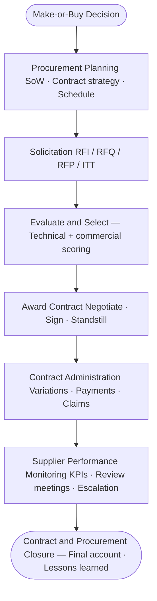
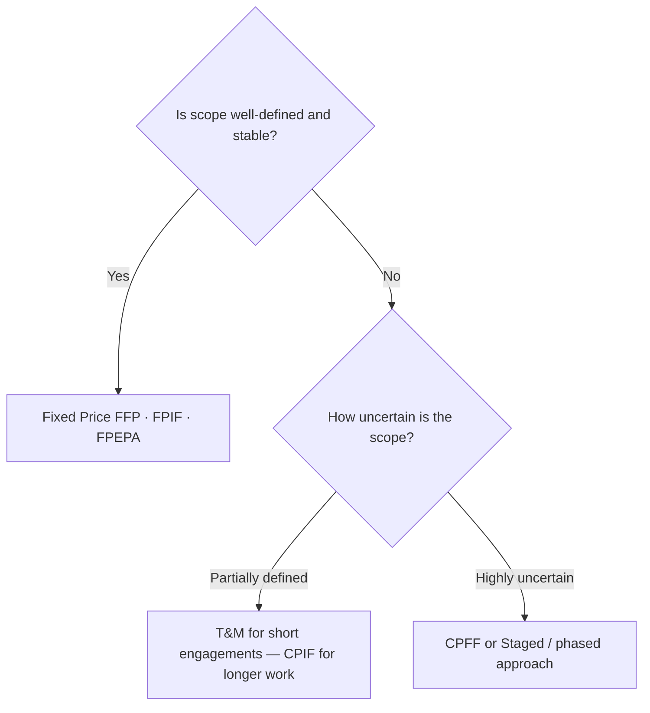

# Module 13 — Procurement Management

> **Procurement is not just buying — it is managing relationships, risk, and accountability across organisational boundaries.** This module covers the full procurement lifecycle from make-or-buy decisions through contract closure.

---

## Table of Contents

- [1. Why Procurement Matters in Projects](#1-why-procurement-matters-in-projects)
- [2. Make-or-Buy Analysis](#2-make-or-buy-analysis)
- [3. Procurement Planning](#3-procurement-planning)
- [4. Contract Types](#4-contract-types)
- [5. Market Engagement and Solicitation](#5-market-engagement-and-solicitation)
- [6. Supplier Evaluation and Selection](#6-supplier-evaluation-and-selection)
- [7. Contract Negotiation](#7-contract-negotiation)
- [8. Contract Administration](#8-contract-administration)
- [9. Supplier Performance Monitoring](#9-supplier-performance-monitoring)
- [10. Contract and Procurement Closure](#10-contract-and-procurement-closure)
- [11. Procurement Ethics and Governance](#11-procurement-ethics-and-governance)
- [Artifacts](#artifacts)
- [Exercises](#exercises)
- [Quiz](#quiz)

---

## 1. Why Procurement Matters in Projects

Modern projects rarely deliver everything in-house. Specialist skills, equipment, software licences, construction works, and professional services are routinely sourced externally. Procurement management ensures that:

- External suppliers deliver what was agreed, on time, within budget, and to the required quality.
- Contractual obligations are met on both sides.
- Risk is allocated appropriately between buyer and seller.
- Public accountability, competition, and value-for-money obligations are honoured (especially in the public sector).

### The Buyer–Seller Relationship

From the project manager's perspective, the organisation is usually the **buyer** (also called client, owner, or contracting authority). The external party is the **seller** (also called supplier, vendor, contractor, or service provider).

In complex projects, an organisation can be a buyer for some contracts and a seller (sub-contractor) for others simultaneously.

### Procurement vs Purchasing

| Term | Meaning |
|---|---|
| **Purchasing** | The transactional act of ordering and paying for goods or services |
| **Procurement** | The full lifecycle: planning, soliciting, selecting, contracting, managing, and closing |

Procurement is the broader discipline; purchasing is one step within it.

*Full procurement lifecycle — from make-or-buy through to contract closure.*

[↑ Back to top](#table-of-contents)

---

## 2. Make-or-Buy Analysis

Before procuring anything, the project must decide whether to produce internally or buy externally.

### Factors Favouring Internal Delivery ("Make")

- The capability exists in-house and is available.
- The work is strategically sensitive or contains proprietary information.
- Internal delivery is cost-competitive over the full lifecycle.
- Greater control over quality, schedule, or integration is required.
- The organisation wants to build or retain internal capability.

### Factors Favouring External Delivery ("Buy")

- The skill or capacity does not exist internally.
- External specialists can deliver faster or at lower cost.
- The organisation wants to transfer risk to a party better placed to manage it.
- The work is non-core and does not justify internal investment.
- Regulatory, public procurement, or policy requirements mandate competition.

### Total Cost of Ownership

Make-or-buy analysis must consider the **total cost of ownership (TCO)**, not just the purchase price:

- Acquisition cost (price, licence fees, installation)
- Operating and maintenance costs
- Integration and change-management costs
- Training and support costs
- Disposal or exit costs at end of life

A lower purchase price can easily be offset by high integration or maintenance costs. TCO analysis surfaces these hidden costs.

### Hybrid Approaches

Many projects use a hybrid: core design and oversight retained internally, delivery sub-contracted. The key is that internal capability must be sufficient to manage and challenge suppliers — the "intelligent client" function.

[↑ Back to top](#table-of-contents)

---

## 3. Procurement Planning

Procurement planning defines **what** to procure, **when**, **how**, and under what contractual vehicle.

### Procurement Management Plan

The procurement management plan (a component of the overall project management plan) documents:

| Element | Content |
|---|---|
| **Procurement strategy** | Approach to market (open competition, restricted, single source) |
| **Contract types** | Which contract type for each package |
| **Procurement schedule** | Key dates: RFP issue, tender close, evaluation, award, mobilisation |
| **Roles and responsibilities** | Who leads procurement, who is technical evaluator, who signs contracts |
| **Risk allocation** | Which risks are transferred, shared, or retained |
| **Governance** | Approvals required, thresholds, legal review triggers |
| **Supplier management approach** | How performance will be monitored and reported |

### Work Packages and Lots

Large procurements are often divided into **lots** (packages) so that:

- Smaller suppliers can bid for parts rather than the whole.
- Different contract types can be applied to different work streams.
- Risk is spread across multiple suppliers.

Define each lot with a clear scope of work (Statement of Work) and associated quality and acceptance criteria.

### Statement of Work (SoW)

The SoW is the foundational procurement document describing exactly what the supplier must deliver:

- **Scope**: What is included and explicitly excluded.
- **Deliverables**: What must be produced, in what format, by when.
- **Standards**: Technical, quality, and regulatory standards that apply.
- **Location / environment**: Where work is performed; access requirements.
- **Buyer-furnished information / equipment**: What the buyer will provide.
- **Acceptance criteria**: How deliverables will be assessed and accepted.

A weak SoW is one of the most common causes of contract disputes.

[↑ Back to top](#table-of-contents)

---

## 4. Contract Types

The choice of contract type determines how risk is shared between buyer and seller, and what incentives operate.

### Fixed-Price Contracts

The seller agrees to deliver the defined scope for an agreed price. Cost overrun risk sits primarily with the seller.

| Sub-type | Description | When to use |
|---|---|---|
| **Firm Fixed Price (FFP)** | Single agreed price; no adjustment | Well-defined scope, stable requirements |
| **Fixed Price Incentive Fee (FPIF)** | Fixed target price with sharing formula; seller earns bonus for outperformance | Clear scope but seller efficiency can be incentivised |
| **Fixed Price with Economic Price Adjustment (FPEPA)** | Price adjusted for inflation indices | Long-duration contracts exposed to market price changes |

**Buyer risk is low; seller risk is high.** Sellers price risk into their bids — a buyer may pay a premium for certainty.

### Cost-Reimbursable Contracts

The buyer reimburses the seller's allowable costs plus a fee. Cost risk sits primarily with the buyer.

| Sub-type | Description | When to use |
|---|---|---|
| **Cost Plus Fixed Fee (CPFF)** | Actual costs + fixed fee regardless of final cost | R&D or exploratory work where scope is uncertain |
| **Cost Plus Incentive Fee (CPIF)** | Actual costs + fee adjusted by sharing formula against target cost | Uncertain scope but seller efficiency can be incentivised |
| **Cost Plus Award Fee (CPAF)** | Actual costs + subjective award fee based on buyer evaluation | Service quality or performance difficult to objectively measure |

**Buyer risk is high; seller risk is low.** Requires robust cost monitoring and audit rights.

### Time and Materials (T&M)

A hybrid: labour charged at agreed rates per unit of time; materials reimbursed at cost. Scope may not be fully defined. Risk is shared.

- Suitable for short engagements, consultancy, or staff augmentation.
- Requires active management — there is limited natural incentive for sellers to be efficient.
- Often used with a **Not-to-Exceed (NTE)** cap to limit buyer exposure.

### Choosing the Right Contract Type

*Contract type selection: match the contract to the scope certainty and risk profile.*

```mermaid
xychart-beta
    title "Contract Type Risk Spectrum"
    x-axis ["FFP", "FPIF", "T&M", "CPIF", "CPFF"]
    y-axis "Risk level (0 = low, 10 = high)" 0 --> 10
    bar "Buyer risk"   [1, 3, 5, 7, 9]
    bar "Seller risk"  [9, 7, 5, 3, 1]
```

*As contracts move from Fixed Price toward Cost-Reimbursable, risk transfers progressively from seller to buyer.*

[↑ Back to top](#table-of-contents)

---

## 5. Market Engagement and Solicitation

### Pre-Market Engagement

Before formal solicitation, buyers often engage the market informally to:

- Test the appetite and capability of potential suppliers.
- Refine the specification using supplier expertise.
- Understand realistic cost and schedule ranges.
- Signal intent to encourage suppliers to invest in bidding.

**Caution**: Pre-market engagement must not create unfair advantage. Any information shared with one supplier in engagement should be made available to all in the formal solicitation.

### Solicitation Documents

The formal solicitation package is sent to prospective suppliers. Common document types:

| Document | Purpose | Response expected |
|---|---|---|
| **Request for Information (RFI)** | Market research; no commitment to procure | Capability statement, indicative interest |
| **Request for Quotation (RFQ)** | Price comparison for defined, standard goods/services | Quoted price and delivery terms |
| **Request for Proposal (RFP)** | Full competitive tender for complex or service contracts | Technical proposal + commercial offer |
| **Invitation to Tender (ITT)** | Common in public sector; detailed specification, price-based | Compliant tender submission |

### Tender Conditions

Good solicitation documents include:

- Clear evaluation criteria and weightings (published to bidders).
- Submission format and deadline.
- Rules on clarification questions (a deadline; answers published to all).
- Conditions of participation (minimum requirements to be eligible).
- Draft contract terms (so bidders price with full knowledge of obligations).

Publishing evaluation criteria upfront is both fair practice and essential — it defines what "best value" means and protects the buyer from challenge.

### Tender Period

Allow enough time for suppliers to prepare quality bids:

| Contract complexity | Minimum tender period |
|---|---|
| Low (standard goods/services) | 10–15 working days |
| Medium (project services) | 3–4 weeks |
| High (complex, multi-lot) | 6–12 weeks |

Compressed tender periods produce lower-quality bids and deter capable suppliers.

[↑ Back to top](#table-of-contents)

---

## 6. Supplier Evaluation and Selection

### Evaluation Framework

Evaluations typically combine **quality/technical** assessment and **commercial/price** assessment. The weighting between them reflects the nature of the contract:

| Contract type | Typical quality:price weighting |
|---|---|
| Commodity goods | 10:90 or 20:80 |
| Professional services | 60:40 or 70:30 |
| Complex IT or construction | 40:60 or 50:50 |

### Evaluation Criteria Examples

**Technical / quality criteria may include:**
- Understanding of the requirement (demonstrated in proposal)
- Technical approach and methodology
- Relevant experience and case studies
- Team CVs and key person profiles
- Management and governance arrangements
- Risk identification and mitigation approach

**Commercial criteria may include:**
- Total tendered price or day rates
- Pricing transparency and breakdown
- Value-added elements or innovations
- Payment profile alignment with project cashflow

### Scoring

Use a pre-defined scoring rubric applied independently by each evaluator before moderation:

| Score | Definition |
|---|---|
| 0 | No response / non-compliant |
| 1 | Poor — significant concerns |
| 2 | Acceptable — meets minimum standard |
| 3 | Good — clearly meets the standard |
| 4 | Excellent — exceeds the standard with evidence |

Scores are moderated in a consensus session. **Do not average individual scores without discussion** — outliers often reveal genuine quality differences.

### Procurement Evaluation Scorecard

Use a structured scorecard (see `/templates/procurement-evaluation-scorecard.md`) to ensure:

- All criteria are evaluated by all evaluators.
- Commercial and technical streams remain separate until combined.
- Rationale for scores is documented (audit trail).

### Selection Decision

After evaluation:

1. Rank suppliers by combined weighted score.
2. Identify the preferred supplier.
3. Seek required internal approvals before communicating the decision.
4. Issue a **standstill notice** (in regulated public procurement) before award — gives unsuccessful bidders time to request feedback or challenge.
5. Award the contract.

[↑ Back to top](#table-of-contents)

---

## 7. Contract Negotiation

Not all procurement routes end in a formal tender. Negotiated or single-source procurement occurs where competition is not feasible (sole supplier, emergency, existing framework). Even in competitive procurement, negotiation may occur on contract terms before final award.

### Principles of Effective Negotiation

- **Prepare thoroughly**: Know your walk-away position, your ideal outcome, and the acceptable range between.
- **Understand their interests**: Suppliers have legitimate business interests. Understanding them enables creative solutions.
- **Separate people from positions**: Negotiation is commercial, not adversarial.
- **Create value before claiming it**: Explore options that expand the total value before competing over how it is split.
- **Document agreed positions**: Verbal agreements have no standing. Circulate meeting notes after every negotiation session.

### What is Typically Negotiated

| Area | Typical negotiation points |
|---|---|
| **Price** | Target cost, ceiling price, day rates, volume discounts |
| **Payment terms** | Milestone triggers, advance payment, retentions |
| **Risk allocation** | Liability caps, indemnities, insurance requirements |
| **Intellectual property** | Ownership of deliverables, licences, background IP |
| **Performance standards** | KPIs, service levels, remedies for failure |
| **Exit and termination** | Termination for convenience, data portability, transition |

### Key Principle: Never Agree to Undefined Scope

A common trap: agreeing a price before scope is fully defined. This shifts risk to the buyer and invites claims later. Finalise the Statement of Work before agreeing the price.

[↑ Back to top](#table-of-contents)

---

## 8. Contract Administration

Once a contract is signed, the project manager becomes the contract's **intelligent client** — responsible for ensuring both parties honour their obligations.

### Contract Administration Responsibilities

**Buyer-side (project manager's team):**

- Issue formal instructions, variations, and authorisations in accordance with contract terms.
- Review and approve deliverables against acceptance criteria.
- Process invoices and payment certificates.
- Monitor the supplier's programme and raise concerns early.
- Manage the change process for scope variations.
- Maintain a contract file (correspondence, instructions, claims, payments).

**Seller-side (supplier's responsibilities):**

- Submit deliverables on time and to quality.
- Issue progress reports as specified.
- Notify of risks, delays, or issues promptly (most contracts require this).
- Submit invoices in the format and at the intervals agreed.

### Change Control in Contracts

Changes to scope, time, or cost must be managed through a formal **variation / change order** process:

1. Change is requested (buyer or seller).
2. Impact is assessed (cost, time, quality, risk).
3. Change is evaluated and approved / rejected by appropriate authority.
4. Contract is formally amended.
5. Variation is recorded in the change log.

**Never instruct a supplier to do additional work without a signed variation.** Verbal instructions create uncontrolled cost exposure and disputes.

### Claims Management

A **claim** is a formal request by either party for something beyond the contract terms:

- **Seller claims**: Extension of time (EOT), additional cost for unforeseen conditions, disruption caused by buyer.
- **Buyer claims**: Liquidated damages (LD) for delay, defect rectification, cost recovery.

Respond to claims formally and promptly. Delay in responding can imply acceptance in some jurisdictions.

[↑ Back to top](#table-of-contents)

---

## 9. Supplier Performance Monitoring

### Performance Framework

Define supplier KPIs at contract award and review them regularly. Typical KPIs:

| Category | Example metric |
|---|---|
| **Schedule** | % milestones met on time |
| **Quality** | Defect rate; first-time acceptance rate of deliverables |
| **Responsiveness** | Average response time to queries/issues |
| **Reporting** | Timeliness and completeness of progress reports |
| **Safety** | Incident rate (construction/field work contracts) |

### Performance Review Meetings

Hold regular contract review meetings (monthly is typical for significant contracts):

- Review KPI dashboard against targets.
- Discuss any issues, claims, or variations in progress.
- Agree action plans with owners and deadlines.
- Record minutes and circulate promptly.

### Escalation

If performance deteriorates and informal action fails:

1. **Formal performance notice**: Written notice citing the specific contractual obligation and the failure. Sets a remedy period.
2. **Show cause**: Require the supplier to explain the failure and provide a recovery plan.
3. **Remedies**: Withhold payment (if contractually permitted), instruct step-in of a substitute, or terminate for cause.

**Escalate early.** Allowing persistent underperformance without formal action weakens the buyer's position in any later dispute.

[↑ Back to top](#table-of-contents)

---

## 10. Contract and Procurement Closure

### Conditions for Contract Closure

A contract is closed when:

- All deliverables have been accepted by the buyer.
- All payments have been made and receipted.
- Any outstanding claims have been resolved.
- Retention (if applicable) has been released.
- Contractual notices of completion have been exchanged.
- Any defect liability / warranty period has expired or been formally waived.

### Procurement Closure Steps

1. **Final acceptance**: Issue formal written acceptance of all deliverables.
2. **Final account**: Agree the final contract value (original + all approved variations).
3. **Final payment**: Process and record the final payment.
4. **Release of retention**: Release any retention sum held (usually on expiry of defects period).
5. **Return of securities**: Return performance bonds, parent company guarantees, or advance payment guarantees.
6. **Contract file closure**: Archive all contract records (correspondence, instructions, variations, payments, claims).
7. **Lessons learned**: Capture procurement-specific lessons (specification quality, tender process, supplier performance).
8. **Supplier reference**: Consider providing a performance reference or reference case study — good suppliers deserve recognition.

### Retention

**Retention** is a percentage of each payment withheld by the buyer as security against defects, typically:

- Half released on practical completion.
- Half released on expiry of the defects liability period (often 12 months after completion).

Retentions create cashflow tension. Some jurisdictions are introducing retention deposit schemes to protect suppliers from buyer insolvency.

[↑ Back to top](#table-of-contents)

---

## 11. Procurement Ethics and Governance

### Ethical Obligations

Procurement involves significant financial decisions and is a prime target for corruption, fraud, and conflicts of interest. All involved must:

- **Declare conflicts of interest** before participating in any evaluation or decision.
- **Maintain confidentiality** of supplier submissions, prices, and evaluation scores.
- **Treat all suppliers fairly and equally** — do not share information with one that is not available to all.
- **Avoid gifts, hospitality, and inducements** that could reasonably influence a decision.
- **Document all decisions** with clear rationale — if challenged, the audit trail must stand up to scrutiny.

### Public Sector Obligations

In public procurement, additional legal obligations typically apply:

- Mandatory competition above financial thresholds.
- Transparency requirements (publication of contract awards).
- Standstill periods before contract award.
- Rights for unsuccessful bidders to receive feedback and challenge decisions.
- Use of approved frameworks and call-off procedures.

### Sustainability in Procurement

Modern procurement increasingly incorporates ESG criteria:

- **Environmental**: Carbon footprint of suppliers, sustainable materials, waste management.
- **Social**: Living wage commitments, local employment, diversity in the supply chain.
- **Governance**: Anti-bribery and corruption policies, modern slavery compliance.

These criteria must be built into the specification and evaluation — not added as afterthoughts.

[↑ Back to top](#table-of-contents)

---

## Artifacts

| Artifact | Description | Template |
|---|---|---|
| Procurement Management Plan | Strategy, schedule, roles, governance for all procurement activity | — |
| Statement of Work (SoW) | Detailed scope, deliverables, and acceptance criteria for each contract | — |
| RFI / RFQ / RFP / ITT | Solicitation documents sent to prospective suppliers | — |
| Procurement Evaluation Scorecard | Structured scoring matrix for tender evaluation | [procurement-evaluation-scorecard.md](../templates/procurement-evaluation-scorecard.md) |
| Contract | The signed legal agreement between buyer and seller | — |
| Change Log | Record of all variations, their approval status, and cost/time impact | [change-log.md](../templates/change-log.md) |
| Supplier Performance Report | KPI dashboard and commentary for each active contract | — |
| Contract File | Archived record of all correspondence, instructions, variations, and payments | — |
| Lessons Learned Log | Procurement-specific lessons captured at closure | [lessons-learned-log.md](../templates/lessons-learned-log.md) |

[↑ Back to top](#table-of-contents)

---

## Exercises

### Exercise 1 — Make-or-Buy Analysis

**Scenario**: The digital planning portal project (regional council) needs a GIS mapping layer integrated into the public-facing application. Three options are available:

- **Option A**: Use the council's internal GIS team (4 staff, currently at 80% capacity on other work).
- **Option B**: Licence a SaaS mapping platform (£18,000/year; 3-year minimum commitment; no customisation).
- **Option C**: Commission a specialist GIS consultancy to build a bespoke layer (estimated £65,000; one-off; fully owned by the council).

**Task**: Conduct a make-or-buy analysis. For each option, identify: cost factors (including TCO over 3 years), risk factors, control/quality factors, and strategic factors. Recommend an option with a written justification of no more than 200 words.

**Expected output**: A structured comparison table and a written recommendation with rationale covering TCO, risk, and strategic fit.

---

### Exercise 2 — Contract Type Selection

**Scenario**: The council is procuring three separate packages for the portal project:

1. **Software development**: A custom-built case management module. Requirements are ~70% defined; the remainder will emerge during an agile delivery phase.
2. **Data migration**: Moving 12 years of planning records from a legacy system to the new platform. Scope is fully defined; volume risk sits with the supplier.
3. **User research and design**: A 6-week discovery and prototype phase. Scope is exploratory; output is a report and prototype — not a defined deliverable set.

**Task**: For each package, recommend a contract type (from FFP, FPIF, CPFF, CPIF, T&M) and justify your choice. Identify the key risk each contract type allocates and to whom.

**Expected output**: A table with three rows (one per package) showing: recommended contract type, key rationale, primary risk holder, and one mitigation the buyer should apply.

---

### Exercise 3 — Supplier Performance Deterioration

**Scenario**: Six months into a 14-month contract for software development on the portal, the supplier's performance is declining:

- 3 of the last 4 sprint deliveries have been late (by 3–8 days each).
- Defect rate has risen from 2% to 9% over the past two sprints.
- The supplier's project manager has changed twice; the new one is inexperienced.
- The supplier has submitted a claim for additional cost, citing "requirements instability" — the council disputes this.

The contract contains KPI targets (95% on-time delivery; <5% defect rate), a performance notice clause, and a right to terminate for cause after two unresolved formal notices.

**Task**: Draft a procurement action plan covering: (1) immediate actions in the next 2 weeks, (2) formal contractual steps over the next 4 weeks, (3) contingency options if performance does not recover, and (4) how you will manage the dispute over the supplier's claim in parallel.

**Expected output**: A structured action plan with timeline, responsible parties, and contractual basis for each action.

[↑ Back to top](#table-of-contents)

---

## Quiz

**1. What does TCO stand for and why is it important in make-or-buy analysis?**

Reveal Answer

**Total Cost of Ownership.** It captures all costs associated with an option over its full life — not just the purchase price. This includes acquisition, operation, maintenance, integration, training, and disposal. A cheap purchase price can be offset by high maintenance costs; TCO analysis surfaces this.

---

**2. Under a Firm Fixed Price (FFP) contract, who bears the risk of cost overrun — buyer or seller?**

Reveal Answer

The **seller** bears the cost overrun risk. The seller has agreed to deliver the defined scope for a fixed price regardless of their actual costs. The buyer pays the agreed price whether the seller is efficient or not.

---

**3. What is a Statement of Work (SoW) and what must it contain?**

Reveal Answer

A SoW is the document that defines exactly what a supplier must deliver under a contract. It must contain: scope (inclusions and exclusions), deliverables, standards, location/environment, buyer-furnished items, and acceptance criteria. A weak SoW is one of the most common causes of contract disputes.

---

**4. What is the difference between an RFI, RFQ, and RFP?**

Reveal Answer

- **RFI (Request for Information)**: Used for market research; no commitment to procure. Suppliers respond with capability statements.
- **RFQ (Request for Quotation)**: Used for well-defined, standard goods/services; responses are quoted prices.
- **RFP (Request for Proposal)**: Used for complex contracts; suppliers submit a technical proposal and commercial offer for evaluation.

---

**5. Why should evaluation criteria and weightings be published to bidders before they submit?**

Reveal Answer

Publishing criteria upfront is fair (bidders can tailor their response to what is valued), transparent (reduces risk of challenge), and defines "best value" in advance so the evaluation is objective and defensible. It also protects the buyer from accusations of post-hoc rationalisation.

---

**6. What is a "standstill period" in public procurement?**

Reveal Answer

A period between notifying the preferred supplier of their selection and formally awarding the contract. It gives unsuccessful bidders time to request feedback, review the decision, or mount a legal challenge before the contract is signed and becomes binding.

---

**7. What is a contract variation (change order) and why must it be issued in writing?**

Reveal Answer

A variation is a formal change to the agreed scope, time, or cost of a contract. It must be issued in writing because verbal instructions have no legal standing, create uncontrolled cost exposure, and leave no audit trail. All additional work must be authorised by a signed variation before it begins.

---

**8. What is "retention" in a construction or services contract?**

Reveal Answer

Retention is a percentage of each payment withheld by the buyer as financial security against defects. Typically, half is released at practical completion and half on expiry of the defects liability period. It gives the buyer leverage to ensure the supplier returns to fix defects.

---

**9. A supplier submits a claim for additional cost, citing "buyer-caused delay." What are the buyer's two immediate obligations?**

Reveal Answer

1. **Respond formally and promptly** — silence or delay can imply acceptance in some contracts and jurisdictions.
2. **Review the claim on its merits** against the contract terms — assess whether the alleged delay occurred, whether it was caused by the buyer, and what the contract says about entitlement to additional cost.

Document the response and keep it factual and contractual.

---

**10. Name two ESG considerations that can be built into a procurement process.**

Reveal Answer

Any two from:
- **Environmental**: Carbon footprint of suppliers, sustainable materials, waste management plans, energy efficiency commitments.
- **Social**: Living wage, local employment targets, supply chain diversity, modern slavery compliance.
- **Governance**: Anti-bribery policies, transparent subcontracting, ethical sourcing certification.

ESG criteria should appear in the specification and evaluation — not as token additions.

[↑ Back to top](#table-of-contents)

---

## Related Modules

| Module | Relationship |
|---|---|
| [Module 04 — Project Planning](04-planning.md) | Procurement planning is a core planning activity; sourcing strategy, make-or-buy decisions, and contract types are established here |
| [Module 05 — Project Execution](05-execution.md) | Supplier onboarding and contract performance management are active execution tasks |
| [Module 14 — Resource and Team Management](14-resource-team.md) | Contracted resources and supplier teams must be integrated with internal delivery teams |
| [Module 15a — Integration, Hybrid Approaches, and Agile](15a-integration-hybrid-agile.md) | Agile procurement models (T&M, outcome-based contracts) and how to structure supplier relationships in iterative environments |

---

[← Module 12: Quality Management](12-quality-management.md) | [→ Module 14: Resource & Team Management](14-resource-team.md)

---

© 2026 UncleJs — Licensed under [CC BY-NC-SA 4.0](https://creativecommons.org/licenses/by-nc-sa/4.0/)
