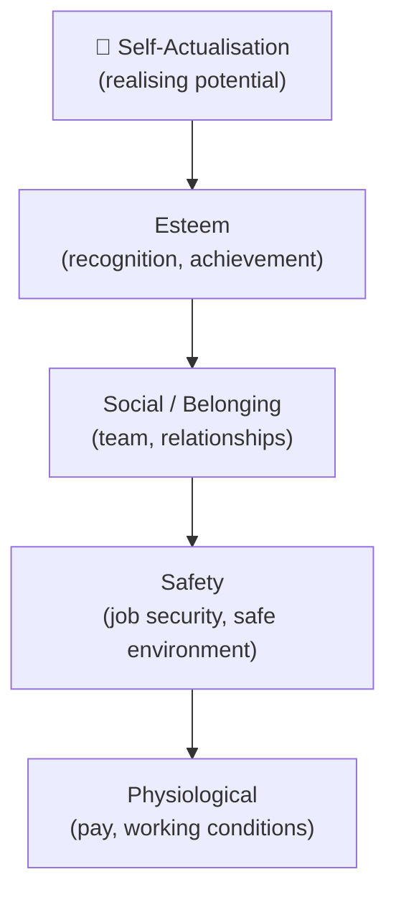
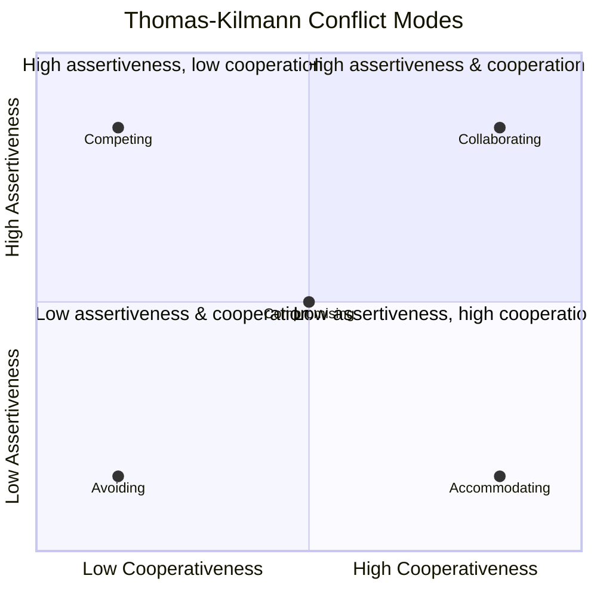

# Module 14 — Resource and Team Management

> **Projects are delivered by people. Technology, process, and methodology can only take you so far — the difference between a struggling project and a successful one is almost always the quality of the team and how it is led.** This module covers how to plan, acquire, develop, and manage project teams.

---

## Table of Contents

- [1. Resource Concepts and Types](#1-resource-concepts-and-types)
- [2. Human Resource Planning](#2-human-resource-planning)
- [3. Team Acquisition](#3-team-acquisition)
- [4. Team Development: Tuckman's Model](#4-team-development-tuckmans-model)
- [5. Motivation Theories](#5-motivation-theories)
- [6. Leadership and Situational Leadership](#6-leadership-and-situational-leadership)
- [7. Conflict Resolution](#7-conflict-resolution)
- [8. Performance Management](#8-performance-management)
- [9. Virtual and Multicultural Teams](#9-virtual-and-multicultural-teams)
- [10. Resource Levelling and Smoothing](#10-resource-levelling-and-smoothing)
- [11. Team Wellbeing and Sustainability](#11-team-wellbeing-and-sustainability)
- [Artifacts](#artifacts)
- [Exercises](#exercises)
- [Quiz](#quiz)

---

## 1. Resource Concepts and Types

### What Is a Resource?

In project management, a **resource** is anything consumed or used to deliver the project:

| Resource type | Examples |
|---|---|
| **Human resources** | Project manager, business analyst, developer, tester, subject matter expert |
| **Physical resources** | Equipment, tools, materials, facilities, IT infrastructure |
| **Financial resources** | Budget, contingency, cash flow |
| **Informational resources** | Data, documentation, intellectual property |

This module focuses primarily on **human resources** — though the planning and scheduling principles apply broadly.

### Resource vs Capacity

- **Resource**: The individual or type of input (e.g., "a senior developer").
- **Capacity**: How much of that resource is available (e.g., "40 hours/week at 80% utilisation").

Projects routinely fail not because they lack the right people in theory, but because those people are over-committed or unavailable at the right time. Capacity planning is therefore as important as headcount planning.

### Shared Resources

Most project resources are **shared** — they have line management responsibilities, BAU commitments, or multiple project allocations. The project manager must negotiate with functional managers (in matrix or functional organisations) for the time they need, and protect that time once allocated.

[↑ Back to top](#table-of-contents)

---

## 2. Human Resource Planning

### Resource Management Plan

The resource management plan (a component of the project management plan) defines:

| Element | Content |
|---|---|
| **Roles and responsibilities** | What each role does; decision-making authority |
| **Competency requirements** | Skills, experience, and qualifications needed per role |
| **Acquisition approach** | Internal assignment, recruitment, or sub-contracting |
| **Training and development** | Gaps to be addressed; how and when |
| **Performance management** | How performance will be assessed and managed |
| **Recognition and rewards** | How contributions will be acknowledged |
| **Resource release** | When and how team members transition off the project |

### RACI Matrix

The RACI matrix (covered in depth in Module 04) maps roles to tasks:

| Letter | Meaning |
|---|---|
| **R** — Responsible | Does the work |
| **A** — Accountable | Owns the outcome; one per task |
| **C** — Consulted | Provides input before the decision/action |
| **I** — Informed | Notified of outcomes; no input required |

At the resource planning stage, populate the RACI with named individuals (not just roles) wherever possible, to surface conflicts and gaps early.

### Resource Calendar

A resource calendar documents each team member's availability: working days, leave, part-time arrangements, and competing commitments. This is the foundation for realistic scheduling.

See `/templates/resource-calendar.md`.

### Skills Matrix

A skills matrix maps team members against the competencies required for the project. It helps identify:

- **Gaps** that must be filled by recruitment, training, or sub-contracting.
- **Single points of failure** — critical skills held by only one person.
- **Development opportunities** — pairing experienced and less experienced staff.

[↑ Back to top](#table-of-contents)

---

## 3. Team Acquisition

### Internal Assignment

Where team members are drawn from within the organisation:

- Negotiate early with functional managers — late requests get the people who are available, not the people who are best.
- Confirm the commitment in writing (even an email trail) — verbal commitments evaporate when priorities shift.
- Agree the percentage of time and the duration; revisit formally at key stage gates.

### External Recruitment

For specialist skills not available internally, consider:

- Fixed-term employment (for longer engagements with full integration into the team).
- Contracting / freelance (for specialist skills with defined deliverables or time-boxes).
- Agency or statement-of-work contracting (for commoditised skills at volume).

Recruitment takes time. Build it into the project schedule — often 6–12 weeks from approval to start date, more for senior or specialist roles.

### Pre-Assignment

Some team members may be pre-assigned (mandated by the project sponsor or required by the business case). The project manager must work with whoever is allocated, but can and should flag risks if pre-assigned resources lack required competencies.

### Collocated vs Distributed Teams

| Model | Advantages | Challenges |
|---|---|---|
| **Collocated** | High collaboration, easy informal communication, shared culture | Requires physical space; geographic constraints on talent pool |
| **Distributed / remote** | Access to global talent pool, flexible | Requires deliberate communication structures, timezone management, trust-building |
| **Hybrid** | Balances both | Risks "two-tier" culture between office and remote members |

[↑ Back to top](#table-of-contents)

---

## 4. Team Development: Tuckman's Model

Bruce Tuckman's model describes the stages a team moves through from formation to high performance. Understanding these stages helps project managers respond appropriately to team dynamics.

### The Five Stages

| Stage | Description | Team behaviour | PM response |
|---|---|---|---|
| **Forming** | Team comes together; roles unclear; everyone is polite | Reliance on PM for direction; low productivity; testing boundaries | Provide structure, clarity of purpose, and clear roles |
| **Storming** | Conflict emerges as personalities and working styles clash | Disagreements, power struggles, resistance to structure | Facilitate conflict resolution; reaffirm norms; coach individuals |
| **Norming** | Team establishes working norms and relationships stabilise | Collaboration increases; trust builds; shared identity emerges | Reinforce positive behaviours; delegate more; reduce directive style |
| **Performing** | Team is high-functioning; focus is on delivery | Autonomous, self-organising, high output and quality | Step back; remove blockers; celebrate achievements |
| **Adjourning** | Project ends; team dissolves | Mix of achievement and loss; risk of disengagement before closure | Acknowledge contributions; manage knowledge transfer; support transitions |

### Key Insights

- Teams do not progress linearly. Significant changes (new members, major setbacks, scope changes) can throw a team back to Storming.
- The PM's leadership style should **adapt** to the stage — directive in Forming, facilitative in Storming, supportive in Norming, delegating in Performing.
- Storming is **normal and necessary** — teams that skip it often have suppressed conflict that surfaces later at higher cost.

[↑ Back to top](#table-of-contents)

---

## 5. Motivation Theories

Understanding what motivates people helps project managers create conditions where teams can perform at their best.

### Maslow's Hierarchy of Needs

Abraham Maslow proposed that human needs form a hierarchy. Lower-level needs must be sufficiently satisfied before higher-level needs become motivating:

*Maslow's Hierarchy of Needs — lower-level needs must be sufficiently met before higher-level needs become motivating.*

**Project application**: A team member under threat of redundancy (safety) will not be motivated by recognition (esteem). Address the lower-level need first.

### Herzberg's Two-Factor Theory

Frederick Herzberg distinguished between:

| Factor type | Examples | Effect |
|---|---|---|
| **Hygiene factors** (Dissatisfiers) | Pay, working conditions, job security, company policy | Their absence causes dissatisfaction; their presence does not motivate |
| **Motivators** (Satisfiers) | Achievement, recognition, responsibility, growth | Their presence increases motivation and job satisfaction |

**Project application**: Fixing hygiene issues (e.g., unclear roles, poor tools) removes dissatisfaction but will not motivate. Genuine motivation comes from meaningful work, recognition, and growth opportunities.

```mermaid
xychart-beta
    title "Herzberg Two-Factor Theory"
    x-axis ["Pay", "Conditions", "Security", "Policy", "Achievement", "Recognition", "Responsibility", "Growth"]
    y-axis "Satisfaction impact (-5 low → +5 high)" -5 --> 5
    bar "Hygiene factors"  [-3, -3, -4, -2, 0, 0, 0, 0]
    bar "Motivators"       [0, 0, 0, 0, 4, 5, 4, 4]
```

*Hygiene factors prevent dissatisfaction when present; motivators actively drive satisfaction and performance.*

### McGregor's Theory X and Theory Y

Douglas McGregor identified two contrasting assumptions managers hold about people:

| Theory | Assumption | Management style |
|---|---|---|
| **Theory X** | People dislike work, need control, avoid responsibility | Directive, monitoring, control-focused |
| **Theory Y** | People find work natural, seek responsibility, self-direct | Empowering, enabling, trust-based |

Neither is universally correct — context and individuals differ. But Theory Y assumptions generally produce better outcomes in knowledge-work project environments.

### McClelland's Acquired Needs Theory

David McClelland proposed that people are primarily motivated by three acquired needs, in varying proportions:

| Need | Characteristics |
|---|---|
| **Achievement (nAch)** | Goal-oriented, sets challenging targets, needs feedback on progress |
| **Affiliation (nAff)** | Values relationships and belonging; may avoid conflict; prefers collaboration |
| **Power (nPow)** | Seeks influence; either personal (self-interest) or social (benefiting others) |

**Project application**: High-achievement individuals need stretch goals and feedback. High-affiliation individuals need team cohesion. High-power individuals may be strong leaders — direct towards social power (shared goals) not personal power.

[↑ Back to top](#table-of-contents)

---

## 6. Leadership and Situational Leadership

### Leadership vs Management

| Management | Leadership |
|---|---|
| Plans, organises, controls | Inspires, influences, enables |
| Focus on systems and processes | Focus on people and relationships |
| Asks "how?" and "when?" | Asks "why?" and "what if?" |
| Reduces uncertainty through structure | Creates shared purpose through vision |

Project managers must do both — and switch between them throughout the project lifecycle.

### Hersey and Blanchard: Situational Leadership

Situational leadership holds that the most effective leadership style depends on the **development level** of the individual for the specific task:

| Development level | Competence | Commitment | PM style |
|---|---|---|---|
| **D1** — Enthusiastic beginner | Low | High | **S1 — Directing**: high task, low relationship |
| **D2** — Disillusioned learner | Some | Low | **S2 — Coaching**: high task, high relationship |
| **D3** — Capable but cautious | Moderate–high | Variable | **S3 — Supporting**: low task, high relationship |
| **D4** — Self-reliant achiever | High | High | **S4 — Delegating**: low task, low relationship |

**Key insight**: The style is matched to the person *for the specific task* — a D4 expert in their domain may be a D1 beginner on an unfamiliar task. Mismatching style (e.g., over-managing a D4) leads to frustration and disengagement.

### Servant Leadership

Increasingly applied in project environments (especially agile), servant leadership inverts the traditional hierarchy:

- The leader's primary role is to **remove obstacles** for the team.
- Authority is earned through service, not position.
- Decisions are pushed down to the people with the best information.
- The leader focuses on team wellbeing and growth.

Servant leadership does not mean passive leadership — it requires active engagement, challenge, and accountability.

[↑ Back to top](#table-of-contents)

---

## 7. Conflict Resolution

Conflict in projects is inevitable. The goal is not to eliminate it but to channel it productively.

### Sources of Conflict in Projects

| Source | Example |
|---|---|
| **Schedule** | Competing priorities; unrealistic deadlines |
| **Resources** | Competition for shared specialists |
| **Technical approach** | Disagreement on design or technology choices |
| **Roles and responsibilities** | Unclear ownership; overlap or gap |
| **Personality** | Different working styles, values, or communication preferences |
| **Priorities** | Stakeholder or sponsor disagreement on scope or trade-offs |
| **Cost** | Budget constraints forcing difficult choices |

### Thomas-Kilmann Conflict Modes

The Thomas-Kilmann model maps five conflict-handling modes on two dimensions: **assertiveness** (concern for self) and **cooperativeness** (concern for others):

| Mode | Assertiveness | Cooperativeness | When to use |
|---|---|---|---|
| **Competing** | High | Low | Emergency decisions; when you are right and stakes are high |
| **Collaborating** | High | High | Complex issues requiring both parties' insights; long-term relationships |
| **Compromising** | Medium | Medium | Time pressure; when a "good enough" solution is acceptable |
| **Avoiding** | Low | Low | Trivial issues; when emotions need to cool before discussion |
| **Accommodating** | Low | High | When the issue matters more to the other party; preserving relationship |

*Thomas-Kilmann conflict modes mapped by assertiveness (concern for self) and cooperativeness (concern for others).*

**Collaborating produces the best outcomes** where time and trust permit. Avoiding is the most damaging default — it suppresses conflict until it explodes.

### Conflict Escalation Ladder

| Level | Behaviour | Intervention |
|---|---|---|
| 1 — Disagreement | Rational, factual differences | Direct conversation between parties |
| 2 — Personalisation | Blame, frustration, emotional language | Facilitated conversation with PM |
| 3 — Contest | Sides form; winning matters more than resolving | Formal mediation; escalation to sponsor |
| 4 — Fight/Avoid | Relationship breakdown; one or both parties disengage | HR involvement; possible team restructure |

Intervene **early** — escalation consumes disproportionate energy and damages morale.

### Practical Conflict Resolution Steps

1. **Separate facts from feelings**: Understand what happened before addressing how people feel about it.
2. **Listen actively**: Both parties must feel heard before they will engage in resolution.
3. **Identify underlying interests**: Positions (what people say they want) differ from interests (why they want it). Resolution is found at the level of interests.
4. **Generate options**: Explore solutions that address both parties' interests.
5. **Agree and document**: A verbal resolution often evaporates; confirm in writing.
6. **Follow up**: Check the agreement is holding; acknowledge improvements.

[↑ Back to top](#table-of-contents)

---

## 8. Performance Management

### Setting Expectations

Performance management begins with clarity:

- What does the role require?
- What are the individual's specific deliverables for this project phase?
- What does "good" look like?

Use SMART objectives (Specific, Measurable, Achievable, Relevant, Time-bound) to set individual performance targets at the start of each stage.

### Feedback

**Ongoing feedback** is more effective than periodic appraisals. Useful feedback is:

- **Timely**: Given as close to the behaviour as possible.
- **Specific**: References a concrete action or outcome, not a generalisation.
- **Balanced**: Acknowledges what is working as well as what needs to change.
- **Constructive**: Focused on behaviour and impact, not personality.

The **SBI (Situation–Behaviour–Impact)** model provides a structure:

- *Situation*: When and where the behaviour occurred.
- *Behaviour*: What the person specifically did or said (observable, not interpreted).
- *Impact*: The effect on the team, project, or stakeholders.

### Managing Underperformance

If a team member is not meeting expectations:

1. **Check the environment first**: Is the problem lack of clarity, inadequate resources, or personal circumstances? Fix the environment before addressing the individual.
2. **Have the conversation early**: Delayed feedback allows poor performance to persist and signals that it is acceptable.
3. **Be specific**: "You seem disengaged" is not actionable. "You missed three status updates and the acceptance criteria weren't tested before submission" is.
4. **Agree a support plan**: What will change, by when, and how will you know?
5. **Escalate if needed**: If the issue persists and has a line manager involved, escalate formally and involve HR as appropriate.

### Recognition and Reward

Recognition is one of the highest-impact and lowest-cost motivators available to a project manager:

- Public acknowledgement in team meetings or status reports.
- A specific, genuine "thank you" that references what the person did and why it mattered.
- Recommending team members for stretch opportunities.
- Providing a professional reference or endorsement.

**Avoid generic praise** ("great job, team!") — it reads as hollow. Specific recognition ("The way you debugged that integration issue overnight meant we made the client demo — that was exceptional") is far more powerful.

[↑ Back to top](#table-of-contents)

---

## 9. Virtual and Multicultural Teams

### Challenges of Virtual Teams

| Challenge | Mitigation |
|---|---|
| **Communication latency** | Agree response-time norms; use asynchronous tools thoughtfully |
| **Loss of informal interaction** | Schedule informal touchpoints (virtual coffees, non-work channels) |
| **Timezone misalignment** | Rotate inconvenient meeting times fairly; record all key meetings |
| **Technology friction** | Standardise tools; provide training; test setups before critical meetings |
| **Reduced visibility of wellbeing** | Check in individually and regularly; watch for disengagement signals |
| **Trust deficit** | Build early through structured interactions; honour all commitments |

### Trust in Virtual Teams

Research consistently shows that **swift trust** — formed quickly based on professionalism and task performance rather than social familiarity — is the dominant mode in virtual project teams. It is fragile:

- Missed deadlines without communication erode it fast.
- Small consistent behaviours (responding promptly, doing what you say) build it quickly.

### Cultural Dimensions (Hofstede)

Geert Hofstede's cultural dimensions model identifies axes along which national and organisational cultures vary:

| Dimension | Low end | High end | Project implications |
|---|---|---|---|
| **Power Distance** | Flat hierarchy; challenge upward is normal | High deference to authority; dissent is suppressed | In high-PD cultures, create safe channels for concerns |
| **Individualism vs Collectivism** | Team-first; group harmony | Individual achievement; personal initiative | Tailor recognition; adapt feedback style |
| **Uncertainty Avoidance** | Comfortable with ambiguity | Need for rules, structure, certainty | Provide more documentation and process in high-UA teams |
| **Long-term Orientation** | Short-term results | Long-term planning and patience | Align on time horizons; manage expectations on pace |
| **Indulgence vs Restraint** | Work to live; celebrates achievements | Suppresses gratification; work-focused | Adapt celebration and social norms |

**No culture is better or worse — awareness prevents misinterpretation.** What reads as "disengaged" in one culture may be "respectfully deferential" in another.

### Communication Across Cultures

- Avoid idioms, jargon, and humour that does not translate.
- Be explicit about norms: silence in a meeting does not mean agreement universally.
- Written confirmation of verbal agreements reduces the risk of cultural misinterpretation.
- Allocate extra time in multicultural teams for alignment — it is not inefficiency, it is investment.

[↑ Back to top](#table-of-contents)

---

## 10. Resource Levelling and Smoothing

### Resource Overallocation

When a resource is scheduled for more hours than they are available in a given period, they are **over-allocated**. This is a planning error that, if unaddressed, leads to:

- Burnout and reduced quality.
- Schedule slippage (people cannot work at 150% indefinitely).
- Hidden risk (the schedule looks fine until the person hits the wall).

### Resource Levelling

**Resource levelling** resolves overallocation by delaying non-critical tasks until the resource becomes available. It respects the resource constraint as a hard boundary.

- **Effect on schedule**: May extend the project end date.
- **Effect on resources**: Eliminates overallocation.
- **When to use**: When resource availability is the binding constraint and schedule flexibility exists.

### Resource Smoothing

**Resource smoothing** adjusts the schedule within the existing float to reduce peak demand without extending the end date.

- **Effect on schedule**: End date preserved.
- **Effect on resources**: Reduces peaks but may not eliminate all overallocation.
- **When to use**: When the end date is fixed and moderate over-allocation exists.

### Practical Resource Management

| Technique | Description |
|---|---|
| **Resource histogram** | Bar chart showing resource demand over time; visually identifies peaks |
| **Capacity planning spreadsheet** | Maps each person's availability and committed hours per week |
| **Skills matrix update** | Identifies who can flex to cover gaps; cross-skilling opportunities |
| **Staggered start dates** | Phases work packages to smooth demand across the team |

### Resource Release

Plan team member release as deliberately as acquisition:

- Define exit dates in the resource calendar.
- Ensure knowledge transfer before release (documentation, handover meetings).
- Notify functional managers in advance so people can be reabsorbed.
- Avoid the "last mile problem" — key contributors often lose motivation once the end is in sight; manage this actively.

[↑ Back to top](#table-of-contents)

---

## 11. Team Wellbeing and Sustainability

### Why Wellbeing Matters

Beyond ethics, team wellbeing is a project performance variable:

- Sustained overwork degrades quality, not just morale.
- Burnout leads to unplanned attrition — losing a key person mid-project is one of the highest-impact risks.
- Teams that feel safe to raise concerns surface risks earlier, when they are cheaper to address.

### Psychological Safety

Amy Edmondson's concept of **psychological safety** — the belief that one can speak up without fear of punishment or humiliation — is the single strongest predictor of team performance identified in Google's Project Aristotle research.

Behaviours that build psychological safety:

- The PM models vulnerability (admits mistakes, asks for help).
- Concerns are acknowledged and acted on, not minimised.
- "No blame" post-mortems focus on process, not people.
- Divergent views are actively invited in meetings.

### Sustainable Pace

The principle of **sustainable pace** (prominent in agile frameworks) holds that teams should work at a pace that can be maintained indefinitely. Sprints of extra effort are acceptable in genuine emergencies — they are not a delivery strategy.

Signs the team is at unsustainable pace:

- Consistent late evenings or weekend working.
- Rising defect rates (cognitive load degrades quality).
- Declining engagement or morale in team check-ins.
- Increasing conflict or irritability.

### Wellbeing Practices for Project Managers

- Hold regular one-to-one conversations focused on the individual, not the task.
- Monitor workload proactively — do not wait for people to escalate.
- Model healthy boundaries (do not send emails at midnight and expect no response).
- Celebrate milestones and contributions visibly and sincerely.
- Support access to professional development and learning.

[↑ Back to top](#table-of-contents)

---

## Artifacts

| Artifact | Description | Template |
|---|---|---|
| Resource Management Plan | Strategy for acquiring, developing, and managing all project resources | — |
| RACI Matrix | Roles and responsibilities mapped to tasks | [raci-matrix.md](../templates/raci-matrix.md) |
| Resource Calendar | Availability, leave, and commitment profile for each team member | [resource-calendar.md](../templates/resource-calendar.md) |
| Skills Matrix | Team competencies mapped against project requirements; gaps identified | — |
| Team Charter | Agreed working norms, communication standards, and decision-making rules | — |
| Performance Development Plan | Individual objectives, development goals, and review schedule | — |
| Issue Log | Team or performance issues requiring action | [issue-log.md](../templates/issue-log.md) |
| Lessons Learned Log | Resource and team management lessons for future projects | [lessons-learned-log.md](../templates/lessons-learned-log.md) |

[↑ Back to top](#table-of-contents)

---

## Exercises

### Exercise 1 — Tuckman Stage Diagnosis and Response

**Scenario**: You are the project manager for the digital planning portal project. Eight weeks into the execution phase, you observe the following:

- Two developers are in open conflict about technical approach; one is refusing to attend sprint planning with the other.
- The business analyst is producing excellent work but is visibly frustrated with scope changes from a sponsor who keeps introducing new requirements informally.
- The UX designer joined the team three weeks ago and is unsure of their role boundaries relative to the developers.
- The senior developer (your most experienced team member) is beginning to work autonomously on design decisions without consulting the team, believing they know best.

**Task**: For each team member situation, identify: (1) the Tuckman stage likely applicable, (2) the underlying cause, (3) a specific leadership response, and (4) any tool or technique you would use. Then assess whether the team as a whole is in Forming, Storming, Norming, or Performing — and justify your assessment.

**Expected output**: A structured table (one row per person) plus a one-paragraph overall assessment of team stage and recommended leadership focus.

---

### Exercise 2 — Motivation and Engagement

**Scenario**: Six months into the portal project, the team's energy is dropping. Sprint velocity has declined 15% over the past month. Three specific situations have emerged:

- **Alex** (developer): Was initially enthusiastic but has become withdrawn. In a one-to-one, he reveals he is concerned about what happens to his role when the project ends — his contract is temporary and no one has discussed his future.
- **Priya** (business analyst): Is performing well technically but feels she is never credited in stakeholder meetings — the PM presents findings as "the team's" without naming contributors.
- **Marcus** (test lead): Is bored. He has automated all his routine test cases and wants more challenge; no one has given him anything new to stretch him.

**Task**: Using at least two motivation theories from this module, diagnose what is driving each individual's disengagement. Propose a specific, practical intervention for each person. Identify which motivation theory supports each intervention.

**Expected output**: A table with three rows (one per person) showing: diagnosis (theory applied), proposed intervention, and expected outcome.

---

### Exercise 3 — Conflict Resolution

**Scenario**: A significant conflict has developed between the council's internal IT team lead (Kim) and the external software development supplier's delivery manager (James). 

Kim believes James's team is introducing technical debt into the portal's codebase, cutting corners to hit sprint velocity targets. James believes Kim is obstructing delivery by insisting on architectural reviews that are not in the contract and were not in the agreed Definition of Done.

The conflict has now escalated: Kim has sent a formal complaint email to the project sponsor. James has responded by asking his company's account director to get involved. Neither will now speak directly to the other.

**Task**: Draft a conflict resolution plan: (1) Identify the conflict level on the escalation ladder and what tipped it there. (2) Identify the underlying interests (not just the positions) of each party. (3) Design a structured resolution session — who facilitates, who attends, what the agenda is, and what ground rules apply. (4) Define what a successful outcome looks like and how it will be documented.

**Expected output**: A structured conflict resolution plan with four sections corresponding to the four task elements above.

[↑ Back to top](#table-of-contents)

---

## Quiz

**1. What is the difference between resource levelling and resource smoothing?**

Reveal Answer

**Resource levelling** resolves overallocation by delaying non-critical tasks — it may extend the project end date. **Resource smoothing** adjusts the schedule within existing float to reduce demand peaks — it preserves the end date but may not eliminate all overallocation. Levelling treats the resource constraint as a hard boundary; smoothing treats the schedule as the binding constraint.

---

**2. In Tuckman's model, what is "Storming" and why is it a necessary stage?**

Reveal Answer

Storming is the stage where conflict emerges as team members' personalities, working styles, and views on authority clash. It is necessary because suppressed conflict does not disappear — it surfaces later at higher cost. Working through Storming builds the trust and shared norms needed for genuine high performance in the Norming and Performing stages.

---

**3. According to Herzberg's two-factor theory, what is the difference between a hygiene factor and a motivator?**

Reveal Answer

**Hygiene factors** (e.g., pay, working conditions, job security) cause dissatisfaction when absent but do not motivate when present. **Motivators** (e.g., achievement, recognition, responsibility, growth) genuinely increase satisfaction and performance. Fixing hygiene issues removes dissatisfaction; it does not create motivation.

---

**4. What does the SBI feedback model stand for, and why is it useful?**

Reveal Answer

**S** — Situation (when/where), **B** — Behaviour (what was specifically done or said, observable), **I** — Impact (the effect on the team, project, or others). It is useful because it keeps feedback concrete and observable rather than interpretive or personal, making it easier for the recipient to understand and act on without becoming defensive.

---

**5. A team member is new to their role on the project (low competence, high enthusiasm). What leadership style does situational leadership recommend?**

Reveal Answer

**S1 — Directing**: high task focus (clear instructions, close supervision, frequent check-ins), low relationship focus. The person is at Development Level D1 (enthusiastic beginner) — they are motivated but lack the skills to work independently. Delegating to them would set them up to fail.

---

**6. What are the five Thomas-Kilmann conflict modes? Which is generally most effective for complex project conflicts?**

Reveal Answer

Competing, Collaborating, Compromising, Avoiding, Accommodating. **Collaborating** is generally most effective for complex project conflicts — it seeks a solution that fully addresses both parties' interests, which preserves relationships and produces durable agreements. It requires time and trust, so the other modes are appropriate in specific circumstances.

---

**7. What is psychological safety and why does it matter for project performance?**

Reveal Answer

Psychological safety is the belief that one can speak up — with questions, concerns, or bad news — without fear of punishment or humiliation. It matters because teams that feel safe surface risks earlier (when they are cheaper to fix), raise quality concerns, challenge poor decisions, and collaborate more openly. It is identified in research as the strongest predictor of team performance.

---

**8. Name two challenges specific to virtual or distributed teams and one mitigation for each.**

Reveal Answer

Any two — examples:
- **Communication latency** → Agree response-time norms; distinguish synchronous and asynchronous channels clearly.
- **Trust deficit** → Build trust through early structured interaction; honour all commitments; use video for relationship-building meetings.
- **Timezone misalignment** → Rotate inconvenient meeting slots fairly; record all key meetings.
- **Reduced visibility of wellbeing** → Schedule regular individual check-ins; watch for disengagement signals.

---

**9. What is McClelland's need for Achievement (nAch) and how should a PM manage a high-nAch team member?**

Reveal Answer

High-nAch individuals are goal-oriented and motivated by challenge; they set demanding targets and need feedback on their progress. A PM should: give them stretch objectives, ensure they receive specific and timely feedback, allow them ownership of challenging work, and avoid micromanagement — which frustrates their need for autonomy and mastery.

---

**10. What are the signs that a project team is working at an unsustainable pace?**

Reveal Answer

Consistent late/weekend working; rising defect rates (cognitive load degrades quality); declining sprint velocity; reduced morale in check-ins; increasing conflict or irritability; team members beginning to disengage before the project ends. Sustainable pace should be the norm — sprints of extra effort are acceptable in genuine emergencies, not as a default delivery mode.

[↑ Back to top](#table-of-contents)

---

## Related Modules

| Module | Relationship |
|---|---|
| [Module 04 — Project Planning](04-planning.md) | Resource planning — staffing models, RACI, and capacity estimates — is established during the planning phase |
| [Module 05 — Project Execution](05-execution.md) | Team performance, motivation, and conflict resolution are active execution responsibilities |
| [Module 13 — Procurement and Contract Management](13-procurement.md) | Contracted resources are a key team component; supplier management and internal team integration overlap |
| [Module 15b — Professional Practice and Career Development](15b-professional-practice.md) | Covers leadership styles, sustainable pace, psychological safety, and the PM's people-management obligations |

---

[← Module 13: Procurement Management](13-procurement.md) | [→ Module 15: Capstone](15-capstone.md)

---

© 2026 UncleJs — Licensed under [CC BY-NC-SA 4.0](https://creativecommons.org/licenses/by-nc-sa/4.0/)
