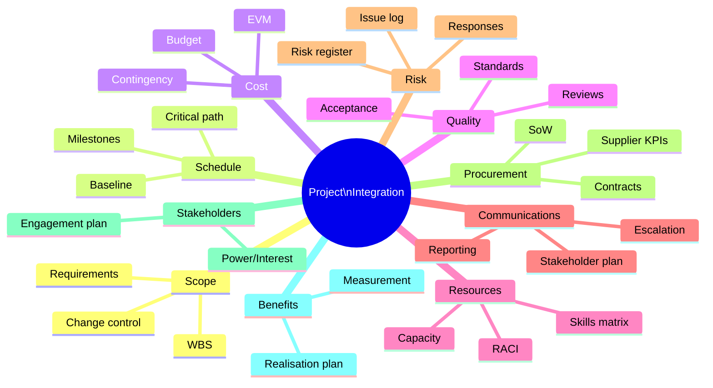
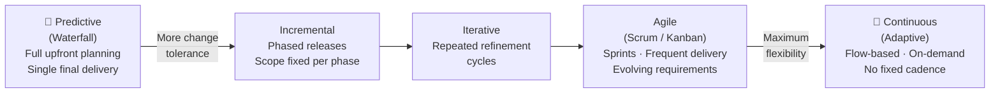
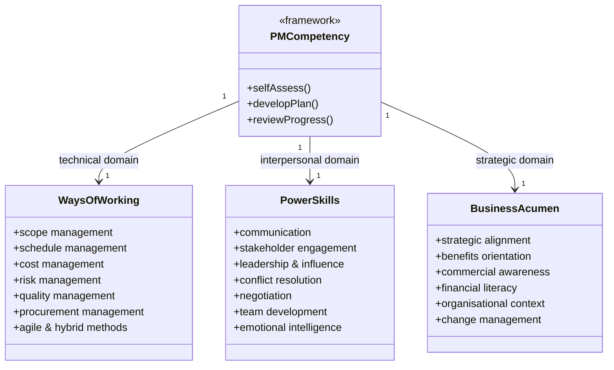

# Module 15 — Capstone: Integration, Hybrid Approaches, and Professional Practice

> **A project manager who masters one knowledge area is a specialist. One who integrates all of them — adapting to context, reading the environment, and making sound judgements under uncertainty — is a professional.** This capstone module synthesises the course and prepares you to apply it.

---

## Table of Contents

- [1. Integration Management](#1-integration-management)
- [2. Organisational Change vs Project Change Control](#2-organisational-change-vs-project-change-control)
- [3. Hybrid and Adaptive Approaches](#3-hybrid-and-adaptive-approaches)
- [4. Agile Principles and Lifecycle Selection](#4-agile-principles-and-lifecycle-selection)
- [5. Scaling Agile for Project Environments](#5-scaling-agile-for-project-environments)
- [6. PM Competency Frameworks](#6-pm-competency-frameworks)
- [7. Continuing Professional Development (CPD)](#7-continuing-professional-development-cpd)
- [8. Common Project Failure Modes](#8-common-project-failure-modes)
- [9. Project Management Across Industries](#9-project-management-across-industries)
- [10. Synthesis: Becoming a Reflective Practitioner](#10-synthesis-becoming-a-reflective-practitioner)
- [Artifacts](#artifacts)
- [Exercises](#exercises)
- [Quiz](#quiz)

---

## 1. Integration Management

Integration management is the discipline of ensuring that all the elements of a project — scope, schedule, cost, quality, risk, procurement, stakeholders, and resources — work together coherently. It is the "glue" that holds the project management plan together.

### What Integration Means in Practice

Every knowledge area produces its own plans, registers, and reports. Without integration:

- Risk responses may not be costed in the budget.
- Scope changes may not be reflected in the schedule.
- Stakeholder commitments may conflict with the resource plan.
- Quality gates may not be built into milestone definitions.

The project manager's primary role in integration is to maintain coherence across these domains throughout the project lifecycle.

### The Project Management Plan as an Integrated Document

The **Project Management Plan (PMP)** is not a single document but a collection of subsidiary plans and baselines. Key components:

| Subsidiary plan / baseline | Primary module |
|---|---|
| Scope Management Plan + Scope Baseline (WBS + Statement) | Module 08 |
| Schedule Management Plan + Schedule Baseline | Module 04 |
| Cost Management Plan + Cost Baseline | Module 04 |
| Quality Management Plan | Module 12 |
| Resource Management Plan | Module 14 |
| Communications Management Plan | Module 10 |
| Risk Management Plan + Risk Register | Module 11 |
| Procurement Management Plan | Module 13 |
| Stakeholder Engagement Plan | Module 09 |
| Change Management Plan | Module 05 |
| Benefits Management Plan | Module 02 |

The PMP must be internally consistent — a change to the scope baseline must trigger review of schedule, cost, resource, and risk baselines.

*All subsidiary plans feed into — and must remain consistent with — the integrated Project Management Plan.*

### Integrated Change Control

Any proposed change to a project baseline passes through **Integrated Change Control**:

1. Change request submitted (any source).
2. Impact assessed across all affected baselines and plans.
3. Change evaluated by the Change Control Board or sponsor.
4. Decision: approve, reject, or defer.
5. If approved: baselines updated, team notified, change log updated.
6. If rejected: requestor notified with rationale.

The word "integrated" is critical — a scope change that is approved without assessing its cost, schedule, and risk implications is not change control; it is wishful thinking.

### Project Work Authorisation

Work should only proceed when formally authorised. The **Work Authorisation System** ensures that:

- The right work is done at the right time in the right sequence.
- No work begins outside the approved baseline.
- Work package owners know when they are authorised to start and what the criteria for completion are.

[↑ Back to top](#table-of-contents)

---

## 2. Organisational Change vs Project Change Control

A frequent point of confusion: there are two distinct disciplines called "change management" that intersect in project environments.

### Project Change Control

Covered extensively in Module 05 and Module 06. This is the process for managing changes to the **project's scope, schedule, cost, or baselines**:

- Triggered by a change request.
- Evaluated for impact on all baselines.
- Approved/rejected by a defined authority.
- Documented in the change log.

### Organisational Change Management

This is the discipline of managing the **human side of change** — helping people in the organisation transition from current state to future state. Projects deliver outputs; organisational change management ensures those outputs are adopted and produce the intended benefits.

Key frameworks include:

- **Kotter's 8-Step Model**: Create urgency → Build coalition → Form vision → Communicate vision → Remove barriers → Create short-term wins → Sustain acceleration → Institute change.
- **ADKAR Model** (Prosci): Awareness → Desire → Knowledge → Ability → Reinforcement. People must move through all five stages to successfully adopt change.
- **Lewin's Change Model**: Unfreeze (destabilise current state) → Change (transition) → Refreeze (embed new state).

### Why Both Matter

A technically successful project that is resisted or ignored by its users has failed in practice. The digital planning portal may be built perfectly — but if planning officers don't understand it, don't trust it, or weren't adequately involved in its design, adoption will be poor and benefits will not be realised.

The **business change manager** role (common in PRINCE2 environments) bridges project delivery and organisational adoption, working alongside the project manager.

| Project Manager | Business Change Manager |
|---|---|
| Manages delivery of outputs | Manages adoption of outputs |
| Owns the project management plan | Owns the benefits realisation plan |
| Focuses on scope, schedule, cost, quality | Focuses on people, culture, readiness |
| Reports on project progress | Reports on benefits and adoption progress |

[↑ Back to top](#table-of-contents)

---

## 3. Hybrid and Adaptive Approaches

### The Waterfall–Agile Spectrum

Project management approaches exist on a spectrum from **predictive (plan-driven)** to **adaptive (change-driven)**:

*The delivery lifecycle spectrum — from fully predictive through to fully adaptive.*

| Characteristic | Predictive | Adaptive |
|---|---|---|
| **Requirements** | Defined upfront | Emerge and evolve |
| **Planning horizon** | Full project | Near-term (sprints/iterations) |
| **Change handling** | Formal change control | Welcomed and expected |
| **Delivery cadence** | Single final delivery | Frequent incremental delivery |
| **Customer involvement** | Milestones and sign-offs | Continuous collaboration |
| **Risk profile** | Front-loaded | Distributed; course-corrected |

Neither is universally superior. The appropriate approach depends on the nature of the project.

### What Drives Lifecycle Selection?

| Factor | Suggests predictive | Suggests adaptive |
|---|---|---|
| **Requirements clarity** | Well-defined, stable | Uncertain, likely to change |
| **Technology** | Proven, well-understood | Novel, exploratory |
| **Stakeholder availability** | Limited access | Active and engaged |
| **Regulatory environment** | Heavy documentation required | Flexible |
| **Team experience with agile** | Low | High |
| **Contract type** | Fixed price (defined scope) | T&M or outcome-based |

### Hybrid Approaches

Many real-world projects blend both approaches:

- **Phased delivery with iterative development**: Overall project is governed predictively (business case, stage gates, formal change control), while the development phase uses agile sprints.
- **Agile within a waterfall programme**: Agile delivery teams nested within a programme managed to a fixed timeline and budget.
- **Rolling wave planning**: Detailed planning for near-term phases; high-level planning for future phases, refined as more is known.

Hybrid approaches work well when governance and delivery work to compatible rhythms. They fail when predictive governance (monthly steering committees, annual budgets) is imposed on agile teams at a cadence that undermines their ability to respond.

[↑ Back to top](#table-of-contents)

---

## 4. Agile Principles and Lifecycle Selection

### The Agile Manifesto (2001)

The Agile Manifesto (Beck et al., 2001) articulates four values:

> - **Individuals and interactions** over processes and tools
> - **Working software** over comprehensive documentation
> - **Customer collaboration** over contract negotiation
> - **Responding to change** over following a plan

*"That is, while there is value in the items on the right, we value the items on the left more."*

The manifesto's 12 principles elaborate: deliver working software frequently; welcome changing requirements; build projects around motivated individuals; face-to-face communication is most effective; sustainable pace; technical excellence; simplicity; self-organising teams; reflect and adjust regularly.

### Scrum in Brief

Scrum is the most widely used agile framework. Key elements:

| Element | Description |
|---|---|
| **Product Backlog** | Prioritised list of all desired product features (owned by Product Owner) |
| **Sprint** | Time-boxed iteration (1–4 weeks) producing a potentially shippable increment |
| **Sprint Planning** | Team selects backlog items to deliver in the Sprint |
| **Daily Standup** | 15-minute daily synchronisation: what did I do, what will I do, what's blocking me |
| **Sprint Review** | Demonstrate increment to stakeholders; update backlog |
| **Sprint Retrospective** | Team reflects on process; agrees improvements |
| **Product Owner** | Prioritises backlog; represents customer/stakeholder value |
| **Scrum Master** | Facilitates; removes impediments; coaches the team |
| **Development Team** | Self-organising; cross-functional; delivers the increment |

### Kanban in Brief

Kanban visualises work as cards on a board, flowing through columns (e.g., To Do → In Progress → Done). Key principles:

- Visualise the workflow.
- Limit Work in Progress (WIP) — focus beats multitasking.
- Manage flow (reduce cycle time; identify bottlenecks).
- Make policies explicit.
- Improve continuously.

Kanban is particularly suited to ongoing service work, support queues, or teams where work arrives unpredictably rather than in defined sprints.

[↑ Back to top](#table-of-contents)

---

## 5. Scaling Agile for Project Environments

### Why Scaling Is Needed

Single-team agile (e.g., one Scrum team of 7) is straightforward. Large projects involve multiple teams working on interdependent products. Coordination across teams requires additional structure.

### SAFe (Scaled Agile Framework)

The most widely adopted enterprise scaling framework. Key levels:

- **Team level**: Standard Scrum/Kanban teams delivering in 2-week sprints.
- **Programme level (ART — Agile Release Train)**: Multiple teams aligned to a Programme Increment (PI) — typically 10 weeks of 4 sprints + 1 Innovation & Planning sprint.
- **Portfolio level**: Strategic alignment; investment themes; Lean portfolio management.

SAFe introduces significant ceremony. It is most appropriate for large organisations with mature agile practices. Applying it to a small project creates overhead without benefit.

### Less (Large-Scale Scrum)

LeSS is a minimalist scaling approach: apply Scrum with as few additional roles and artefacts as possible. Up to 8 teams share a single Product Backlog and Product Owner. Favoured by organisations that want to scale without bureaucratic overhead.

### Practical Scaling Principles

Regardless of framework, successful scaling requires:

- A shared definition of done across teams.
- Frequent cross-team synchronisation (daily or at sprint boundaries).
- Dependency management (visualised and tracked explicitly).
- A single integrated product backlog (or clearly aligned backlog hierarchy).
- A clear integration and test strategy — integrating multiple teams' work is the hardest part.

[↑ Back to top](#table-of-contents)

---

## 6. PM Competency Frameworks

### Why Competency Frameworks Matter

Competency frameworks define what "good" looks like for a project manager. They are used for:

- Self-assessment and development planning.
- Recruitment and role definition.
- Training needs analysis.
- Professional certification and progression.

### PMI Talent Triangle

The Project Management Institute defines three competency domains:

| Domain | Description |
|---|---|
| **Ways of Working** | Technical project management skills: scope, schedule, cost, risk, quality, procurement |
| **Power Skills** | Interpersonal and leadership skills: communication, stakeholder engagement, conflict resolution, influence |
| **Business Acumen** | Strategic and business skills: understanding the wider context, benefits orientation, commercial awareness |

The Talent Triangle reflects the evolution of the PM role — technical skills alone are no longer sufficient.

*PMI Talent Triangle — the three competency domains every professional project manager must develop.*

### APM Competence Framework

The Association for Project Management (UK) defines competences across three dimensions:

- **Technical**: Planning, scheduling, risk, quality, procurement, monitoring and control.
- **Behavioural**: Leadership, communication, conflict resolution, ethics, self-management.
- **Contextual**: Understanding of organisational governance, programme and portfolio management, sponsorship, benefits management.

### IPMA Individual Competence Baseline (ICB)

IPMA's ICB4 uses three competence "eyes":

- **People**: Personal and interpersonal skills (self-reflection, integrity, leadership, teamwork, conflict, negotiation, results orientation).
- **Perspective**: Context and governance (strategy, governance, compliance, power and interest, culture).
- **Practice**: Technical project management processes (design, goals and objectives, scope, time, organisation, quality, finance, resources, procurement, planning and control, risk, stakeholders, change, select and balance).

### Self-Assessment

Regardless of which framework you use, honest self-assessment is the starting point:

1. Map your experience and strengths to the competence areas.
2. Identify 2–3 genuine development priorities (not your weakest areas overall — the ones that matter most for your context and goals).
3. Create a development plan with specific actions, resources, and target dates.
4. Review progress quarterly.

[↑ Back to top](#table-of-contents)

---

## 7. Continuing Professional Development (CPD)

### What CPD Is

CPD is the ongoing commitment to maintain, develop, and evidence your professional competence. It is not optional for professionals — it is an ethical obligation. The world changes; a PM who stops learning becomes progressively less capable relative to the demands of their role.

### Forms of CPD

| Type | Examples |
|---|---|
| **Formal learning** | Courses, qualifications, workshops, webinars |
| **Self-directed learning** | Reading books, articles, case studies, podcasts |
| **Practice-based learning** | Taking on new challenges; leading a new type of project |
| **Peer learning** | Communities of practice, mentoring, coaching, peer review |
| **Reflection** | After-action reviews, journaling, supervision |

### Reflective Practice

Donald Schön's concept of **reflective practice** distinguishes:

- **Reflection-in-action**: Adjusting your approach in real time as you notice what is and isn't working.
- **Reflection-on-action**: Deliberate review after an event to extract learning.

High-performing PMs do both. They are not just technically skilled — they are students of their own practice, continuously asking: *What worked? What didn't? What would I do differently? What does this situation have in common with others I have faced?*

### Recording CPD

Most professional bodies require members to record and evidence CPD activities (typically 20–35 hours per year). Record:

- Activity type and description.
- Date and duration.
- Learning objective.
- Outcome and how it will be applied.
- Evidence (certificate, notes, peer confirmation).

### Professional Certifications Overview

| Certification | Body | Focus |
|---|---|---|
| CAPM | PMI | Entry-level; knowledge-based |
| PMP | PMI | Experienced practitioners; application and judgment |
| PRINCE2 Foundation / Practitioner | Axelos / PeopleCert | PRINCE2 method |
| APM PMQ / PPQ | APM | UK/European standards-based |
| IPMA Level D–A | IPMA | Competence-based; portfolio of evidence |
| PMI-ACP | PMI | Agile practices |
| Scrum Master (CSM / PSM) | Scrum Alliance / Scrum.org | Scrum facilitation |
| SAFe certifications | Scaled Agile | Enterprise agile scaling |

Certifications demonstrate a minimum standard. They are a starting point, not a destination.

[↑ Back to top](#table-of-contents)

---

## 8. Common Project Failure Modes

Understanding why projects fail is as important as knowing how they should succeed. Most failures are not one catastrophic event — they are a slow accumulation of unaddressed warning signs.

### The Top Failure Modes

| Failure mode | Description | Early warning signs |
|---|---|---|
| **Unclear objectives** | Project proceeds without shared understanding of what success looks like | Stakeholders disagree on priorities; business case is vague |
| **Weak business case** | Benefits are assumed rather than evidenced; project justified by advocacy not analysis | No benefits owner; no benefits measurement plan |
| **Scope creep** | Scope grows incrementally without formal change control | Informal requests acted on; backlog grows without trade-offs |
| **Optimism bias** | Schedule and budget estimates are consistently over-optimistic | No reference class forecasting; estimates not challenged |
| **Weak sponsorship** | Sponsor not engaged; decisions delayed; team lacks senior air cover | Sponsor misses steering meetings; escalations not resolved |
| **Poor stakeholder engagement** | Resistance at implementation; requirements poorly understood | Stakeholders disengaged during planning; minimal consultation |
| **Resource over-commitment** | Key people committed to too many projects simultaneously | RACI shows same names everywhere; velocity declining |
| **Technical debt** | Shortcuts accumulate; system becomes fragile and expensive to change | Defect rates rising; rework increasing; test coverage declining |
| **Communication breakdown** | Team members not sharing concerns; issues hidden | Status reports consistently green; then sudden red |
| **Failure to close** | Project drifts; benefits not measured; lessons not captured | No formal closure milestone; team disperses informally |

### The "Green Project" Trap

One of the most dangerous failure modes is the project that reports green until it reports red — and then is cancelled or fails. The causes:

- **Social pressure** to report positively to sponsors.
- **Lack of psychological safety** — bad news is unwelcome or punished.
- **Vanity metrics** — measuring completion of tasks rather than progress towards outcomes.
- **PM over-optimism** — genuine belief that problems will be resolved.

Counter this by:

- Creating an explicit norm that raising concerns is valued.
- Reviewing trends (velocity, defect rates, escalations) not just point-in-time RAG status.
- Requiring exception reports for early warning, not just for current problems.

### Cynefin: Choosing the Right Response

Dave Snowden's **Cynefin framework** helps PM practitioners categorise situations and choose appropriate responses:

| Domain | Characteristics | Appropriate response |
|---|---|---|
| **Clear** (Simple) | Cause-effect obvious; best practice exists | Sense → Categorise → Respond (apply best practice) |
| **Complicated** | Cause-effect requires analysis; good practice exists | Sense → Analyse → Respond (apply expert knowledge) |
| **Complex** | Cause-effect only visible in retrospect; multiple actors | Probe → Sense → Respond (safe-to-fail experiments) |
| **Chaotic** | No apparent cause-effect; crisis | Act → Sense → Respond (stabilise, then learn) |
| **Disorder** | It is unclear which domain applies | Disaggregate the problem; classify each element |

Project planning problems are usually **complicated** (known unknowns, expert analysis required). Stakeholder dynamics are often **complex** (emergent, non-linear). Crisis response is **chaotic**. Applying complicated-domain tools (detailed plans) to complex-domain problems (emerging user behaviour) is a common and costly mistake.

[↑ Back to top](#table-of-contents)

---

## 9. Project Management Across Industries

The principles in this course are universal. Their application varies by industry.

### Construction and Infrastructure

- Highly regulated; safety is a non-negotiable quality dimension.
- Contracts are central — most relationships are governed by NEC, FIDIC, or JCT forms.
- Long procurement lead times; design-to-build sequence is critical path.
- BIM (Building Information Modelling) is transforming collaborative design and asset management.
- Post-project: asset handover and whole-life costing matter as much as construction cost.

### Information Technology and Software

- Requirements volatility is high — agile or hybrid approaches are common.
- Technical debt and integration risk are significant project risks.
- Vendor management (SaaS, cloud, licensed platforms) is a major procurement domain.
- Change management for users is often the critical path to benefits realisation.
- Security and data protection are non-negotiable from project initiation.

### Healthcare and Life Sciences

- Regulatory approval (FDA, MHRA, CE marking) is a formal project gate with hard timelines.
- Clinical trials have their own project lifecycle (Phase I–IV) with rigorous quality management.
- Patient safety considerations govern every scope and quality decision.
- Benefits realisation is measured in health outcomes, not just financial return.

### Financial Services

- Heavy compliance and regulatory burden (FCA, PRA, DORA in the UK/EU).
- Risk management frameworks are mature and exacting.
- Change projects must demonstrate regulatory compliance at each stage gate.
- Business cases require detailed financial modelling and sign-off.

### Public Sector

- Procurement is subject to legal requirements (Public Contracts Regulations in the UK; equivalent in other jurisdictions).
- Business cases follow structured frameworks (e.g., HM Treasury Green Book in the UK; Five Case Model).
- Benefits are often social / public value rather than purely financial.
- Accountability and transparency obligations are high; audit trail discipline is essential.
- Political context shapes stakeholder dynamics; sponsor continuity can be poor.

### Lessons Across Industries

Despite these differences, the failure modes are remarkably consistent across all industries:

- Weak business cases.
- Inadequate stakeholder engagement.
- Over-optimistic estimates.
- Poor change control.
- Insufficient attention to benefits realisation.

Mastery of these fundamentals transfers across every sector.

[↑ Back to top](#table-of-contents)

---

## 10. Synthesis: Becoming a Reflective Practitioner

### The Course in One Page

Fifteen modules. Hundreds of tools and techniques. But at its core, project management is about answering six questions — and answering them well, repeatedly, throughout the project:

| Question | Key modules |
|---|---|
| **Why are we doing this?** | Business case, benefits management (02, 03) |
| **What will we deliver?** | Scope, requirements, WBS (04, 08) |
| **How will we deliver it?** | Planning, execution, procurement, resources (04, 05, 13, 14) |
| **Are we on track?** | Monitoring and control, EVM, reporting (06) |
| **What could go wrong — and how do we respond?** | Risk, issues, change control (05, 06, 11) |
| **Did we succeed — and what did we learn?** | Closing, lessons learned, benefits realisation (07) |

### The PM as Integrator

The project manager does not need to be the most technical person in the room — but they must be the most integrative. They hold the thread that connects:

- Strategy to delivery.
- People to process.
- Risk to opportunity.
- Current state to future state.

This requires **judgement** — the ability to make sound decisions in conditions of incomplete information, competing interests, and time pressure. Judgement is not innate; it is developed through practice, reflection, and learning from both success and failure.

### A Framework for Reflective Practice

After every significant project phase, milestone, or event, ask:

1. **What happened?** (Facts — what was planned vs what occurred.)
2. **Why did it happen?** (Root causes — not symptoms.)
3. **What does this tell me about my assumptions, approach, or skills?**
4. **What will I do differently next time?**
5. **What will I do to embed that learning?** (CPD action, template update, conversation with a mentor.)

Write it down. Reflection that exists only in your head is incomplete.

### A Final Word on Ethics

Every module in this course has touched on ethics: fair dealing in procurement, honest reporting in monitoring and control, psychological safety in teams, transparency in stakeholder engagement, sustainability in governance.

Ethics is not a separate module — it is the foundation of professional practice. The PMI Code of Ethics and Professional Conduct, the APM Code of Professional Conduct, and equivalent bodies all emphasise: **responsibility, respect, fairness, and honesty**.

When in doubt, ask: *Would I be comfortable if my sponsor, my client, and my professional body could all see exactly what I am doing and why?* If yes, proceed. If not, stop and reconsider.

[↑ Back to top](#table-of-contents)

---

## Artifacts

| Artifact | Description | Template |
|---|---|---|
| Project Management Plan (integrated) | Consolidated plan linking all subsidiary plans and baselines | — |
| Benefits Register | Tracked benefits, owners, measurement approach, and realisation dates | [benefits-register.md](../templates/benefits-register.md) |
| Change Log | All changes across the project lifecycle | [change-log.md](../templates/change-log.md) |
| Lessons Learned Log | Accumulated lessons from all phases | [lessons-learned-log.md](../templates/lessons-learned-log.md) |
| Project Closure Report | Final project summary; performance vs baseline; recommendations | [project-closure-report.md](../templates/project-closure-report.md) |
| CPD Log | Personal record of professional development activities | — |
| Competency Self-Assessment | Mapped against chosen PM competency framework | — |

[↑ Back to top](#table-of-contents)

---

## Exercises

### Exercise 1 — Integration Failure Analysis

**Scenario**: The digital planning portal has been delivered and gone live. However, six months later the post-implementation review reveals the following:

- The portal works technically but adoption by planning officers is only 34% (target was 80% by month 3).
- Three significant features were descoped during execution; the business case benefits assumed all features would be delivered.
- The supplier has submitted a £45,000 claim for a scope change that was verbally agreed by the PM but never formally raised as a change request.
- The lessons-learned session was never held — the team dispersed immediately after go-live.

**Task**: For each of the four failure points above, identify: (1) which project management process or knowledge area failed, (2) what specific failure occurred, (3) what the PM should have done instead, and (4) which module in this course addresses it. Conclude with a 150-word reflection on what "integration failure" means in this context.

**Expected output**: A structured table (four rows) plus a written reflection.

---

### Exercise 2 — Lifecycle Selection

**Scenario**: You are advising a project management office. Three projects are seeking approval:

1. **Project Alpha**: Replace a 20-year-old payroll system with an off-the-shelf SaaS solution for 3,000 employees. The software is proven; configuration is the main work. Go-live date is fixed (new tax year). Budget is £380,000.

2. **Project Beta**: Develop a new mobile app to help citizens report environmental issues to the council. The user need is validated but the features are not yet defined. The council wants to test with real users as early as possible. Budget is indicative (£200,000–£300,000).

3. **Project Gamma**: Design and build a pedestrian bridge across a canal. Full planning permission has been obtained. Structural engineering design is complete. Construction is to a fixed specification. Budget is £1.2m.

**Task**: For each project, recommend a lifecycle approach (predictive, adaptive, or hybrid) and justify your recommendation using the lifecycle selection factors from this module. Identify the two biggest risks in each project and explain how the chosen lifecycle mitigates them.

**Expected output**: Three structured sections (one per project) with: recommended lifecycle, justification, top 2 risks, and mitigation rationale.

---

### Exercise 3 — Reflective Professional Portfolio

**Scenario**: You are preparing a portfolio entry for a professional development review (or a job application). You will reflect on a project from your experience (real or the recurring portal scenario from this course).

**Task**: Using the five-question reflective practice framework from Section 10 of this module, write a structured reflection on one significant challenge you faced (or imagine facing) in the portal project. The challenge should relate to a specific knowledge area covered in this course. Your reflection must:

1. Describe what happened (factually, without blame).
2. Identify the root cause (using a structured technique such as 5 Whys from Module 12).
3. Identify what the situation revealed about your assumptions or approach.
4. State specifically what you would do differently.
5. Define one concrete CPD action (with a timeframe) to embed the learning.

**Expected output**: A 400–500 word structured reflection suitable for a professional portfolio or CPD log.

[↑ Back to top](#table-of-contents)

---

## Quiz

**1. What is the purpose of Integrated Change Control and why is the word "integrated" significant?**

Reveal Answer

Integrated Change Control ensures that proposed changes are evaluated for their impact across **all** affected project baselines and plans — not just the one being changed. The word "integrated" is significant because approving a scope change without assessing its cost, schedule, and risk implications is not change control — it is wishful thinking. All baselines must remain internally consistent.

---

**2. What is the difference between project change control and organisational change management?**

Reveal Answer

**Project change control** manages changes to the project's scope, schedule, cost, or baselines — it is a technical/governance process. **Organisational change management** manages the human transition from current state to future state — it ensures that the project's outputs are adopted and that intended benefits are realised. Both are needed: a technically perfect delivery that is resisted by users has failed in practice.

---

**3. What are the four values of the Agile Manifesto?**

Reveal Answer

1. Individuals and interactions over processes and tools
2. Working software over comprehensive documentation
3. Customer collaboration over contract negotiation
4. Responding to change over following a plan

The manifesto notes that while items on the right have value, the items on the left are valued more.

---

**4. What factors suggest a predictive (waterfall) lifecycle is more appropriate than an adaptive (agile) one?**

Reveal Answer

Predictive is more appropriate when: requirements are well-defined and stable; technology is proven and well-understood; regulatory or contractual requirements demand documentation and formal sign-off; stakeholder availability is limited; the team has low experience with agile; or the contract is fixed-price (requiring a defined scope). When requirements are uncertain and likely to evolve, adaptive approaches are more appropriate.

---

**5. What are the three levels of the PMI Talent Triangle?**

Reveal Answer

1. **Ways of Working** — technical project management skills (scope, schedule, cost, risk, quality, procurement).
2. **Power Skills** — interpersonal and leadership skills (communication, stakeholder engagement, conflict resolution, influence).
3. **Business Acumen** — strategic and commercial skills (understanding the wider context, benefits orientation, commercial awareness).

---

**6. What is Cynefin and why is it useful for project managers?**

Reveal Answer

Cynefin is a sense-making framework that helps practitioners categorise situations as Clear, Complicated, Complex, Chaotic, or Disordered, and choose appropriate responses. It is useful for PMs because applying the wrong approach to a situation is a common failure mode — e.g., using detailed planning (complicated-domain tool) for emergent stakeholder dynamics (complex domain). Recognising the domain helps choose the right tool.

---

**7. Name three common project failure modes and one early warning sign for each.**

Reveal Answer

Any three — examples:
- **Unclear objectives** → Stakeholders disagree on priorities; business case is vague.
- **Scope creep** → Informal requests being acted on without change control; backlog growing without trade-offs.
- **Weak sponsorship** → Sponsor missing steering meetings; escalations remaining unresolved.
- **Optimism bias** → Estimates consistently unquestioned; no reference class forecasting.
- **Communication breakdown** → Status consistently green with no issues reported; then sudden critical issues emerging.

---

**8. What is the ADKAR model and in what context is it used?**

Reveal Answer

ADKAR is an organisational change management model (Prosci): **A**wareness → **D**esire → **K**nowledge → **A**bility → **R**einforcement. It describes the stages an individual must move through to successfully adopt a change. It is used in the context of organisational change management — ensuring that project outputs are actually adopted and used by the people affected — not in project change control.

---

**9. What distinguishes Scrum from Kanban?**

Reveal Answer

**Scrum** uses time-boxed sprints (1–4 weeks) with defined ceremonies (planning, daily standup, review, retrospective) and roles (Product Owner, Scrum Master, Development Team). Work is committed to in sprint. **Kanban** visualises continuous flow on a board with WIP limits; there are no sprints or prescribed ceremonies. Kanban suits ongoing or unpredictable work; Scrum suits iterative development with regular delivery cadence.

---

**10. Describe the five-question reflective practice framework from this module.**

Reveal Answer

1. **What happened?** — Facts: what was planned vs what occurred.
2. **Why did it happen?** — Root causes, not symptoms.
3. **What does this tell me about my assumptions, approach, or skills?** — Self-awareness.
4. **What will I do differently next time?** — Behavioural change.
5. **What will I do to embed that learning?** — Concrete CPD action (with timeframe).

The framework is most effective when written down — reflection that exists only in one's head is incomplete.

[↑ Back to top](#table-of-contents)

---

---

[← Module 14: Resource & Team Management](14-resource-team.md)

---

© UncleJs — Licensed under [CC BY-NC-SA 4.0](https://creativecommons.org/licenses/by-nc-sa/4.0/)
