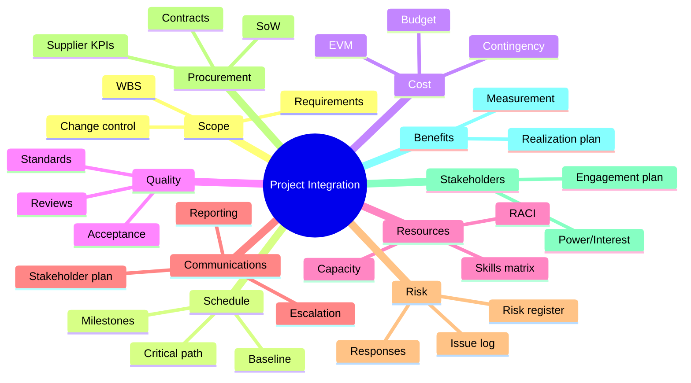
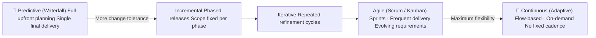

# Module 15a — Integration, Hybrid Approaches, and Agile

> **A project manager who masters one knowledge area is a specialist. One who integrates all of them — adapting to context, reading the environment, and making sound judgments under uncertainty — is a professional.** This module brings together integration management, organizational change, and hybrid/agile delivery.

> **This module is Part 1 of the Capstone.** See also: [Module 15b — Professional Practice and Career Development](15b-professional-practice.md)

---

## Learning outcomes

By the end of this module you will be able to:

- Hold scope, schedule, cost, risk, and change in one picture
- Choose a predictive, agile, or hybrid approach for the work in front of you
- Say what stays under change control when delivery is iterative

---

## Table of Contents

- [Learning outcomes](#learning-outcomes)
- [1. Integration Management](#1-integration-management)
  - [What Integration Means in Practice](#what-integration-means-in-practice)
  - [The Project Management Plan as an Integrated Document](#the-project-management-plan-as-an-integrated-document)
  - [Integrated Change Control](#integrated-change-control)
  - [Project Work Authorization](#project-work-authorization)
- [2. Organizational Change vs Project Change Control](#2-organizational-change-vs-project-change-control)
  - [Project Change Control](#project-change-control)
  - [Organizational Change Management](#organizational-change-management)
  - [Why Both Matter](#why-both-matter)
- [3. Hybrid and Adaptive Approaches](#3-hybrid-and-adaptive-approaches)
  - [The Waterfall–Agile Spectrum](#the-waterfallagile-spectrum)
  - [What Drives Lifecycle Selection?](#what-drives-lifecycle-selection)
  - [Hybrid Approaches](#hybrid-approaches)
- [4. Agile Principles and Lifecycle Selection](#4-agile-principles-and-lifecycle-selection)
  - [The Agile Manifesto (2001)](#the-agile-manifesto-2001)
  - [Scrum in Brief](#scrum-in-brief)
  - [Kanban in Brief](#kanban-in-brief)
- [5. Scaling Agile for Project Environments](#5-scaling-agile-for-project-environments)
  - [Why Scaling Is Needed](#why-scaling-is-needed)
  - [SAFe (Scaled Agile Framework)](#safe-scaled-agile-framework)
  - [LeSS (Large-Scale Scrum)](#less-large-scale-scrum)
  - [Practical Scaling Principles](#practical-scaling-principles)
- [Artifacts](#artifacts)
- [Exercises](#exercises)
  - [Exercise 1 — Integration Failure Analysis](#exercise-1--integration-failure-analysis)
  - [Exercise 2 — Lifecycle Selection](#exercise-2--lifecycle-selection)
  - [Exercise 3 — Hybrid Governance Design](#exercise-3--hybrid-governance-design)
- [Quiz](#quiz)
- [Related Modules](#related-modules)

---

## 1. Integration Management

Integration management is the discipline of ensuring that all the elements of a project — scope, schedule, cost, quality, risk, procurement, stakeholders, and resources — work together coherently. It is the "glue" that holds the project management plan together.

### What Integration Means in Practice

Every knowledge area produces its own plans, registers, and reports. Without integration:

- Risk responses may not be costed in the budget.
- Scope changes may not be reflected in the schedule.
- Stakeholder commitments may conflict with the resource plan.
- Quality gates may not be built into milestone definitions.

The project manager's primary role in integration is to maintain coherence across these domains throughout the project lifecycle.

### The Project Management Plan as an Integrated Document

The **Project Management Plan (PMP)** is not a single document but a collection of subsidiary plans and baselines. Key components:

| Subsidiary plan / baseline | Primary module |
|---|---|
| Scope Management Plan + Scope Baseline (WBS + Statement) | Module 08 |
| Schedule Management Plan + Schedule Baseline | Module 04 |
| Cost Management Plan + Cost Baseline | Module 04 |
| Quality Management Plan | Module 12 |
| Resource Management Plan | Module 14 |
| Communications Management Plan | Module 10 |
| Risk Management Plan + Risk Register | Module 11 |
| Procurement Management Plan | Module 13 |
| Stakeholder Engagement Plan | Module 09 |
| Change Management Plan | Module 05 |
| Benefits Management Plan | Module 02 |

The PMP must be internally consistent — a change to the scope baseline must trigger review of schedule, cost, resource, and risk baselines.

*All subsidiary plans feed into — and must remain consistent with — the integrated Project Management Plan.*

### Integrated Change Control

Any proposed change to a project baseline passes through **Integrated Change Control**:

1. Change request submitted (any source).
2. Impact assessed across all affected baselines and plans.
3. Change evaluated by the Change Control Board or sponsor.
4. Decision: approve, reject, or defer.
5. If approved: baselines updated, team notified, change log updated.
6. If rejected: requestor notified with rationale.

The word "integrated" is critical — a scope change that is approved without assessing its cost, schedule, and risk implications is not change control; it is wishful thinking.

### Project Work Authorization

Work should only proceed when formally authorized. The **Work Authorization System** ensures that:

- The right work is done at the right time in the right sequence.
- No work begins outside the approved baseline.
- Work package owners know when they are authorized to start and what the criteria for completion are.

[↑ Back to top](#table-of-contents)

---

## 2. Organizational Change vs Project Change Control

A frequent point of confusion: there are two distinct disciplines called "change management" that intersect in project environments.

### Project Change Control

Covered extensively in Module 05 and Module 06. This is the process for managing changes to the **project's scope, schedule, cost, or baselines**:

- Triggered by a change request.
- Evaluated for impact on all baselines.
- Approved/rejected by a defined authority.
- Documented in the change log.

### Organizational Change Management

This is the discipline of managing the **human side of change** — helping people in the organization transition from current state to future state. Projects deliver outputs; organizational change management ensures those outputs are adopted and produce the intended benefits.

Key frameworks include:

- **Kotter's 8-Step Model**: Create urgency → Build coalition → Form vision → Communicate vision → Remove barriers → Create short-term wins → Sustain acceleration → Institute change.
- **ADKAR Model** (Prosci): Awareness → Desire → Knowledge → Ability → Reinforcement. People must move through all five stages to successfully adopt change.
- **Lewin's Change Model**: Unfreeze (destabilize current state) → Change (transition) → Refreeze (embed new state).

### Why Both Matter

A technically successful project that is resisted or ignored by its users has failed in practice. The digital planning portal may be built perfectly — but if planning officers don't understand it, don't trust it, or weren't adequately involved in its design, adoption will be poor and benefits will not be realized.

The **business change manager** role (common in PRINCE2 environments) bridges project delivery and organizational adoption, working alongside the project manager.

| Project Manager | Business Change Manager |
|---|---|
| Manages delivery of outputs | Manages adoption of outputs |
| Owns the project management plan | Owns the benefits realization plan |
| Focuses on scope, schedule, cost, quality | Focuses on people, culture, readiness |
| Reports on project progress | Reports on benefits and adoption progress |

[↑ Back to top](#table-of-contents)

---

## 3. Hybrid and Adaptive Approaches

### The Waterfall–Agile Spectrum

Project management approaches exist on a spectrum from **predictive (plan-driven)** to **adaptive (change-driven)**:

*The delivery lifecycle spectrum — from fully predictive through to fully adaptive.*

| Characteristic | Predictive | Adaptive |
|---|---|---|
| **Requirements** | Defined upfront | Emerge and evolve |
| **Planning horizon** | Full project | Near-term (sprints/iterations) |
| **Change handling** | Formal change control | Welcomed and expected |
| **Delivery cadence** | Single final delivery | Frequent incremental delivery |
| **Customer involvement** | Milestones and sign-offs | Continuous collaboration |
| **Risk profile** | Front-loaded | Distributed; course-corrected |

Neither is universally superior. The appropriate approach depends on the nature of the project.

### What Drives Lifecycle Selection?

| Factor | Suggests predictive | Suggests adaptive |
|---|---|---|
| **Requirements clarity** | Well-defined, stable | Uncertain, likely to change |
| **Technology** | Proven, well-understood | Novel, exploratory |
| **Stakeholder availability** | Limited access | Active and engaged |
| **Regulatory environment** | Heavy documentation required | Flexible |
| **Team experience with agile** | Low | High |
| **Contract type** | Fixed price (defined scope) | T&M or outcome-based |

### Hybrid Approaches

Many real-world projects blend both approaches:

- **Phased delivery with iterative development**: Overall project is governed predictively (business case, stage gates, formal change control), while the development phase uses agile sprints.
- **Agile within a waterfall program**: Agile delivery teams nested within a program managed to a fixed timeline and budget.
- **Rolling wave planning**: Detailed planning for near-term phases; high-level planning for future phases, refined as more is known.

Hybrid approaches work well when governance and delivery work to compatible rhythms. They fail when predictive governance (monthly steering committees, annual budgets) is imposed on agile teams at a cadence that undermines their ability to respond.

[↑ Back to top](#table-of-contents)

---

## 4. Agile Principles and Lifecycle Selection

### The Agile Manifesto (2001)

The Agile Manifesto (Beck et al., 2001) articulates four values:

> - **Individuals and interactions** over processes and tools
> - **Working software** over comprehensive documentation
> - **Customer collaboration** over contract negotiation
> - **Responding to change** over following a plan

*"That is, while there is value in the items on the right, we value the items on the left more."*

The manifesto's 12 principles elaborate: deliver working software frequently; welcome changing requirements; build projects around motivated individuals; face-to-face communication is most effective; sustainable pace; technical excellence; simplicity; self-organizing teams; reflect and adjust regularly.

### Scrum in Brief

Scrum is the most widely used agile framework. Key elements:

| Element | Description |
|---|---|
| **Product Backlog** | Prioritized list of all desired product features (owned by Product Owner) |
| **Sprint** | Time-boxed iteration (1–4 weeks) producing a potentially shippable increment |
| **Sprint Planning** | Team selects backlog items to deliver in the Sprint |
| **Daily Standup** | 15-minute daily synchronization: what did I do, what will I do, what's blocking me |
| **Sprint Review** | Demonstrate increment to stakeholders; update backlog |
| **Sprint Retrospective** | Team reflects on process; agrees improvements |
| **Product Owner** | Prioritizes backlog; represents customer/stakeholder value |
| **Scrum Master** | Facilitates; removes impediments; coaches the team |
| **Development Team** | Self-organizing; cross-functional; delivers the increment |

### Kanban in Brief

Kanban visualizes work as cards on a board, flowing through columns (e.g., To Do → In Progress → Done). Key principles:

- Visualize the workflow.
- Limit Work in Progress (WIP) — focus beats multitasking.
- Manage flow (reduce cycle time; identify bottlenecks).
- Make policies explicit.
- Improve continuously.

Kanban is particularly suited to ongoing service work, support queues, or teams where work arrives unpredictably rather than in defined sprints.

[↑ Back to top](#table-of-contents)

---

## 5. Scaling Agile for Project Environments

### Why Scaling Is Needed

Single-team agile (e.g., one Scrum team of 7) is straightforward. Large projects involve multiple teams working on interdependent products. Coordination across teams requires additional structure.

### SAFe (Scaled Agile Framework)

The most widely adopted enterprise scaling framework. Key levels:

- **Team level**: Standard Scrum/Kanban teams delivering in 2-week sprints.
- **Program level (ART — Agile Release Train)**: Multiple teams aligned to a Program Increment (PI) — typically 10 weeks of 4 sprints + 1 Innovation & Planning sprint.
- **Portfolio level**: Strategic alignment; investment themes; Lean portfolio management.

SAFe introduces significant ceremony. It is most appropriate for large organizations with mature agile practices. Applying it to a small project creates overhead without benefit.

### LeSS (Large-Scale Scrum)

LeSS is a minimalist scaling approach: apply Scrum with as few additional roles and artifacts as possible. Up to 8 teams share a single Product Backlog and Product Owner. Favored by organizations that want to scale without bureaucratic overhead.

### Practical Scaling Principles

Regardless of framework, successful scaling requires:

- A shared definition of done across teams.
- Frequent cross-team synchronization (daily or at sprint boundaries).
- Dependency management (visualized and tracked explicitly).
- A single integrated product backlog (or clearly aligned backlog hierarchy).
- A clear integration and test strategy — integrating multiple teams' work is the hardest part.

[↑ Back to top](#table-of-contents)

---

## Artifacts

| Artifact | Description | Template |
|---|---|---|
| Project Management Plan (integrated) | Consolidated plan linking all subsidiary plans and baselines | — |
| Change Log | All changes across the project lifecycle | [change-log.md](../templates/change-log.md) |
| Sprint Backlog | Prioritized list of user stories for the current sprint (agile) | — |
| Sprint Review Notes | Output of sprint review: what was demonstrated, accepted, and rejected | — |
| Retrospective Action Log | Team improvement actions from sprint retrospective | — |

[↑ Back to top](#table-of-contents)

---

## Exercises

### Exercise 1 — Integration Failure Analysis

**Scenario**: The digital planning portal has been delivered and gone live. However, six months later the post-implementation review reveals the following:

- The portal works technically but adoption by planning officers is only 34% (target was 80% by month 3).
- Three significant features were descoped during execution; the business case benefits assumed all features would be delivered.
- The supplier has submitted a $45,000 claim for a scope change that was verbally agreed by the PM but never formally raised as a change request.
- The lessons-learned session was never held — the team dispersed immediately after go-live.

**Task**: For each of the four failure points above, identify: (1) which project management process or knowledge area failed, (2) what specific failure occurred, (3) what the PM should have done instead, and (4) which module in this course addresses it. Conclude with a 150-word reflection on what "integration failure" means in this context.

**Expected output**: A structured table (four rows) plus a written reflection.

---

### Exercise 2 — Lifecycle Selection

**Scenario**: You are advising a project management office. Three projects are seeking approval:

1. **Project Alpha**: Replace a 20-year-old payroll system with an off-the-shelf SaaS solution for 3,000 employees. The software is proven; configuration is the main work. Go-live date is fixed (new tax year). Budget is $380,000.

2. **Project Beta**: Develop a new mobile app to help citizens report environmental issues to the city. The user need is validated but the features are not yet defined. The city wants to test with real users as early as possible. Budget is indicative ($200,000–$300,000).

3. **Project Gamma**: Design and build a pedestrian bridge across a canal. Full planning permission has been obtained. Structural engineering design is complete. Construction is to a fixed specification. Budget is $1.2m.

**Task**: For each project, recommend a lifecycle approach (predictive, adaptive, or hybrid) and justify your recommendation using the lifecycle selection factors from this module. Identify the two biggest risks in each project and explain how the chosen lifecycle mitigates them.

**Expected output**: Three structured sections (one per project) with: recommended lifecycle, justification, top 2 risks, and mitigation rationale.

---

### Exercise 3 — Hybrid Governance Design

**Scenario**: The Meridian portal project is planning its build phase. GovTech Solutions has proposed using 4-week Scrum sprints for the development work, while the City's project governance runs on monthly Project Board meetings aligned to PRINCE2 stage gates.

**Task**: Design a hybrid governance model that allows GovTech to work in agile sprints while the City maintains appropriate predictive oversight. Your model should address: (1) how sprint outputs are reported to the Project Board; (2) how change requests arising mid-sprint are handled; (3) how the PM maintains a consistent view of schedule and cost across sprint boundaries; (4) what the stage gate criteria are at the end of the build phase (Gate 2).

**Expected output**: A hybrid governance model with a brief Mermaid diagram showing the relationship between sprint cycles and Project Board meetings, plus a Gate 2 acceptance criteria checklist.

[↑ Back to top](#table-of-contents)

---

## Quiz

**1. What is the purpose of Integrated Change Control and why is the word "integrated" significant?**

Reveal Answer

Integrated Change Control ensures that proposed changes are evaluated for their impact across **all** affected project baselines and plans — not just the one being changed. The word "integrated" is significant because approving a scope change without assessing its cost, schedule, and risk implications is not change control — it is wishful thinking. All baselines must remain internally consistent.

---

**2. What is the difference between project change control and organizational change management?**

Reveal Answer

**Project change control** manages changes to the project's scope, schedule, cost, or baselines — it is a technical/governance process. **Organizational change management** manages the human transition from current state to future state — it ensures that the project's outputs are adopted and that intended benefits are realized. Both are needed: a technically perfect delivery that is resisted by users has failed in practice.

---

**3. What are the four values of the Agile Manifesto?**

Reveal Answer

1. Individuals and interactions over processes and tools
2. Working software over comprehensive documentation
3. Customer collaboration over contract negotiation
4. Responding to change over following a plan

The manifesto notes that while items on the right have value, the items on the left are valued more.

---

**4. What factors suggest a predictive (waterfall) lifecycle is more appropriate than an adaptive (agile) one?**

Reveal Answer

Predictive is more appropriate when: requirements are well-defined and stable; technology is proven and well-understood; regulatory or contractual requirements demand documentation and formal sign-off; stakeholder availability is limited; the team has low experience with agile; or the contract is fixed-price (requiring a defined scope). When requirements are uncertain and likely to evolve, adaptive approaches are more appropriate.

---

**5. What distinguishes Scrum from Kanban?**

Reveal Answer

**Scrum** uses time-boxed sprints (1–4 weeks) with defined ceremonies (planning, daily standup, review, retrospective) and roles (Product Owner, Scrum Master, Development Team). Work is committed to in sprint. **Kanban** visualizes continuous flow on a board with WIP limits; there are no sprints or prescribed ceremonies. Kanban suits ongoing or unpredictable work; Scrum suits iterative development with regular delivery cadence.

---

**6. What are the three levels of SAFe (Scaled Agile Framework)?**

Reveal Answer

1. **Team level**: Standard Scrum/Kanban teams delivering in 2-week sprints.
2. **Program level (ART)**: Multiple teams aligned in a Program Increment (PI) — typically 10 weeks of 4 sprints + 1 Innovation & Planning sprint.
3. **Portfolio level**: Strategic alignment; investment themes; Lean portfolio management.

SAFe is most appropriate for large organizations with mature agile practices; it introduces significant ceremony that is disproportionate for small projects.

---

**7. What does the ADKAR model describe, and in what discipline is it used?**

Reveal Answer

ADKAR (Prosci) describes the stages an individual must pass through to successfully adopt change: **A**wareness → **D**esire → **K**nowledge → **A**bility → **R**einforcement. It is used in **organizational change management** — ensuring that project outputs are actually adopted and used. It is not a project change control model.

---

**8. Why do hybrid approaches sometimes fail, even when the intent is sound?**

Reveal Answer

Hybrid approaches fail when predictive governance (monthly steering committees, annual budgets, formal change control) is imposed on agile teams at a cadence that undermines their ability to respond. If a team is working in 2-week sprints but a change to the sprint backlog requires a monthly steering committee decision, the governance rhythm and the delivery rhythm are incompatible. The fix is to design governance that is compatible with the team's cadence — not to force the team to slow down.

[↑ Back to top](#table-of-contents)

---

## Related Modules

| Module | Relationship |
|---|---|
| [Module 14 — Resource and Team Management](14-resource-team.md) | Team structures and roles differ significantly in agile and hybrid environments; cross-functional teams and servant leadership are key 15a themes |
| [Module 15b — Professional Practice and Career Development](15b-professional-practice.md) | Professional practice and career development in the context of hybrid and agile delivery |
| [Module 01 — Foundations of Project Management](01-foundations.md) | Integration management connects back to foundational concepts of the project lifecycle and triple constraint |

---

[← Module 14: Resource & Team Management](14-resource-team.md) | [→ Module 15b: Professional Practice & Career Development](15b-professional-practice.md)

---

© 2026 UncleJs — Licensed under [CC BY-NC-SA 4.0](https://creativecommons.org/licenses/by-nc-sa/4.0/)
