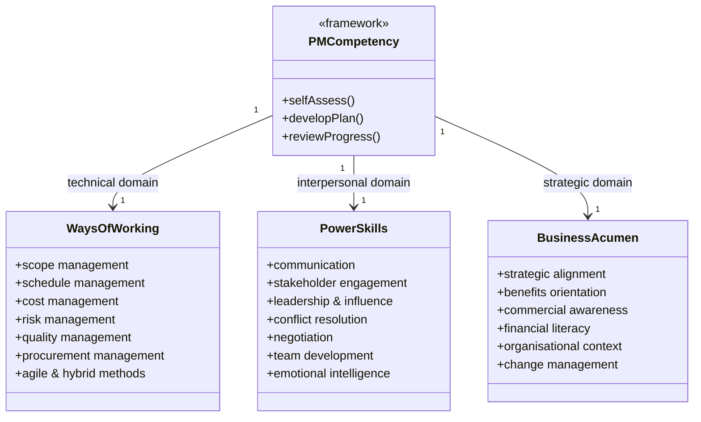

# Module 15b — Professional Practice and Career Development

> **The project manager does not need to be the most technical person in the room — but they must be the most integrative.** This module synthesises the full course, addresses failure modes and cross-industry practice, and equips you for ongoing professional development as a reflective practitioner.

> **This module is Part 2 of the Capstone.** See also: [Module 15a — Integration, Hybrid Approaches, and Agile](15a-integration-hybrid-agile.md)

---

## Table of Contents

- [6. PM Competency Frameworks](#6-pm-competency-frameworks)
- [7. Continuing Professional Development (CPD)](#7-continuing-professional-development-cpd)
- [8. Common Project Failure Modes](#8-common-project-failure-modes)
- [9. Project Management Across Industries](#9-project-management-across-industries)
- [10. Synthesis: Becoming a Reflective Practitioner](#10-synthesis-becoming-a-reflective-practitioner)
- [Artifacts](#artifacts)
- [Exercises](#exercises)
- [Quiz](#quiz)

---

## 6. PM Competency Frameworks

### Why Competency Frameworks Matter

Competency frameworks define what "good" looks like for a project manager. They are used for:

- Self-assessment and development planning.
- Recruitment and role definition.
- Training needs analysis.
- Professional certification and progression.

### PMI Talent Triangle

The Project Management Institute defines three competency domains:

| Domain | Description |
|---|---|
| **Ways of Working** | Technical project management skills: scope, schedule, cost, risk, quality, procurement |
| **Power Skills** | Interpersonal and leadership skills: communication, stakeholder engagement, conflict resolution, influence |
| **Business Acumen** | Strategic and business skills: understanding the wider context, benefits orientation, commercial awareness |

The Talent Triangle reflects the evolution of the PM role — technical skills alone are no longer sufficient.

*PMI Talent Triangle — the three competency domains every professional project manager must develop.*

### APM Competence Framework

The Association for Project Management (UK) defines competences across three dimensions:

- **Technical**: Planning, scheduling, risk, quality, procurement, monitoring and control.
- **Behavioural**: Leadership, communication, conflict resolution, ethics, self-management.
- **Contextual**: Understanding of organisational governance, programme and portfolio management, sponsorship, benefits management.

### IPMA Individual Competence Baseline (ICB)

IPMA's ICB4 uses three competence "eyes":

- **People**: Personal and interpersonal skills (self-reflection, integrity, leadership, teamwork, conflict, negotiation, results orientation).
- **Perspective**: Context and governance (strategy, governance, compliance, power and interest, culture).
- **Practice**: Technical project management processes (design, goals and objectives, scope, time, organisation, quality, finance, resources, procurement, planning and control, risk, stakeholders, change, select and balance).

### Self-Assessment

Regardless of which framework you use, honest self-assessment is the starting point:

1. Map your experience and strengths to the competence areas.
2. Identify 2–3 genuine development priorities (not your weakest areas overall — the ones that matter most for your context and goals).
3. Create a development plan with specific actions, resources, and target dates.
4. Review progress quarterly.

[↑ Back to top](#table-of-contents)

---

## 7. Continuing Professional Development (CPD)

### What CPD Is

CPD is the ongoing commitment to maintain, develop, and evidence your professional competence. It is not optional for professionals — it is an ethical obligation. The world changes; a PM who stops learning becomes progressively less capable relative to the demands of their role.

### Forms of CPD

| Type | Examples |
|---|---|
| **Formal learning** | Courses, qualifications, workshops, webinars |
| **Self-directed learning** | Reading books, articles, case studies, podcasts |
| **Practice-based learning** | Taking on new challenges; leading a new type of project |
| **Peer learning** | Communities of practice, mentoring, coaching, peer review |
| **Reflection** | After-action reviews, journaling, supervision |

### Reflective Practice

Donald Schön's concept of **reflective practice** distinguishes:

- **Reflection-in-action**: Adjusting your approach in real time as you notice what is and isn't working.
- **Reflection-on-action**: Deliberate review after an event to extract learning.

High-performing PMs do both. They are not just technically skilled — they are students of their own practice, continuously asking: *What worked? What didn't? What would I do differently? What does this situation have in common with others I have faced?*

### Recording CPD

Most professional bodies require members to record and evidence CPD activities (typically 20–35 hours per year). Record:

- Activity type and description.
- Date and duration.
- Learning objective.
- Outcome and how it will be applied.
- Evidence (certificate, notes, peer confirmation).

### Professional Certifications Overview

| Certification | Body | Focus |
|---|---|---|
| CAPM | PMI | Entry-level; knowledge-based |
| PMP | PMI | Experienced practitioners; application and judgment |
| PRINCE2 Foundation / Practitioner | Axelos / PeopleCert | PRINCE2 method |
| APM PMQ / PPQ | APM | UK/European standards-based |
| IPMA Level D–A | IPMA | Competence-based; portfolio of evidence |
| PMI-ACP | PMI | Agile practices |
| Scrum Master (CSM / PSM) | Scrum Alliance / Scrum.org | Scrum facilitation |
| SAFe certifications | Scaled Agile | Enterprise agile scaling |

Certifications demonstrate a minimum standard. They are a starting point, not a destination.

[↑ Back to top](#table-of-contents)

---

## 8. Common Project Failure Modes

Understanding why projects fail is as important as knowing how they should succeed. Most failures are not one catastrophic event — they are a slow accumulation of unaddressed warning signs.

### The Top Failure Modes

| Failure mode | Description | Early warning signs |
|---|---|---|
| **Unclear objectives** | Project proceeds without shared understanding of what success looks like | Stakeholders disagree on priorities; business case is vague |
| **Weak business case** | Benefits are assumed rather than evidenced; project justified by advocacy not analysis | No benefits owner; no benefits measurement plan |
| **Scope creep** | Scope grows incrementally without formal change control | Informal requests acted on; backlog grows without trade-offs |
| **Optimism bias** | Schedule and budget estimates are consistently over-optimistic | No reference class forecasting; estimates not challenged |
| **Weak sponsorship** | Sponsor not engaged; decisions delayed; team lacks senior air cover | Sponsor misses steering meetings; escalations not resolved |
| **Poor stakeholder engagement** | Resistance at implementation; requirements poorly understood | Stakeholders disengaged during planning; minimal consultation |
| **Resource over-commitment** | Key people committed to too many projects simultaneously | RACI shows same names everywhere; velocity declining |
| **Technical debt** | Shortcuts accumulate; system becomes fragile and expensive to change | Defect rates rising; rework increasing; test coverage declining |
| **Communication breakdown** | Team members not sharing concerns; issues hidden | Status reports consistently green; then sudden red |
| **Failure to close** | Project drifts; benefits not measured; lessons not captured | No formal closure milestone; team disperses informally |

### The "Green Project" Trap

One of the most dangerous failure modes is the project that reports green until it reports red — and then is cancelled or fails. The causes:

- **Social pressure** to report positively to sponsors.
- **Lack of psychological safety** — bad news is unwelcome or punished.
- **Vanity metrics** — measuring completion of tasks rather than progress towards outcomes.
- **PM over-optimism** — genuine belief that problems will be resolved.

Counter this by:

- Creating an explicit norm that raising concerns is valued.
- Reviewing trends (velocity, defect rates, escalations) not just point-in-time RAG status.
- Requiring exception reports for early warning, not just for current problems.

### Cynefin: Choosing the Right Response

Dave Snowden's **Cynefin framework** helps PM practitioners categorise situations and choose appropriate responses:

| Domain | Characteristics | Appropriate response |
|---|---|---|
| **Clear** (Simple) | Cause-effect obvious; best practice exists | Sense → Categorise → Respond (apply best practice) |
| **Complicated** | Cause-effect requires analysis; good practice exists | Sense → Analyse → Respond (apply expert knowledge) |
| **Complex** | Cause-effect only visible in retrospect; multiple actors | Probe → Sense → Respond (safe-to-fail experiments) |
| **Chaotic** | No apparent cause-effect; crisis | Act → Sense → Respond (stabilise, then learn) |
| **Disorder** | It is unclear which domain applies | Disaggregate the problem; classify each element |

Project planning problems are usually **complicated** (known unknowns, expert analysis required). Stakeholder dynamics are often **complex** (emergent, non-linear). Crisis response is **chaotic**. Applying complicated-domain tools (detailed plans) to complex-domain problems (emerging user behaviour) is a common and costly mistake.

[↑ Back to top](#table-of-contents)

---

## 9. Project Management Across Industries

The principles in this course are universal. Their application varies by industry.

### Construction and Infrastructure

- Highly regulated; safety is a non-negotiable quality dimension.
- Contracts are central — most relationships are governed by NEC, FIDIC, or JCT forms.
- Long procurement lead times; design-to-build sequence is critical path.
- BIM (Building Information Modelling) is transforming collaborative design and asset management.
- Post-project: asset handover and whole-life costing matter as much as construction cost.

### Information Technology and Software

- Requirements volatility is high — agile or hybrid approaches are common.
- Technical debt and integration risk are significant project risks.
- Vendor management (SaaS, cloud, licensed platforms) is a major procurement domain.
- Change management for users is often the critical path to benefits realisation.
- Security and data protection are non-negotiable from project initiation.

### Healthcare and Life Sciences

- Regulatory approval (FDA, MHRA, CE marking) is a formal project gate with hard timelines.
- Clinical trials have their own project lifecycle (Phase I–IV) with rigorous quality management.
- Patient safety considerations govern every scope and quality decision.
- Benefits realisation is measured in health outcomes, not just financial return.

### Financial Services

- Heavy compliance and regulatory burden (FCA, PRA, DORA in the UK/EU).
- Risk management frameworks are mature and exacting.
- Change projects must demonstrate regulatory compliance at each stage gate.
- Business cases require detailed financial modelling and sign-off.

### Public Sector

- Procurement is subject to legal requirements (Public Contracts Regulations in the UK; equivalent in other jurisdictions).
- Business cases follow structured frameworks (e.g., HM Treasury Green Book in the UK; Five Case Model).
- Benefits are often social / public value rather than purely financial.
- Accountability and transparency obligations are high; audit trail discipline is essential.
- Political context shapes stakeholder dynamics; sponsor continuity can be poor.

### Lessons Across Industries

Despite these differences, the failure modes are remarkably consistent across all industries:

- Weak business cases.
- Inadequate stakeholder engagement.
- Over-optimistic estimates.
- Poor change control.
- Insufficient attention to benefits realisation.

Mastery of these fundamentals transfers across every sector.

[↑ Back to top](#table-of-contents)

---

## 10. Synthesis: Becoming a Reflective Practitioner

### The Course in One Page

Fifteen modules. Hundreds of tools and techniques. But at its core, project management is about answering six questions — and answering them well, repeatedly, throughout the project:

| Question | Key modules |
|---|---|
| **Why are we doing this?** | Business case, benefits management (02, 03) |
| **What will we deliver?** | Scope, requirements, WBS (04, 08) |
| **How will we deliver it?** | Planning, execution, procurement, resources (04, 05, 13, 14) |
| **Are we on track?** | Monitoring and control, EVM, reporting (06) |
| **What could go wrong — and how do we respond?** | Risk, issues, change control (05, 06, 11) |
| **Did we succeed — and what did we learn?** | Closing, lessons learned, benefits realisation (07) |

### The PM as Integrator

The project manager does not need to be the most technical person in the room — but they must be the most integrative. They hold the thread that connects:

- Strategy to delivery.
- People to process.
- Risk to opportunity.
- Current state to future state.

This requires **judgement** — the ability to make sound decisions in conditions of incomplete information, competing interests, and time pressure. Judgement is not innate; it is developed through practice, reflection, and learning from both success and failure.

### A Framework for Reflective Practice

After every significant project phase, milestone, or event, ask:

1. **What happened?** (Facts — what was planned vs what occurred.)
2. **Why did it happen?** (Root causes — not symptoms.)
3. **What does this tell me about my assumptions, approach, or skills?**
4. **What will I do differently next time?**
5. **What will I do to embed that learning?** (CPD action, template update, conversation with a mentor.)

Write it down. Reflection that exists only in your head is incomplete.

### A Final Word on Ethics

Every module in this course has touched on ethics: fair dealing in procurement, honest reporting in monitoring and control, psychological safety in teams, transparency in stakeholder engagement, sustainability in governance.

Ethics is not a separate module — it is the foundation of professional practice. The PMI Code of Ethics and Professional Conduct, the APM Code of Professional Conduct, and equivalent bodies all emphasise: **responsibility, respect, fairness, and honesty**.

When in doubt, ask: *Would I be comfortable if my sponsor, my client, and my professional body could all see exactly what I am doing and why?* If yes, proceed. If not, stop and reconsider.

[↑ Back to top](#table-of-contents)

---

## Artifacts

| Artifact | Description | Template |
|---|---|---|
| Benefits Register | Tracked benefits, owners, measurement approach, and realisation dates | [benefits-register.md](../templates/benefits-register.md) |
| Lessons Learned Log | Accumulated lessons from all phases | [lessons-learned-log.md](../templates/lessons-learned-log.md) |
| Project Closure Report | Final project summary; performance vs baseline; recommendations | [project-closure-report.md](../templates/project-closure-report.md) |
| CPD Log | Personal record of professional development activities | — |
| Competency Self-Assessment | Mapped against chosen PM competency framework | — |

[↑ Back to top](#table-of-contents)

---

## Exercises

### Exercise 1 — Failure Mode Analysis

**Scenario**: A post-implementation review of a major public-sector IT project has revealed that:

- The project was consistently reported as RAG Green until Month 14 (of 18), when it was suddenly escalated as RED.
- The project closed 6 months late at 140% of its approved budget.
- Benefits realisation data was not collected — the benefits owner left the organisation during the project and was not replaced.
- A lessons-learned session was never held. The PM has since moved to another employer.

**Task**: Using the failure modes table from Section 8, identify which failure modes apply to each of the four facts above. For each: (1) name the failure mode, (2) explain how it manifested in this project, (3) identify what early warning sign the PM or Sponsor should have noticed, and (4) describe what should have been done differently. Conclude with a 200-word reflection on the relationship between governance, psychological safety, and honest reporting.

**Expected output**: A structured table (four rows) plus a written reflection.

---

### Exercise 2 — Competency Self-Assessment

**Scenario**: You are a project manager with 3 years' experience in a public-sector IT environment. You have managed two projects end-to-end and are now seeking to develop a professional development plan.

**Task**: Using the PMI Talent Triangle (Ways of Working, Power Skills, Business Acumen), conduct an honest self-assessment:

1. For each of the three domains, rate yourself 1–4 (1 = developing, 4 = strong) across at least three specific competences per domain.
2. Identify your two highest-priority development areas — not your weakest overall, but the ones most important for your current role and career goals.
3. For each priority area, define: one specific learning action (with a named resource — course, book, community of practice), a timeframe, and how you will evidence the learning.

**Expected output**: A competency self-assessment table and a development plan for two priority areas (one page total).

---

### Exercise 3 — Reflective Professional Portfolio

**Scenario**: You are preparing a portfolio entry for a professional development review (or a job application). You will reflect on a project from your experience (real or the recurring portal scenario from this course).

**Task**: Using the five-question reflective practice framework from Section 10 of this module, write a structured reflection on one significant challenge you faced (or imagine facing) in the portal project. The challenge should relate to a specific knowledge area covered in this course. Your reflection must:

1. Describe what happened (factually, without blame).
2. Identify the root cause (using a structured technique such as 5 Whys from Module 12).
3. Identify what the situation revealed about your assumptions or approach.
4. State specifically what you would do differently.
5. Define one concrete CPD action (with a timeframe) to embed the learning.

**Expected output**: A 400–500 word structured reflection suitable for a professional portfolio or CPD log.

[↑ Back to top](#table-of-contents)

---

## Quiz

**1. What are the three levels of the PMI Talent Triangle?**

Reveal Answer

1. **Ways of Working** — technical project management skills (scope, schedule, cost, risk, quality, procurement).
2. **Power Skills** — interpersonal and leadership skills (communication, stakeholder engagement, conflict resolution, influence).
3. **Business Acumen** — strategic and commercial skills (understanding the wider context, benefits orientation, commercial awareness).

---

**2. What is Cynefin and why is it useful for project managers?**

Reveal Answer

Cynefin is a sense-making framework that helps practitioners categorise situations as Clear, Complicated, Complex, Chaotic, or Disordered, and choose appropriate responses. It is useful for PMs because applying the wrong approach to a situation is a common failure mode — e.g., using detailed planning (complicated-domain tool) for emergent stakeholder dynamics (complex domain). Recognising the domain helps choose the right tool.

---

**3. Name three common project failure modes and one early warning sign for each.**

Reveal Answer

Any three — examples:
- **Unclear objectives** → Stakeholders disagree on priorities; business case is vague.
- **Scope creep** → Informal requests being acted on without change control; backlog growing without trade-offs.
- **Weak sponsorship** → Sponsor missing steering meetings; escalations remaining unresolved.
- **Optimism bias** → Estimates consistently unquestioned; no reference class forecasting.
- **Communication breakdown** → Status consistently green with no issues reported; then sudden critical issues emerging.

---

**4. What is the ADKAR model and in what context is it used?**

Reveal Answer

ADKAR is an organisational change management model (Prosci): **A**wareness → **D**esire → **K**nowledge → **A**bility → **R**einforcement. It describes the stages an individual must move through to successfully adopt a change. It is used in the context of organisational change management — ensuring that project outputs are actually adopted and used by the people affected — not in project change control.

---

**5. What distinguishes "reflection-in-action" from "reflection-on-action" (Schön)?**

Reveal Answer

**Reflection-in-action** is real-time adjustment — noticing that your current approach is not working and adapting in the moment. **Reflection-on-action** is deliberate review after an event to extract learning — asking what happened, why, and what to do differently next time. High-performing PMs practise both: they adapt in the moment and review systematically after significant events.

---

**6. Describe the five-question reflective practice framework from this module.**

Reveal Answer

1. **What happened?** — Facts: what was planned vs what occurred.
2. **Why did it happen?** — Root causes, not symptoms.
3. **What does this tell me about my assumptions, approach, or skills?** — Self-awareness.
4. **What will I do differently next time?** — Behavioural change.
5. **What will I do to embed that learning?** — Concrete CPD action (with timeframe).

The framework is most effective when written down — reflection that exists only in one's head is incomplete.

---

**7. Why do public-sector projects have distinctive characteristics compared to private-sector projects?**

Reveal Answer

Public-sector projects are subject to: legal procurement requirements (Public Contracts Regulations); structured business case frameworks (e.g., HM Treasury Five Case Model); benefits defined in terms of public value rather than purely financial return; higher accountability and transparency obligations; and political stakeholder dynamics (sponsor continuity can be poor when Ministers or senior officers change). These characteristics do not change the fundamentals of project management but do shape how they are applied — particularly in governance, procurement, and benefits definition.

---

**8. What is the "green project trap" and how can it be countered?**

Reveal Answer

The "green project trap" is the pattern of a project reporting RAG Green throughout, then suddenly escalating to Red — with no warning — and failing. It is caused by social pressure to report positively, lack of psychological safety, vanity metrics, and PM over-optimism. Counter it by: creating explicit norms that raising concerns is valued and safe; reviewing trends (velocity, defect rates, escalation frequency) not just point-in-time RAG; and requiring exception reports for emerging risks, not just current problems.

[↑ Back to top](#table-of-contents)

---

## Related Modules

| Module | Relationship |
|---|---|
| [Module 15a — Integration, Hybrid Approaches, and Agile](15a-integration-hybrid-agile.md) | Hybrid delivery context in which many of the professional practice challenges described here arise |
| [Module 02 — Governance, Frameworks, and Methodologies](02-governance.md) | Professional conduct and ethical obligations are embedded in governance frameworks such as APM, PMI, and PRINCE2 |
| [Module 07 — Project Closing](07-closing.md) | Closure is where lessons learned, handover quality, and professional accountability are most visible |

---

[← Module 15a: Integration, Hybrid Approaches, and Agile](15a-integration-hybrid-agile.md)

---

© 2026 UncleJs — Licensed under [CC BY-NC-SA 4.0](https://creativecommons.org/licenses/by-nc-sa/4.0/)
